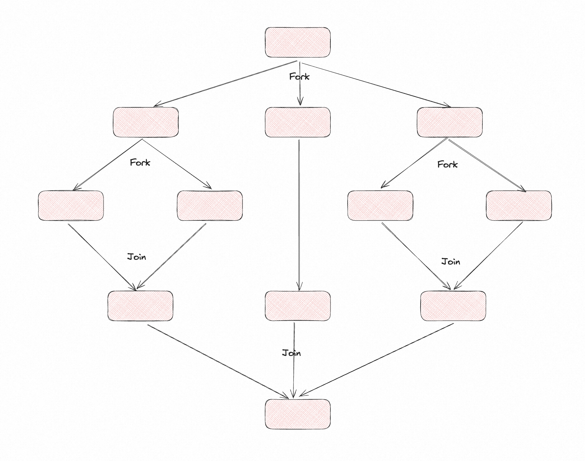

# ✅ForkJoinPool和ThreadPoolExecutor区别是什么？

# 典型回答


ForkJoinPool和ExecutorService都是Java中常用的线程池的实现，他们主要在实现方式上有一定的区别，所以也就会同时带来的适用场景上面的区别。


首先在**<u>实现方式</u>**上，**ForkJoinPool 是基于工作窃取（Work-Stealing）算法实现的线程池**，ForkJoinPool 中每个线程都有自己的工作队列，用于存储待执行的任务。当一个线程执行完自己的任务之后，会从其他线程的工作队列中窃取任务执行，以此来实现任务的动态均衡和线程的利用率最大化。


**ThreadPoolExecutor 是基于任务分配（Task-Assignment）算法实现的线程池**，ThreadPoolExecutor 中线程池中有一个共享的工作队列，所有任务都将提交到这个队列中。线程池中的线程会从队列中获取任务执行，如果队列为空，则线程会等待，直到队列中有任务为止。


ForkJoinPool 中的任务通常是一些可以分割成多个子任务的任务，例如快速排序。每个任务都可以分成两个或多个子任务，然后由不同的线程来执行这些子任务。在这个过程中，ForkJoinPool 会自动管理任务的执行、分割和合并，从而实现任务的动态分配和最优化执行。





ForkJoinPool 中的工作线程是一种特殊的线程，与普通线程池中的工作线程有所不同。它们会自动地创建和销毁，以及自动地管理线程的数量和调度。这种方式可以降低线程池的管理成本，提高线程的利用率和并行度。


ThreadPoolExecutor 中线程的创建和销毁是静态的，线程池创建后会预先创建一定数量的线程，根据任务的数量动态调整线程的利用率，不会销毁线程。如果线程长时间处于空闲状态，可能会占用过多的资源。


在**<u>使用场景</u>**上也有区别，ThreadPoolExecutor **适合处理 IO 密集型或普通 CPU 任务**，如网络请求处理、数据库访问、Web 服务请求调度。尤其是大量独立、不需要拆分的小任务。


ForkJoinPool** 适合于 CPU 密集型、可拆分的并行计算任务，**


1. **大任务分解为小任务**：适用于可以递归分解为更小任务的大型任务。ForkJoinPool 通过分而治之的方式，将大任务拆分为小任务，这些小任务可以并行处理。
2. **计算密集型任务**：对于需要大量计算且能够并行化的任务，ForkJoinPool 是一个理想的选择。它能够有效利用多核处理器的优势来加速处理过程。
3. **递归算法的并行化**：适合于可以用递归方法解决的问题，如快速排序、归并排序、图像处理中的分区算法等。
4. **数据聚合任务**：在处理需要聚合多个数据源结果的任务时（例如，遍历树结构并聚合结果），ForkJoinPool 提供了有效的方式来并行化这一过程。


# 扩展知识


## 为什么CompletableFuture使用ForkJoinPool


CompletableFuture 使用 ForkJoinPool 而不是 ExecutorService 的原因主要是因为它的执行模型和任务分割方式与 ForkJoinPool 更加匹配。


在 CompletableFuture 中，一个任务可以分割成多个子任务，并且这些子任务之间可以存在依赖关系。而**ForkJoinPool 本身就是一种支持任务分割和合并的线程池实现，能够自动地处理任务的拆分和合并**。而且，**ForkJoinPool 还有一种工作窃取算法，能够自动地调整线程的负载，提高线程的利用率和并行度。**


**ForkJoinPool 还有一个特点，就是它的线程池大小是动态调整的。**当任务比较少时，线程池的大小会自动缩小，从而减少了线程的数量和占用的系统资源。当任务比较多时，线程池的大小会自动增加，从而保证任务能够及时地得到执行。


如果使用 ExecutorService 来执行这些任务，需要手动地创建线程池、任务队列和任务执行策略，并且需要手动地处理任务的拆分和合并，实现起来相对比较复杂。


因此，ForkJoinPool 更加适合 CompletableFuture 的执行模型。


## ForkJoinPool使用示例


下面是一个使用 ForkJoinPool 实现快排的代码：


```plain
import java.util.concurrent.RecursiveAction;
import java.util.concurrent.ForkJoinPool;

public class ParallelQuickSort extends RecursiveAction {
    private int[] array;
    private int left;
    private int right;

    public ParallelQuickSort(int[] array, int left, int right) {
        this.array = array;
        this.left = left;
        this.right = right;
    }

    private int partition(int left, int right) {
        int pivot = array[right];
        int i = left - 1;
        for (int j = left; j < right; j++) {
            if (array[j] <= pivot) {
                i++;
                // Swap array[i] and array[j]
                int temp = array[i];
                array[i] = array[j];
                array[j] = temp;
            }
        }
        // Swap array[i+1] and array[right] (or pivot)
        int temp = array[i + 1];
        array[i + 1] = array[right];
        array[right] = temp;
        return i + 1;
    }

    @Override
    protected void compute() {
        if (left < right) {
            int partitionIndex = partition(left, right);

            // Parallelize the two subtasks
            ParallelQuickSort leftTask = new ParallelQuickSort(array, left, partitionIndex - 1);
            ParallelQuickSort rightTask = new ParallelQuickSort(array, partitionIndex + 1, right);

            leftTask.fork();
            rightTask.fork();
            
            leftTask.join();
            rightTask.join();
        }
    }

    public static void parallelQuickSort(int[] array) {
        ForkJoinPool pool = new ForkJoinPool();
        pool.invoke(new ParallelQuickSort(array, 0, array.length - 1));
    }

    public static void main(String[] args) {
        int[] array = { 12, 35, 87, 26, 9, 28, 7 };
        parallelQuickSort(array);
        for (int i : array) {
            System.out.print(i + " ");
        }
    }
}

```


ParallelQuickSort 类继承自 RecursiveAction。在这个类中，compute 方法实现了快速排序的逻辑，包括分区（partition 方法）和递归调用。对于每个递归调用，它创建了一个新的 ParallelQuickSort 实例，并通过 fork 方法将其提交给 ForkJoinPool 以异步执行。


> RecursiveAction 是用于创建没有返回值的递归任务的基类。
>


这个实现通过将快速排序的左右部分分解为独立的任务来实现并行化。在大数据集上，这可以有效利用多核处理器，从而加快排序过程。然而，对于小数组，传统的快速排序可能更高效，因为并行化引入的额外开销可能不值得。


> 更新: 2025-09-01 22:42:08  
> 原文: <https://www.yuque.com/hollis666/aw7b67/wl8s1swvh7g841be>