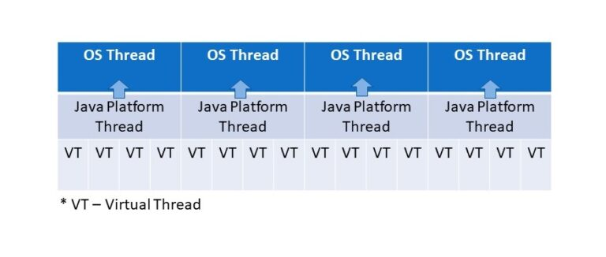

# ✅JDK21 中的虚拟线程是怎么回事？

# 典型回答

虚拟线程这个名字很多人可能比较懵，但是如果对像Go、Ruby、python等语言有一些了解的话，就会很快的反应过来，其实这就是协程。

在以前的JDK中，Java的线程模型其实比较简单，在大多数操作系统中，主要采用的是基于轻量级进程实现的一对一的线程模型，简单来说就是每一个Java线程对应一个操作系统中的轻量级进程，这种线程模型中的线程创建、析构及同步等动作，都需要进行系统调用。而系统调用则需要在用户态（User Mode）和内核态（Kernel Mode）中来回切换，所以性能开销还是很大的。

而新引入的虚拟线程，是JDK 实现的轻量级线程，他可以避免上下文切换带来的的额外耗费。他的实现原理其实是JDK不再是每一个线程都一对一的对应一个操作系统的线程了，而是会将多个虚拟线程映射到少量操作系统线程中，通过有效的调度来避免那些上下文切换。

在JDK 21，有多种方法可以创建协程，如Thread.startVirtualThread()、Executors.newVirtualThreadPerTaskExecutor()等。

# 扩展知识

## 线程的实现方式

在操作系统中，线程是比进程更轻量级的调度执行单位，线程的引入可以把一个进程的资源分配和执行调度分开，各个线程既可以共享进程资源，又可以独立调度。

其实，**线程的实现方式主要有三种：分别是使用内核线程实现、使用用户线程实现以及使用用户线程加轻量级进程混合实现。**

[✅线程的实现方式有哪些？](https://www.yuque.com/hollis666/aw7b67/mpap8c7gpr8iz1sh)

## Java的线程实现

以上讲的是操作系统的线程的实现的三种方式，不同的操作系统在实现线程的时候会采用不同的机制，比如windows采用的是内核线程实现的，而Solaris则是通过混合模式实现的。

而Java作为一门跨平台的编程语言，实际上他的线程的实现其实是依赖具体的操作系统的。而比较常用的windows和linux来说，都是采用的内核线程的方式实现的。

也就是说，当我们在JAVA代码中创建一个Thread的时候，其实是需要映射到操作系统的线程的具体实现的，因为常见的通过内核线程实现的方式在创建、调度时都需要进行内核参与，所以成本比较高，尽管JAVA中提供了线程池的方式来避免重复创建线程，但是依旧有很大的优化空间。**而且这种实现方式意味着受机器资源的影响，平台线程数也是有限制的。**

## 虚拟线程

\*\*JDK 21引入的虚拟线程，是JDK 实现的轻量级线程，他可以避免上下文切换带来的额外耗费。\*\*他的实现原理其实是JDK不再是每一个线程都一对一的对应一个操作系统的线程了，而是会将多个虚拟线程映射到少量操作系统线程中，通过有效的调度来避免那些上下文切换。



而且，我们可以在应用程序中创建非常多的虚拟线程，而不依赖于平台线程的数量。这些虚拟线程是由JVM管理的，因此它们不会增加额外的上下文切换开销，因为它们作为普通Java对象存储在RAM中。

## 虚拟线程和平台线程的区别

首先，虚拟线程总是守护线程。setDaemon (false)方法不能将虚拟线程更改为非守护线程。**所以，需要注意的是，当所有启动的非守护线程都终止时，JVM将终止。这意味着JVM不会等待虚拟线程完成后才退出。**

其次，即使使用setPriority()方法，**虚拟线程始终具有normal的优先级**，且不能更改优先级。在虚拟线程上调用此方法没有效果。

还有就是，**虚拟线程是不支持stop()、suspend()或resume()等方法**。这些方法在虚拟线程上调用时会抛出UnsupportedOperationException异常。

## 如何使用

接下来介绍一下，在JDK 21中如何使用虚拟线程。

首先，通过Thread.startVirtualThread()可以运行一个虚拟线程：

```plain
Thread.startVirtualThread(() -> {
    System.out.println("虚拟线程执行中...");
});
```

其次，通过Thread.Builder也可以创建虚拟线程，Thread类提供了ofPlatform()来创建一个平台线程、ofVirtual()来创建虚拟线程。

```plain
Thread.Builder platformBuilder = Thread.ofPlatform().name("平台线程");
Thread.Builder virtualBuilder = Thread.ofVirtual().name("虚拟线程");

Thread t1 = platformBuilder .start(() -> {...}); 
Thread t2 = virtualBuilder.start(() -> {...});
```

另外，线程池也支持了虚拟线程，可以通过Executors.newVirtualThreadPerTaskExecutor()来创建虚拟线程：

```plain
try (var executor = Executors.newVirtualThreadPerTaskExecutor()) {
    IntStream.range(0, 10000).forEach(i -> {
        executor.submit(() -> {
            Thread.sleep(Duration.ofSeconds(1));
            return i;
        });
    });
}
```

但是，**其实并不建议虚拟线程和线程池一起使用**，因为Java线程池的设计是为了避免创建新的操作系统线程的开销，但是创建虚拟线程的开销并不大，所以其实没必要放到线程池中。

[✅为什么虚拟线程不要和线程池一起用？](https://www.yuque.com/hollis666/aw7b67/gwmioommi0ps1vco)

## 性能差异

说了半天，虚拟线程到底能不能提升性能，能提升多少呢？我们来做个测试。

我们写一个简单的任务，在控制台中打印消息之前等待1秒：

```plain
// 模拟一个简单任务：计数并睡眠
private static void simpleTask() {
    try {
        // 简单的计算任务
        IntStream.range(0, 100).forEach(i -> {
            double result = Math.sqrt(i);  // 做一些计算
        });

        // 让任务模拟I/O阻塞，休眠
        Thread.sleep(10);
    } catch (InterruptedException e) {
        Thread.currentThread().interrupt();
    }
}
```

每个任务执行一个简单的计算操作并模拟 I/O 阻塞（通过 `Thread.sleep(10)`），以便在线程的生命周期中模拟一些等待操作。这种方式让每个线程会有一段空闲时间，模拟真实环境中的并发场景，比如等待网络响应或其他 I/O 操作。

先来我们比较熟悉的平台线程的实现：

```plain
// 使用平台线程（传统线程池）处理任务
private static void testPlatformThreads(int taskCount) throws InterruptedException {
  ExecutorService executor = Executors.newFixedThreadPool(100); // 创建一个平台线程池
  long start = System.nanoTime();

  // 提交多个任务
  for (int i = 0; i < taskCount; i++) {
      executor.submit(ThreadPerformanceComparison::simpleTask);
  }

  executor.shutdown();
  executor.awaitTermination(Long.MAX_VALUE, TimeUnit.NANOSECONDS);
  long end = System.nanoTime();
  System.out.println("Platform Threads Time: " + (end - start) / 1_000_000 + " ms");
}
```

运行：

```plain
public static void main(String[] args) throws InterruptedException {
    int taskCount = 10_000; // 执行 10,000 个任务

    // 测试平台线程
    testPlatformThreads(taskCount);
}
```

�

输出结果为：

```plain
Platform Threads Time: 1096 ms
```

总耗时大概1000ms左右。接下来再用虚拟线程跑一下看看

> 在JDK 21中已经是正式功能了，但是在JDK 19中，虚拟线程是一个预览API，默认是禁用。所以需要使用$ java——source 19——enable-preview xx.java 的方式来运行代码。

```plain
// 使用虚拟线程处理任务
private static void testVirtualThreads(int taskCount) throws InterruptedException {
    ExecutorService executor = Executors.newVirtualThreadPerTaskExecutor(); // 创建一个虚拟线程池
    long start = System.nanoTime();

    // 提交多个任务
    for (int i = 0; i < taskCount; i++) {
        executor.submit(ThreadPerformanceComparison::simpleTask);
    }

    executor.shutdown();
    executor.awaitTermination(Long.MAX_VALUE, TimeUnit.NANOSECONDS);
    long end = System.nanoTime();
    System.out.println("Virtual Threads Time: " + (end - start) / 1_000_000 + " ms");
}
```

使用 Executors.newVirtualThreadPerTaskExecutor()来创建虚拟线程，执行结果如下：

```plain
Virtual Threads Time: 205 ms
```

总耗时大概200ms左右。

1000ms秒和200ms秒的差距，足以看出虚拟线程的性能提升还是立竿见影的。


> 更新: 2024-12-08 23:51:48  
> 原文: <https://www.yuque.com/hollis666/aw7b67/ac1a0q>