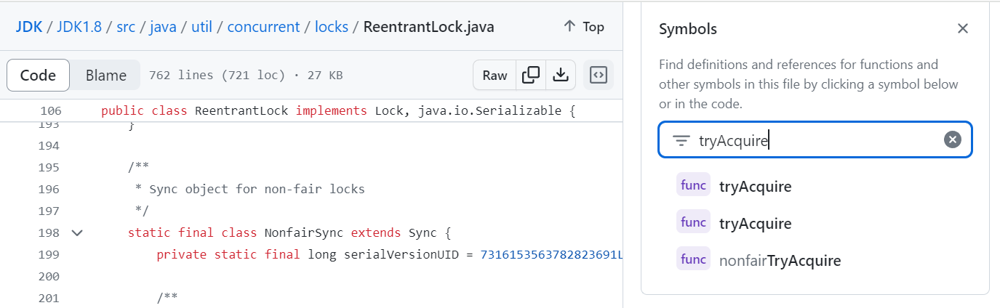
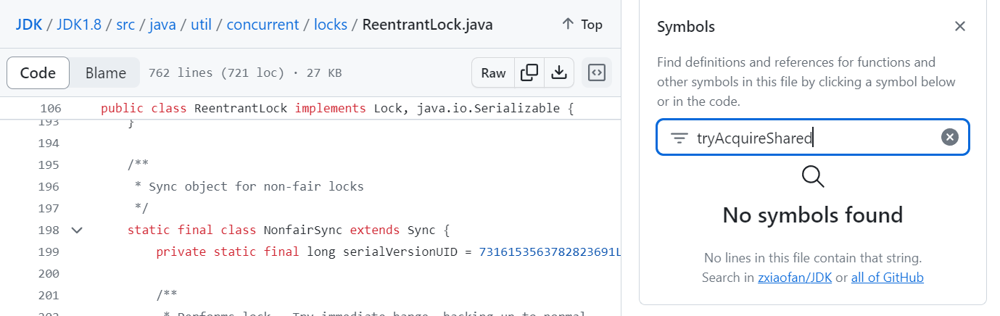
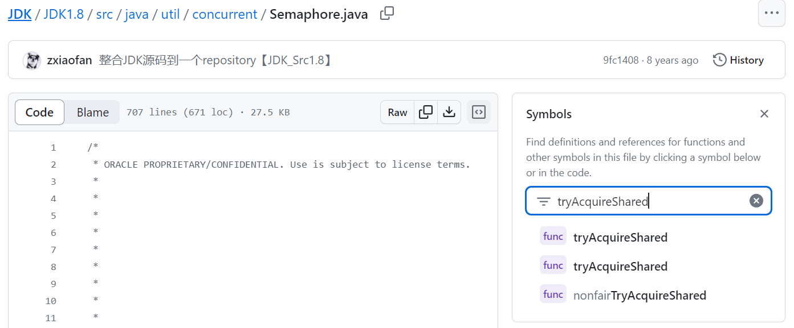
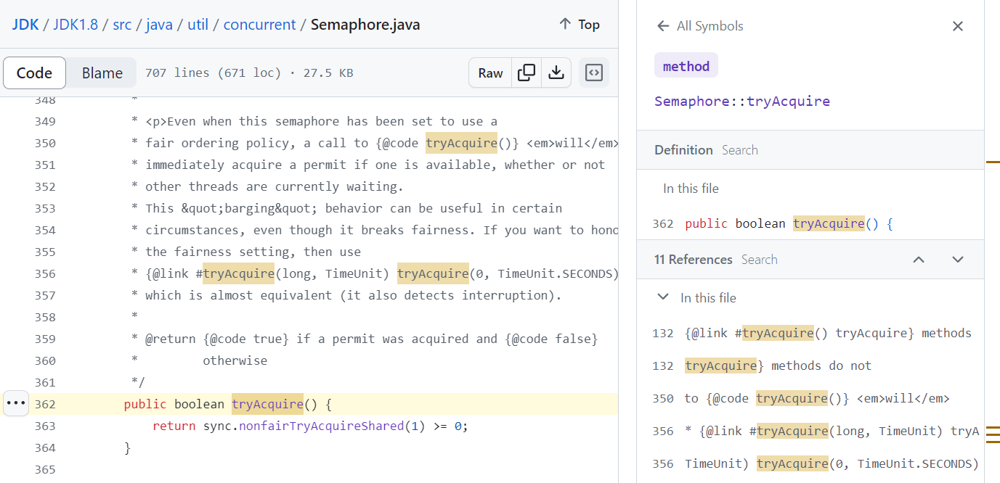

# ✅什么是AQS的独占模式和共享模式？

# 典型回答

AbstractQueuedSynchronizer（AQS）是Java并发包中的一个核心框架，用于构建锁和其他同步组件。

[✅如何理解AQS？](https://www.yuque.com/hollis666/aw7b67/qka9yt)

**它提供了一套基于FIFO队列的同步器框架，并支持独占模式和共享模式，这两种模式是用于实现同步组件的关键。**

****

+ 独占模式意味着一次只有一个线程可以获取同步状态。这种模式通常用于实现互斥锁，如ReentrantLock。
+ 共享模式允许多个线程同时获取同步状态。这种模式通常用于实现如信号量（Semaphore）和读写锁（ReadWriteLock的读锁）等同步组件。

AQS的各种实现类中，要么是基于独占模式实现的， 要么是基于共享模式实现的。

<u>举个例子。虽然不是很文雅，但是大家能懂。</u>

<u></u>

<u>1、独占模式：一次只能一个人用。其他人只能排队。就像是女厕所一样，每一个门只能进去一个人，进去一个人之后门就锁上了，其他人要等他出来之后再进。就像Java中的ReentrantLock</u>

<u>2、共享模式：只要还有名额，大家就都能用。就像是男厕所，他有小便池，只要有位置，就可以一起进来多个人，大家一起用。就像Java中的Semaphore</u>

在AQS中提供了很多和锁操作相关的方法，如：

+ tryAcquire、tryRelease、acquire、release等。
+ tryAcquireShared、tryReleaseShared、releaseShared、acquireShared等。

如果是独占模式，则需要实现tryAcquire、tryRelease、acquire、release等方法，如ReentrantLock：

如Semaphore则是实现了tryAcquireShared、tryReleaseShared等方法：

其中也有tryAcquire的实现，但是也是调用了tryAcquireShared来实现的：

### 
在独占模式中，状态通常表示是否被锁定（0表示未锁定，1表示锁定）。在共享模式中，状态可以表示可用的资源数量。

**当需要保证某个资源或一段代码在同一时间内只能被一个线程访问时，独占模式是最合适的选择。如我们经常用的ReentrantLock和ReadWriteLock中的写锁。**

****

**当资源或数据主要被多个线程读取，而写操作相对较少时，共享模式能够提高并发性能。如我们经常使用的Semaphore和CountDownLatch，用来多个线程控制共享资源的。还有ReadWriteLock中的读锁允许多个线程同时读取数据，只要没有线程在写入数据。**

> 更新: 2026-01-17 14:30:01  
> 原文: <https://www.yuque.com/hollis666/aw7b67/wk1gxv6xgqk0folv>