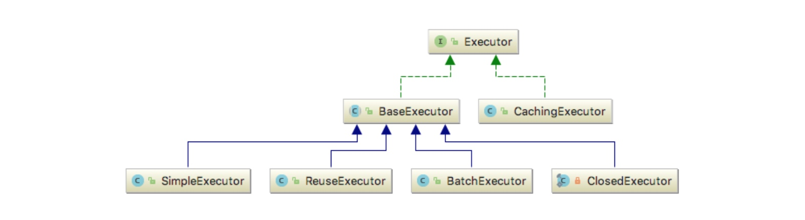

# ✅Mybatis的工作原理？

# \*\*<font style="color:rgb(38, 38, 38);"></font>\*\*典型回答

无论是Mybatis也好，Spring也罢，它们的执行过程无非可分为启动阶段和运行阶段：

启动阶段：

1. 定义配置文件，如XML，注解
2. 解析配置文件，将配置文件加载到内存当中

运行阶段：

1. 读取内存中的配置文件，并根据配置文件实现对应的功能

对于执行SQL的逻辑来讲，有如下步骤：

当配置完成之后，假如说我们要执行一个下面一个sql，那么该如何执行呢？

```java
TestMapper testMapper = session.getMapper(TestMapper.class);
Test test = testMapper.findOne(1);
```

### 代理类的生成

首先Mybatis会根据我们传入接口通过JDK动态代理，生成一个代理对象TestMapper，生成逻辑如下所示：

```java
public T newInstance(SqlSession sqlSession) {
    // mapperProxy实现了Invocationhandler接口，用于JDK动态代理
    final MapperProxy<T> mapperProxy = new MapperProxy<>(sqlSession, mapperInterface, methodCache);
    return newInstance(mapperProxy);
}
// 通过JDK动态代理生成对象
protected T newInstance(MapperProxy<T> mapperProxy) {
	return (T) Proxy.newProxyInstance(mapperInterface.getClassLoader(), new Class[] { mapperInterface }, mapperProxy);
}
```

代理类的主要逻辑在MapperProxy中，而代理逻辑则是通过MapperMethod完成的。

对于MapperMethod来说，它在创建的时候是需要读取XML或者方法注解的配置项，所以在使用的时候才能知道具体代理的方法的SQL内容。同时，这个类也会解析和记录被代理方法的入参和出参，以方便对SQL的查询占位符进行替换，同时对查询到的SQL结果进行转换。

### 执行SQL

代理类生成之后，就可以执行代理类的具体逻辑，也就是真正开始执行用户自定义的SQL逻辑了。

首先会进入到MapperMethod核心的执行逻辑，如下所示：

```java
public Object execute(SqlSession sqlSession, Object[] args) {
    Object result;
    switch (command.getType()) {
      case INSERT: {
      Object param = method.convertArgsToSqlCommandParam(args);
        result = rowCountResult(sqlSession.insert(command.getName(), param));
        break;
      }
      case UPDATE: {
        Object param = method.convertArgsToSqlCommandParam(args);
        result = rowCountResult(sqlSession.update(command.getName(), param));
        break;
      }
      case DELETE: {
        Object param = method.convertArgsToSqlCommandParam(args);
        result = rowCountResult(sqlSession.delete(command.getName(), param));
        break;
      }
      case SELECT:
        if (method.returnsVoid() && method.hasResultHandler()) {
          executeWithResultHandler(sqlSession, args);
          result = null;
        } else if (method.returnsMany()) {
          result = executeForMany(sqlSession, args);
        } else if (method.returnsMap()) {
          result = executeForMap(sqlSession, args);
        } else if (method.returnsCursor()) {
          result = executeForCursor(sqlSession, args);
        } else {
          Object param = method.convertArgsToSqlCommandParam(args);
          result = sqlSession.selectOne(command.getName(), param);
        }
        break;
      case FLUSH:
        result = sqlSession.flushStatements();
        break;
      default:
        throw new BindingException("Unknown execution method for: " + command.getName());
    }
     // ...
    return result;
  }
```

通过代码我们可以很清晰的发现，为什么Mybatis的insert，update和delete会返回行数的原因。业务处理上，我们经常通过update==1来判断当前语句是否更新成功。

这里一共做了两件事情，一件事情是通过BoundSql将方法的入参转换为SQL需要的入参形式，第二件事情就是通过SqlSession来执行对应的Sql。下面我们通过select来举例。

### 缓存

Sqlsession是Mybatis对Sql执行的封装，真正的SQL处理逻辑要通过Executor来执行。Executor有多个实现类，因为在查询之前，要先check缓存是否存在，所以默认使用的是CachingExecutor类，顾名思义，它的作用就是二级缓存。



CachingExecutor的执行逻辑如下所示：

```java
public <E> List<E> query(MappedStatement ms, Object parameterObject, RowBounds rowBounds, ResultHandler resultHandler, CacheKey key, BoundSql boundSql)
      throws SQLException {
    Cache cache = ms.getCache();
    if (cache != null) {
      flushCacheIfRequired(ms);
      if (ms.isUseCache() && resultHandler == null) {
        ensureNoOutParams(ms, boundSql);
        @SuppressWarnings("unchecked")
        List<E> list = (List<E>) tcm.getObject(cache, key);
        if (list == null) {
          list = delegate.<E> query(ms, parameterObject, rowBounds, resultHandler, key, boundSql);
          // 放缓存
          tcm.putObject(cache, key, list); // issue #578 and #116
        }
        return list;
      }
    }
    // 若二级缓存为空，则重新查询数据库
    return delegate.<E> query(ms, parameterObject, rowBounds, resultHandler, key, boundSql);
  }
```

二级缓存是和命名空间绑定的，如果多表操作的SQL的话，是会出现脏数据的。同时如果是不同的事务，也可能引起脏读，所以要慎重。

如果二级缓存没有命中则会进入到BaseExecutor中继续执行，在这个过程中，会调用一级缓存执行。

值得一提的是，在Mybatis中，缓存分为PerpetualCache, BlockingCache, LruCache等，这些cache的实现则是借用了装饰者模式。一级缓存使用的是PerpetualCache，里面是一个简单的HashMap。一级缓存会在更新的时候，事务提交或者回滚的时候被清空。换句话说，一级缓存是和SqlSession绑定的。

具体的细节可以参考：

[🔜Mybatis的缓存机制](https://www.yuque.com/hollis666/aw7b67/mapxqi)

### 查询数据库

如果一级缓存中没有的话，则需要调用JDBC执行真正的SQL逻辑。我们知道，在调用JDBC之前，是需要建立连接的，如下代码所示：

```java
private Statement prepareStatement(StatementHandler handler, Log statementLog) throws SQLException {
    Statement stmt;
    Connection connection = getConnection(statementLog);
    stmt = handler.prepare(connection, transaction.getTimeout());
    handler.parameterize(stmt);
    return stmt;
}
```

我们会发现，Mybatis并不是直接从JDBC获取连接的，通过数据源来获取的，Mybatis默认提供了是那种种数据源：JNDI，PooledDataSource和UnpooledDataSource，我们也可以引入第三方数据源，如Druid等。包括驱动等都是通过数据源获取的。

获取到Connection之后，还不够，因为JDBC的数据库操作是需要Statement的，所以Mybatis专门抽象出来了`StatementHandler`处理类来专门处理和JDBC的交互，如下所示：

```java
public <E> List<E> query(Statement statement, ResultHandler resultHandler) throws SQLException {
    String sql = boundSql.getSql();
    statement.execute(sql);
    return resultSetHandler.<E>handleResultSets(statement);
  }
```

其实这三行代码就代表了Mybatis执行SQL的核心逻辑：组装SQL，执行SQL，组装结果。仅此而已。

具体Sql是如何组装的呢？是通过BoundSql来完成的，具体组装的逻辑大家可以从`org.apache.ibatis.mapping.MappedStatement#getBoundSql`中了解，这里不再赘述。

### 处理查询结果

当我们获取到查询结果之后，就需要对查询结果进行封装，即把查询到的数据库字段映射为DO对象。

因为此时我们已经拿到了执行结果ResultSet，同时我们也在应用启动的时候在配置文件中配置了DO到数据库字段的映射ResultMap，所以通过这两个配置就可以转换。核心的转换逻辑是通过TypeHandler完成的，流程如下所示：

1. 创建返回的实体类对象，如果该类是延迟加载，则先生成代理类
2. 根据ResultMap中配置的数据库字段，将该字段从ResultSet取出来
3. 从ResultMap中获取映射关系，如果没有，则默认将下划线转为驼峰式命名来映射
4. 通过setter方法反射调用，将数据库的值设置到实体类对象当中


> 更新: 2024-12-08 23:51:17  
> 原文: <https://www.yuque.com/hollis666/aw7b67/rf9y4p>