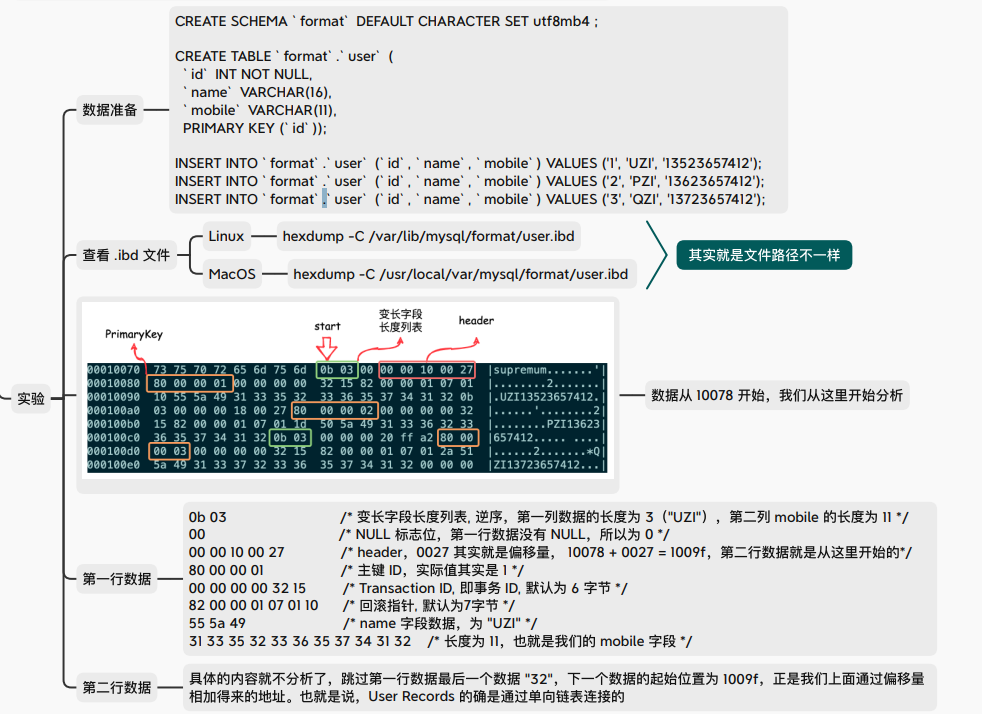

# ✅varchar(100)和varchar(10)有什么区别？

# 典型回答

### 基本差别

**最简单的区别**<code>**VARCHAR(10)**</code>**最多只能存储 10 个字符。**<code>**VARCHAR(100)**</code>**最多可以存储 100 个字符。**

> 这里是字符，不是字节哦！字节和字符之间的转换公式：**字符数 \* 字符集最大字节/字符，**例如，<code>**utf8mb4**</code> 最大 4 字节/字符，那么10个字符就占用<code>**10 * 4 = 40 字节**</code>

varchar在实际存储时只用实际字符长度 + 长度信息字节，不像 `CHAR` 会固定长度填充。 所以，如果他们同时存储"Hollis"的话，那么占用的**都是**6个字符数据，加上一个长度开销（根据编码方式不同）。这一点上没有什么不同的。

### 排序差别（重点）

如果，你用一个varchar来做排序，那么可能会有些细微的差别。

在《高性能MySQL》一书中，有这样一段描述：

> 较大的列会使用更多的内存，因为MySQL通常会在内部分配固定大小的内存来保存值。这对于使用内存临时表的排序或操作来说尤其糟糕。再利用磁盘临时表进行文件排序时也同样糟糕\*\*。\*\*
>
> **最好的策略是只分配真正需要的空间。**

***

解释一下。

**当 MySQL 执行排序**（如 `ORDER BY varchar_column`）时，它通常需要在内存（`sort_buffer`）中存储待排序行的相关字段值。对于 `VARCHAR` 列，**MySQL 在内存中为排序操作预留空间时，会考虑该列定义的最大长度 (**<code>**N**</code>**) 。**

* `VARCHAR(10)`： 内存中可能为每个值预留 `10 字符` 的空间，则最多预留 `10字符` + 长度字节。
* `VARCHAR(100)`： 内存中可能为每个值预留 `100 字符` + 长度字节。

而我们知道（不知道的看下面这篇文章），如果待排序的数据集太大，那么就会有两种结果：

1、如果单行的长度超过<code>**max_length_for_sort_data**</code>的值，MySQL就认为单行太大，那么就会采用**rowid 排序**，否则就进行全字段排序。但是rowid排序会多一次回表，性能可能没那么好。

2、如果要排序的数据量大于<code>**sort_buffer_size**</code>的值，MySQL 会将数据写入磁盘上的临时文件进行排序，这就要比基于内存排序要慢。

所以，**如果使用 **<code>**VARCHAR(100)**</code>** 作为排序字段更容易触发rowid排序和磁盘排序，且磁盘排序过程会更慢、I/O 开销更大。**

[✅order by 是怎么实现的？](https://www.yuque.com/hollis666/aw7b67/caou56)

和order by一样，group by也需要在临时表中处理和排序分组键。<code>VARCHAR(100)</code> 作为分组键会导致和 <code>ORDER BY</code> 一样的内存消耗大、易触发磁盘临时表的问题。

### 索引差别？

我看到有人提到过， 说varchar的长度会影响索引树的建立，说什么“<code>~~VARCHAR(100)~~</code>~~ 的索引页能存的索引项比 ~~<code>~~VARCHAR(10)~~</code>~~ 少  ~~”甚至ChatGPT也是这么说的:

(注意：错误信息，不要信）

(注意：错误信息，不要信）

其实，在 InnoDB 存储引擎中，索引并不是按照字段定义的最大长度（如 <code>VARCHAR(100)</code>）来分配固定空间的。InnoDB 采用了更高效的变长存储方式。也就是说在存储 <code>**VARCHAR**</code>、<code>**VARBINARY**</code>、<code>**TEXT**</code>、<code>**BLOB**</code> 等**变长字段**时，**只存储实际数据的字节长度**，而非按定义的最大长度预留空间。

大家可以看下这个文档（<https://smartkeyerror.oss-cn-shenzhen.aliyuncs.com/Psyduck/MySQL/InnoDB-Page.pdf>），其中有一个例子，就说明了在Innodb的数据中，User Records部分存储的是实际存储的字符长度。

> 更新: 2025-08-15 21:49:58  
> 原文: <https://www.yuque.com/hollis666/aw7b67/dg2ddbvmc2r3pw9f>