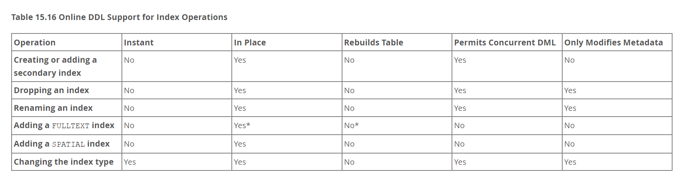

# ✅什么是OnlineDDL

# 典型回答

DDL，即Data Defination Language，是用于定义数据库结构的操作。DDL操作用于创建、修改和删除数据库中的表、索引、视图、约束等数据库对象，而不涉及实际数据的操作。以下是一些常见的DDL操作：

* CREATE
* ALTER
* DROP
* TRUNCATE

> 与DDL相对的是DML，即Data Manipulation Language，用于操作数据。即包括我们常用的INSERT、DELETE和UPDATE等。

在MySQL 5.6之前，所有的ALTER操作其实是会阻塞DML操作的，如：<font style="color:rgb(0, 0, 0);">添加/删除字段、添加/删除索引等，都是会锁表的。</font>

但是在MySQL 5.6中引入了Online DDL，OnLineDDL是MySQL5.6提出的加速DDL方案，\*\*<font style="background-color:#FBDE28;">尽最大可能</font>**保证DDL期间不阻塞DML动作。但是需要注意，这里说的**<font style="background-color:#FBDE28;">尽最大可能</font>\*\*意味着不是所有DDL语句都会使用OnlineDDL加锁。

Online DDL的优点就是可以减少阻塞，是MySQL的一种内置优化手段，但是需要注意的是，DDL在刚开始和快结束的时候，都需要获取MDL锁，而在获取锁的时候如果有事务未提交，那么DDL就会因为加锁失败而进入阻塞状态，也会造成性能影响。

还有就是，如果Online DDL操作失败，其回滚操作可能成本较高。以及长时间运行的Online DDL操作可能导致主从同步滞后。

**<u>但是需要注意的是，即使有了Online DDL，也不意味着就可以随意在业务高峰期进行DDL变更了</u>**：

[✅MySQL做索引更新的时候，会锁表吗？](https://www.yuque.com/hollis666/aw7b67/ue3wgwvc5x7nyugl)

使用方式：

```sql
ALTER TABLE tbl_name RENAME INDEX old_index_name TO new_index_name, ALGORITHM=INPLACE, LOCK=NONE;

ALTER TABLE tbl_name DROP COLUMN column_name, ALGORITHM=INSTANT;

ALTER TABLE tbl_name MODIFY COLUMN col_name column_definition FIRST, ALGORITHM=INPLACE, LOCK=NONE;

ALTER TABLE t1 ADD COLUMN (c2 INT GENERATED ALWAYS AS (c1 + 1) STORED), ALGORITHM=COPY;

```

即在SQL后增加`ALGORITHM=INPLACE, LOCK=NONE;`或者` ALGORITHM=INSTANT`、`ALGORITHM=COPY`

## 扩展阅读

## DDL算法

在MySQL 5.6支持Online DDL之前，有两种DDL的算法，分别是COPY和INPLACE。

我们可以使用如下SQL指定DDL算法：

```java
ALTER TABLE hollis_ddl_test ADD PRIMARY KEY (id) ,ALGORITHM=INPLACE,LOCK=NONE
```

### copy算法原理

1. 新建一张临时表
2. 对原表加共享MDL锁，禁止原表的写，只允许查询操作
3. 逐行拷贝原表数据到临时表，且不进行排序
4. 拷贝完成后升级原表锁为排他MDL锁，禁止原表读写
5. 对临时表rename操作，创建索引，完成DDL操作

[✅什么是MySQL的字典锁？](https://yuque.com/hollis666/aw7b67/ru6eaoolefdo0lor)

### INPLACE算法原理

INPLACE算法是MySQL 5.5中引入的，主要是为了优化索引的创建和删除过程的效率。INPLACE算法的原理是可能地使用**原地算法**进行DDL操作，而不是重新创建或复制表。

1. 创建索引数据字典，
2. 对原表加共享MDL锁，禁止原表的写，只允许查询操作
3. 根据聚集索引的顺序，查询表中的数据，并提取需要的索引列数据。将提取的索引数据进行排序，并插入到新的索引页中。
4. 等待当前表的所有只读事务提交。
5. 创建索引结束。

MySQL中的INPLACE其实还可以分为以下两种算法：

* inplace-no-rebuild ：对二级索引的增删改查、修改变长字段长度（如：varchar）、重命名列名都不需要重建原表
* inplace-rebuild：修改主键索引、增加删除列、修改字符集、创建全文索引等都需要重建原表。

## OnlineDDL算法

前面说过，ALGORITHM可以指定的DDL操作的算法，目前主要支持以下几种：

1. COPY算法
2. INPLACE算法
3. INSTANT算法：MySQL 8.0.12 引入的新算法，目前只支持添加列等少量操作，利用 8.0 新的表结构设计，可以直接修改表的元数据，省掉了重建原表的过程，极大的缩短了 DDL 语句的执行时间。其他类型的改表语句默认使用inplace算法。\
   关于instant支持的场景可参考官方文档[Online DDL Operations](https://dev.mysql.com/doc/refman/8.0/en/innodb-online-ddl-operations.html)
4. DEFAULT：如果不指定ALGORITHM，那么MySQL会自行选择默认算法，优先使用INSTANT、其次是INPLACE、再然后是COPY

以下是MySQL官网上给出的Online DDL对索引操作的支持情况：



## OnlineDDL的原理

以下是OnlineDDL的整体步骤，主要分为Prepare阶段、DDL执行阶段以及Commit阶段。

**Prepare阶段：**

1. 创建临时 frm 文件
2. 加EXCLUSIVE-MDL 锁，禁止读写
3. 根据alter类型，确定执行方式（copy/online-rebuild/online-norebuild）。这里需要注意如果使用copy算法，就不是OnLineDDL了。
4. 更新数据字典的内存对象
5. 分配row\_log对象，记录OnlineDDL过程中增量的DML
6. 生成新的临时idb文件

**Execute阶段：**

1. 降级EXCLUSIVE-MDL锁为SHARED-MDL锁，允许读写。
2. 扫描原表聚集索引的每一条记录。
3. 遍历新表的聚集索引和二级索引，逐一处理。
4. 根据原表中的记录构造对应的索引项。
5. 将构造的索引项插入sort\_buffer 块排序。
6. 将sort\_buffer块更新到新表的索引上。
7. 记录 OnlineDDL 执行过程中产生的增量（oinline-rebuild）。
8. 重放row\_log 中的操作到新表的索引上（online-not-rebuild 数据是在原表上更新）。
9. 重放row\_log 中的 DML 操作到新表的数据行上。

**Commit阶段：**

2. 升级到 EXCLUSIVE-MDL 锁，禁止读写。
3. 重做 row\_log 中最后一部分增量。
4. 更新 innodb 的数据字典表。
5. 提交事务，写redolog。
6. 修改统计信息。
7. rename 临时 ibd 文件，frm 文件。
8. 变更完成，释放 EXCLUSIVE-MDL 锁。

Prepare阶段和Commit阶段虽然也加了EXECLUSIVE-MDL锁，但操作非常轻，所以耗时较低。Execute阶段允许读写，通过row\_log记录期间变更的数据记录，最后再应用row\_log到新表中。最终实现OnLineDDL的效果。

## OnlineDDL使用限制

下表来自ALIYUN：<https://help.aliyun.com/zh/rds/support/how-do-i-perform-ddl-operations-online-on-apsaradb-rds-for-mysql>

| **<font style="color:rgb(24, 24, 24);">操作</font>** | **<font style="color:rgb(24, 24, 24);">是否支持Inplace</font>** | **<font style="color:rgb(24, 24, 24);">是否需要</font>\*\*\*\*<font style="color:rgb(24, 24, 24);">Copy Table</font>** | **<font style="color:rgb(24, 24, 24);">是否允许并发</font>\*\*\*\*<font style="color:rgb(24, 24, 24);">DML</font>** | **<font style="color:rgb(24, 24, 24);">是否允许并发查询</font>** |
| :--- | :--- | :--- | :--- | :--- |
| <font style="color:rgb(24, 24, 24);">创建普通索引</font> | <font style="color:rgb(24, 24, 24);">支持</font> | <font style="color:rgb(24, 24, 24);">不需要</font> | <font style="color:rgb(24, 24, 24);">允许</font> | <font style="color:rgb(24, 24, 24);">允许</font> |
| <font style="color:rgb(24, 24, 24);">创建全文索引</font> | <font style="color:rgb(24, 24, 24);">支持</font> | <font style="color:rgb(24, 24, 24);">不需要</font> | <font style="color:rgb(24, 24, 24);">不允许</font> | <font style="color:rgb(24, 24, 24);">允许</font> |
| <font style="color:rgb(24, 24, 24);">删除索引</font> | <font style="color:rgb(24, 24, 24);">支持</font> | <font style="color:rgb(24, 24, 24);">不需要</font> | <font style="color:rgb(24, 24, 24);">允许</font> | <font style="color:rgb(24, 24, 24);">允许</font> |
| <font style="color:rgb(24, 24, 24);">优化表</font> | <font style="color:rgb(24, 24, 24);">支持</font> | <font style="color:rgb(24, 24, 24);">需要</font> | <font style="color:rgb(24, 24, 24);">允许</font> | <font style="color:rgb(24, 24, 24);">允许</font> |
| <font style="color:rgb(24, 24, 24);">设置列默认值</font> | <font style="color:rgb(24, 24, 24);">支持</font> | <font style="color:rgb(24, 24, 24);">不需要</font> | <font style="color:rgb(24, 24, 24);">允许</font> | <font style="color:rgb(24, 24, 24);">允许</font> |
| <font style="color:rgb(24, 24, 24);">修改自增列值</font> | <font style="color:rgb(24, 24, 24);">支持</font> | <font style="color:rgb(24, 24, 24);">不需要</font> | <font style="color:rgb(24, 24, 24);">允许</font> | <font style="color:rgb(24, 24, 24);">允许</font> |
| <font style="color:rgb(24, 24, 24);">添加外键约束</font> | <font style="color:rgb(24, 24, 24);">支持</font> | <font style="color:rgb(24, 24, 24);">不需要</font> | <font style="color:rgb(24, 24, 24);">允许</font> | <font style="color:rgb(24, 24, 24);">允许</font> |
| <font style="color:rgb(24, 24, 24);">删除外键约束</font> | <font style="color:rgb(24, 24, 24);">支持</font> | <font style="color:rgb(24, 24, 24);">不需要</font> | <font style="color:rgb(24, 24, 24);">允许</font> | <font style="color:rgb(24, 24, 24);">允许</font> |
| <font style="color:rgb(24, 24, 24);">重命名列</font> | <font style="color:rgb(24, 24, 24);">支持</font> | <font style="color:rgb(24, 24, 24);">不需要</font> | <font style="color:rgb(24, 24, 24);">允许</font> | <font style="color:rgb(24, 24, 24);">允许</font> |
| <font style="color:rgb(24, 24, 24);">添加列</font> | <font style="color:rgb(24, 24, 24);">支持</font> | <font style="color:rgb(24, 24, 24);">需要</font> | <font style="color:rgb(24, 24, 24);">允许</font> | <font style="color:rgb(24, 24, 24);">允许</font> |
| <font style="color:rgb(24, 24, 24);">删除列</font> | <font style="color:rgb(24, 24, 24);">支持</font> | <font style="color:rgb(24, 24, 24);">需要</font> | <font style="color:rgb(24, 24, 24);">允许</font> | <font style="color:rgb(24, 24, 24);">允许</font> |
| <font style="color:rgb(24, 24, 24);">修改各列顺序</font> | <font style="color:rgb(24, 24, 24);">支持</font> | <font style="color:rgb(24, 24, 24);">需要</font> | <font style="color:rgb(24, 24, 24);">允许</font> | <font style="color:rgb(24, 24, 24);">允许</font> |
| <font style="color:rgb(24, 24, 24);">修改</font><font style="color:rgb(24, 24, 24);">Row\_Format</font><font style="color:rgb(24, 24, 24);">属性</font> | <font style="color:rgb(24, 24, 24);">支持</font> | <font style="color:rgb(24, 24, 24);">需要</font> | <font style="color:rgb(24, 24, 24);">允许</font> | <font style="color:rgb(24, 24, 24);">允许</font> |
| <font style="color:rgb(24, 24, 24);">修改</font><font style="color:rgb(24, 24, 24);">Key\_Block\_Size</font><font style="color:rgb(24, 24, 24);">属性</font> | <font style="color:rgb(24, 24, 24);">支持</font> | <font style="color:rgb(24, 24, 24);">需要</font> | <font style="color:rgb(24, 24, 24);">允许</font> | <font style="color:rgb(24, 24, 24);">允许</font> |
| <font style="color:rgb(24, 24, 24);">设置列为空值</font><font style="color:rgb(24, 24, 24);">Null</font> | <font style="color:rgb(24, 24, 24);">支持</font> | <font style="color:rgb(24, 24, 24);">需要</font> | <font style="color:rgb(24, 24, 24);">允许</font> | <font style="color:rgb(24, 24, 24);">允许</font> |
| <font style="color:rgb(24, 24, 24);">设置列不为空值</font><font style="color:rgb(24, 24, 24);">NOT Null</font> | <font style="color:rgb(24, 24, 24);">支持</font> | <font style="color:rgb(24, 24, 24);">需要</font> | <font style="color:rgb(24, 24, 24);">允许</font> | <font style="color:rgb(24, 24, 24);">允许</font> |
| <font style="color:rgb(24, 24, 24);">修改列的数据类型</font> | <font style="color:rgb(24, 24, 24);">不支持</font> | <font style="color:rgb(24, 24, 24);">需要</font> | <font style="color:rgb(24, 24, 24);">不允许</font> | <font style="color:rgb(24, 24, 24);">允许</font> |
| <font style="color:rgb(24, 24, 24);">添加主键</font> | <font style="color:rgb(24, 24, 24);">支持</font> | <font style="color:rgb(24, 24, 24);">需要</font> | <font style="color:rgb(24, 24, 24);">允许</font> | <font style="color:rgb(24, 24, 24);">允许</font> |
| <font style="color:rgb(24, 24, 24);">删除主键并添加新主键</font> | <font style="color:rgb(24, 24, 24);">支持</font> | <font style="color:rgb(24, 24, 24);">需要</font> | <font style="color:rgb(24, 24, 24);">允许</font> | <font style="color:rgb(24, 24, 24);">允许</font> |
| <font style="color:rgb(24, 24, 24);">删除主键</font> | <font style="color:rgb(24, 24, 24);">不支持</font> | <font style="color:rgb(24, 24, 24);">需要</font> | <font style="color:rgb(24, 24, 24);">不允许</font> | <font style="color:rgb(24, 24, 24);">允许</font> |
| <font style="color:rgb(24, 24, 24);">Convert character set</font> | <font style="color:rgb(24, 24, 24);">不支持</font> | <font style="color:rgb(24, 24, 24);">需要</font> | <font style="color:rgb(24, 24, 24);">不允许</font> | <font style="color:rgb(24, 24, 24);">允许</font> |
| <font style="color:rgb(24, 24, 24);">Specify character set</font> | <font style="color:rgb(24, 24, 24);">不支持</font> | <font style="color:rgb(24, 24, 24);">需要</font> | <font style="color:rgb(24, 24, 24);">不允许</font> | <font style="color:rgb(24, 24, 24);">允许</font> |
| <font style="color:rgb(24, 24, 24);">带</font><font style="color:rgb(24, 24, 24);">force</font><font style="color:rgb(24, 24, 24);">选项重建表</font> | <font style="color:rgb(24, 24, 24);">支持</font> | <font style="color:rgb(24, 24, 24);">需要</font> | <font style="color:rgb(24, 24, 24);">允许</font> | <font style="color:rgb(24, 24, 24);">允许</font> |
| <font style="color:rgb(24, 24, 24);">重建表</font><br/><font style="color:rgb(24, 24, 24);">alter table ... engine=innodb</font> | <font style="color:rgb(24, 24, 24);">支持</font> | <font style="color:rgb(24, 24, 24);">需要</font> | <font style="color:rgb(24, 24, 24);">允许</font> | <font style="color:rgb(24, 24, 24);">允许</font> |
| <font style="color:rgb(24, 24, 24);">设置表的 persistent statistics</font> | <font style="color:rgb(24, 24, 24);">支持</font> | <font style="color:rgb(24, 24, 24);">不需要</font> | <font style="color:rgb(24, 24, 24);">允许</font> | <font style="color:rgb(24, 24, 24);">允许</font> |
| <font style="color:rgb(24, 24, 24);">修改表注释</font> | <font style="color:rgb(24, 24, 24);">支持</font> | <font style="color:rgb(24, 24, 24);">不需要</font> | <font style="color:rgb(24, 24, 24);">允许</font> | <font style="color:rgb(24, 24, 24);">允许</font> |


> 更新: 2025-08-02 13:46:07  
> 原文: <https://www.yuque.com/hollis666/aw7b67/lwxtmggon7ir4zzz>