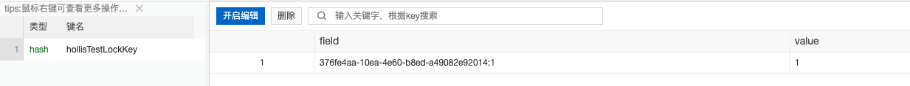
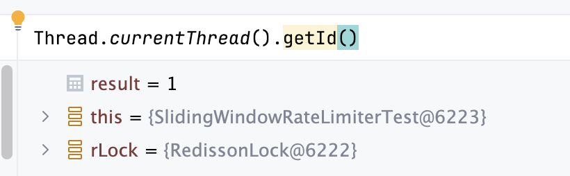

# ✅Redisson如何保证解锁的线程一定是加锁的线程？

# 典型回答

在分布式锁的实现中，有一个比较重要的问题就是误解锁的问题，如何有效的避免A线程加的锁被B线程给解锁是非常重要的。

Redisson作为一个分布式锁用的比较多的框架，他是如何实现的这个功能呢？我们通过源码来深入展开介绍一下。

以下是 lock 方法，也就是加锁的入口，

```plain
@Override
public void lock(long leaseTime, TimeUnit unit) {
    try {
        lock(leaseTime, unit, false);
    } catch (InterruptedException e) {
        throw new IllegalStateException();
    }
}
```

这里调用了一个<code><font style="color:#080808;background-color:#ffffff;">lock(long leaseTime, TimeUnit unit, boolean interruptibly) </font></code><font style="color:#080808;background-color:#ffffff;">方法，放方法的大致内容是：</font>

<font style="color:#080808;background-color:#ffffff;"></font>

```plain
private void lock(long leaseTime, TimeUnit unit, boolean interruptibly) throws InterruptedException {
  long threadId = Thread.currentThread().getId();
  Long ttl = tryAcquire(-1, leaseTime, unit, threadId);
}
```

�

我精简了一下，只保留了关键部分，也就是说，在方法中，获取了当前线程的threadId，然后把他传到了tryAcquire方法中进行加锁。

这个方法最终会调用到<code><font style="color:#080808;background-color:#ffffff;">tryLockInnerAsync(long waitTime, long leaseTime, TimeUnit unit, long threadId, RedisStrictCommand<T> command)</font></code><font style="color:#080808;background-color:#ffffff;">这个方法。</font>

<font style="color:#080808;background-color:#ffffff;"></font>

<font style="color:#080808;background-color:#ffffff;">这个方法的第四个参数就是刚刚我们获取的线程 ID，然后这个方法的内容是啥呢？</font>

<font style="color:#080808;background-color:#ffffff;"></font>

```plain
<T> RFuture<T> tryLockInnerAsync(long waitTime, long leaseTime, TimeUnit unit, long threadId, RedisStrictCommand<T> command) {
    return evalWriteAsync(getRawName(), LongCodec.INSTANCE, command,
            "if ((redis.call('exists', KEYS[1]) == 0) " +
                        "or (redis.call('hexists', KEYS[1], ARGV[2]) == 1)) then " +
                    "redis.call('hincrby', KEYS[1], ARGV[2], 1); " +
                    "redis.call('pexpire', KEYS[1], ARGV[1]); " +
                    "return nil; " +
                "end; " +
                "return redis.call('pttl', KEYS[1]);",
            Collections.singletonList(getRawName()), unit.toMillis(leaseTime), getLockName(threadId));
}

```

�

这是一段 lua 脚本，这里使用线程 ID 调用getLockName方法得到了一个锁的name，然后把他传到 lua 脚本中进行执行。

```plain
protected String getLockName(long threadId) {
    return id + ":" + threadId;
}
```

在 lua 脚本中，可以简单的认为他把线程 ID 传了进去，然后脚本中的`redis.call('hincrby', KEYS[1], ARGV[2], 1); `里面的`KEYS[1]`就是加锁的 key，而`ARGV[2]`就是我们的线程 id

hincrby 命令用于为哈希表中的字段值加上指定增量值语法如下：

> HINCRBY KEY\_NAME FIELD\_NAME INCR\_BY\_NUMBER

比如以下是我加锁后的一个 redis 中存储的信息：



可以看到，这里面的`376fe4aa-10ea-4e60-b8ed-a49082e92014:1`中的后半段"1"就是我的线程 ID，因为我在 debug，所以只有一个线程：



那么也就是说**Redisson 在加锁的时候，会把当前线程 ID 当作 hash结构中的 filed 进行存储下来。**

***

那么，解锁的时候，是如何校验这个线程 id 的呢？解锁的方法如下：

***

```plain
@Override
public void unlock() {
  try {
      get(unlockAsync(Thread.currentThread().getId()));
  } catch (RedisException e) {
      if (e.getCause() instanceof IllegalMonitorStateException) {
          throw (IllegalMonitorStateException) e.getCause();
      } else {
          throw e;
      }
  }
```

可以看到，这里同样获取了一个线程 ID，然后传给了unlockAsync方法，最终调用到unlockAsync0方法：

```plain
private RFuture<Void> unlockAsync0(long threadId) {
        CompletionStage<Boolean> future = unlockInnerAsync(threadId);
        CompletionStage<Void> f = future.handle((opStatus, e) -> {
            cancelExpirationRenewal(threadId);

            if (e != null) {
                if (e instanceof CompletionException) {
                    throw (CompletionException) e;
                }
                throw new CompletionException(e);
            }
            if (opStatus == null) {
                IllegalMonitorStateException cause = new IllegalMonitorStateException("attempt to unlock lock, not locked by current thread by node id: "
                        + id + " thread-id: " + threadId);
                throw new CompletionException(cause);
            }

            return null;
        });

        return new CompletableFutureWrapper<>(f);
    }
```

然后继续看关键方法`unlockInnerAsync(threadId);`，不出意外，还是个 lua 脚本：

```plain
 protected RFuture<Boolean> unlockInnerAsync(long threadId, String requestId, int timeout) {
    return evalWriteAsync(getRawName(), LongCodec.INSTANCE, RedisCommands.EVAL_BOOLEAN,
        "local val = redis.call('get', KEYS[3]); " +
              "if val ~= false then " +
                  "return tonumber(val);" +
              "end; " +

              "if (redis.call('hexists', KEYS[1], ARGV[3]) == 0) then " +
                  "return nil;" +
              "end; " +
              "local counter = redis.call('hincrby', KEYS[1], ARGV[3], -1); " +
              "if (counter > 0) then " +
                  "redis.call('pexpire', KEYS[1], ARGV[2]); " +
                  "redis.call('set', KEYS[3], 0, 'px', ARGV[5]); " +
                  "return 0; " +
              "else " +
                  "redis.call('del', KEYS[1]); " +
                  "redis.call(ARGV[4], KEYS[2], ARGV[1]); " +
                  "redis.call('set', KEYS[3], 1, 'px', ARGV[5]); " +
                  "return 1; " +
              "end; ",
          Arrays.asList(getRawName(), getChannelName(), getUnlockLatchName(requestId)),
          LockPubSub.UNLOCK_MESSAGE, internalLockLeaseTime,
          getLockName(threadId), getSubscribeService().getPublishCommand(), timeout);
}

```

这里同样是调用了<font style="color:#080808;background-color:#ffffff;">getLockName(threadId)来获取一个 field 的名字，最终拿到的应该是和加锁时候一样的，因为线程 ID 相同，方法也是同一个，拿结果肯定也一样。</font>

<font style="color:#080808;background-color:#ffffff;"></font>

<font style="color:#080808;background-color:#ffffff;">脚本中关键的是这句：</font>

<font style="color:#080808;background-color:#ffffff;"></font>

```plain
if (redis.call('hexists', KEYS[1], ARGV[3]) == 0) then return nil;
```

这里的KEYS\[1]就是你加锁的 key，ARGV\[3]就是我们传入的那个带着线程 ID 的 lockName，那这段代码其实是判断当前的 hash 结构中是否有一个 filed 为我们指定的线程 ID 一致的 k-v 对，如果没有，说明不是当前线程加的锁。那么就解锁失败。

如果有，则说明是当前线程加的锁，那么就可以进行解锁，执行后面的脚本就行了。

所以， 简单点说，就是 **Redisson 的 unlock 方法在解锁时，会去判断当前线程 ID 是否存在于redis 的加锁的 hash 结构中，如果有则认为可以解锁，如果没有，则无法解锁。**

总结一下，就是**加锁的时候把线程 id 存进去，解锁的时候再校验，一致就可以解，不一致就不能解。**

***

# 扩展知识

[✅watchdog解锁失败，会不会导致一直续期下去？](https://www.yuque.com/hollis666/aw7b67/kufqnzmzvxm2sf5o)


> 更新: 2024-12-08 23:50:44  
> 原文: <https://www.yuque.com/hollis666/aw7b67/mtfd25g8imxnamo6>