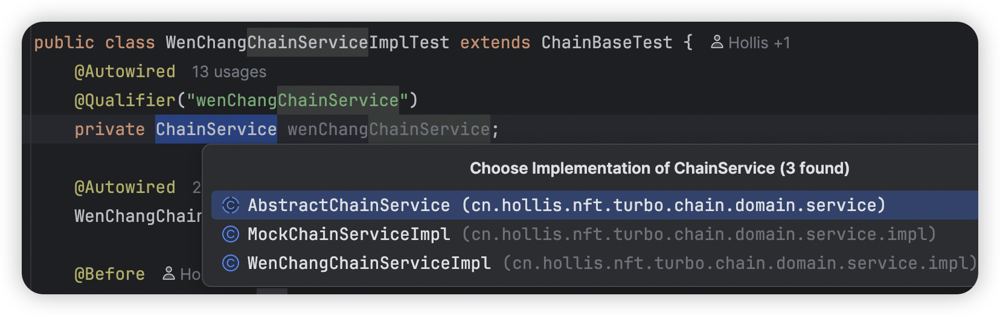
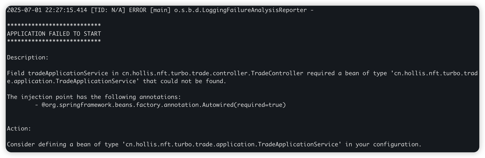
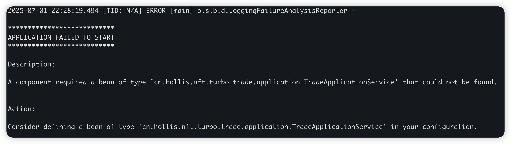

# ✅Autowired和Resource的关系？

# 典型回答

## 相同点

对于下面的代码来说，如果是Spring容器的话，两个注解的功能基本是等价的，他们都可以将bean注入到对应的field中。

```java
@Autowired
private Bean beanA;

@Resource
private Bean beanB;
```

## 不同点

### 支持方不同

**Autowired是Spring提供的自动注入注解，只有Spring容器会支持，如果做容器迁移，是需要修改代码的。**

以下是Autowired注解的定义，可以看到他是属于spring的包下面的。

```plain
package org.springframework.beans.factory.annotation;

import java.lang.annotation.Documented;
import java.lang.annotation.ElementType;
import java.lang.annotation.Retention;
import java.lang.annotation.RetentionPolicy;
import java.lang.annotation.Target;

@Target({ElementType.CONSTRUCTOR, ElementType.METHOD, ElementType.PARAMETER, ElementType.FIELD, ElementType.ANNOTATION_TYPE})
@Retention(RetentionPolicy.RUNTIME)
@Documented
public @interface Autowired {
    boolean required() default true;
}
```

�

**Resource是JDK官方提供的自动注入注解（JSR-250）。它等于说是一个标准或者约定，所有的IOC容器都会支持这个注解。假如系统容器从Spring迁移到其他IOC容器中，是不需要修改代码的。**

***

以下是Resource注解的定义，他是属于jakarta这个包（旧版在javax中）的。

> jakarta ee：`Jakarta EE` 和 `Java EE` 本质上是同一个技术规范体系的不同命名阶段，可以简单理解为以前叫javaee，后来叫jakarta ee了。

```plain
package jakarta.annotation;

import java.lang.annotation.ElementType;
import java.lang.annotation.Repeatable;
import java.lang.annotation.Retention;
import java.lang.annotation.RetentionPolicy;
import java.lang.annotation.Target;

@Target({ElementType.TYPE, ElementType.FIELD, ElementType.METHOD})
@Retention(RetentionPolicy.RUNTIME)
@Repeatable(Resources.class)
public @interface Resource {
    String name() default "";

    String lookup() default "";

    Class<?> type() default Object.class;

    AuthenticationType authenticationType() default Resource.AuthenticationType.CONTAINER;

    boolean shareable() default true;

    String mappedName() default "";

    String description() default "";

    public static enum AuthenticationType {
        CONTAINER,
        APPLICATION;
    }
}
```

### byName和byType匹配顺序不同

1. Autowired在获取bean的时候，先是byType的方式，再是byName的方式。意思就是先在Spring容器中找以Bean为类型的Bean实例，如果找不到或者找到多个bean，则会通过fieldName来找。举个例子：

```java
@Component("beanOne")
class BeanOne implements Bean {}
@Component("beanTwo")
class BeanTwo implements Bean {}
@Service
class Test {
    // 此时会报错，先byType找到两个bean：beanOne和beanTwo
    // 然后通过byName（bean）仍然没办法匹配
	@Autowired
    private Bean bean; 

    // 先byType找到两个bean，然后通过byName确认最后要注入的bean
    @Autowired
    private Bean beanOne;

    // 先byType找到两个bean，然后通过byName确认最后要注入的bean
    @Autowired
    @Qualifier("beanOne")
    private Bean bean;
}
```

2. Resource在获取bean的时候，和Autowired恰好相反，先是byName方式，然后再是byType方式。当然，我们也可以通过注解中的参数显示指定通过哪种方式。同样举个例子：

```java
@Component("beanOne")
class BeanOne implements Bean {}
@Component("beanTwo")
class BeanTwo implements Bean {}
@Service
class Test {
    // 此时会报错，先byName，发现没有找到bean
    // 然后通过byType找到了两个Bean：beanOne和beanTwo，仍然没办法匹配
	@Resource
    private Bean bean; 

    // 先byName直接找到了beanOne，然后注入
    @Resource
    private Bean beanOne;

    // 显示通过byType注入，能注入成功
    @Resource(type = BeanOne.class)
    private Bean bean;
}
```

### 作用域不同

1. Autowired可以作用在构造器，字段，setter方法上
2. Resource 只可以使用在字段，setter方法上，不支持构造器注入

### 多个bean注入情况不同

因为Autowired是优先按照byType注入的，那么如果一个接口有多个bean的实例的时候，注入的时候<font style="color:rgb(64, 64, 64);">需要配合 </font><code><font style="color:rgb(64, 64, 64);background-color:rgb(236, 236, 236);">@Qualifier("beanName")</font></code><font style="color:rgb(64, 64, 64);"> 来指定要注入的具体 Bean 的名称。否则会抛出 </font><code><font style="color:rgb(64, 64, 64);background-color:rgb(236, 236, 236);">NoUniqueBeanDefinitionException</font></code><font style="color:rgb(64, 64, 64);">。</font>

<font style="color:rgb(64, 64, 64);"></font>

如以下示例中，ChainService有多个实现的时候，需要Qualifier指定具体要注入的beanName



<font style="color:rgb(64, 64, 64);">因为Resouece是优先使用名称匹配的。如果通过名称（显式指定或默认推导）唯一确定了 Bean，则注入它。如果按名称找不到，但按类型找到了多个，</font>**<font style="color:rgb(64, 64, 64);">同样会抛出异常</font>**<font style="color:rgb(64, 64, 64);">。此时也需要配合 </font><code>**<font style="color:rgb(64, 64, 64);background-color:rgb(236, 236, 236);">@Qualifier</font>**</code><font style="color:rgb(64, 64, 64);"> 或在 </font><code>**<font style="color:rgb(64, 64, 64);background-color:rgb(236, 236, 236);">@Resource</font>**</code><font style="color:rgb(64, 64, 64);"> 中指定 </font><code>**<font style="color:rgb(64, 64, 64);background-color:rgb(236, 236, 236);">name</font>**</code><font style="color:rgb(64, 64, 64);"> 来解决。</font>

<font style="color:rgb(64, 64, 64);"></font>

### **<font style="color:rgb(64, 64, 64);">可选性不同</font>**

\*\*Autowire可以通过 \*\*<code>**required = false**</code>**属性设置依赖bean可以不必须存在**。如果找不到要注入 Bean 时会注入 `null`，不报错。

而如果没有指定required，默认就是这个bean要存在的，不存在则启动报错。



Resource没有直接的 `required`属性。用它注入的Bean必须存在。如果找不到匹配的 Bean，会抛出异常。




> 更新: 2025-07-16 19:35:45  
> 原文: <https://www.yuque.com/hollis666/aw7b67/gai6a9>