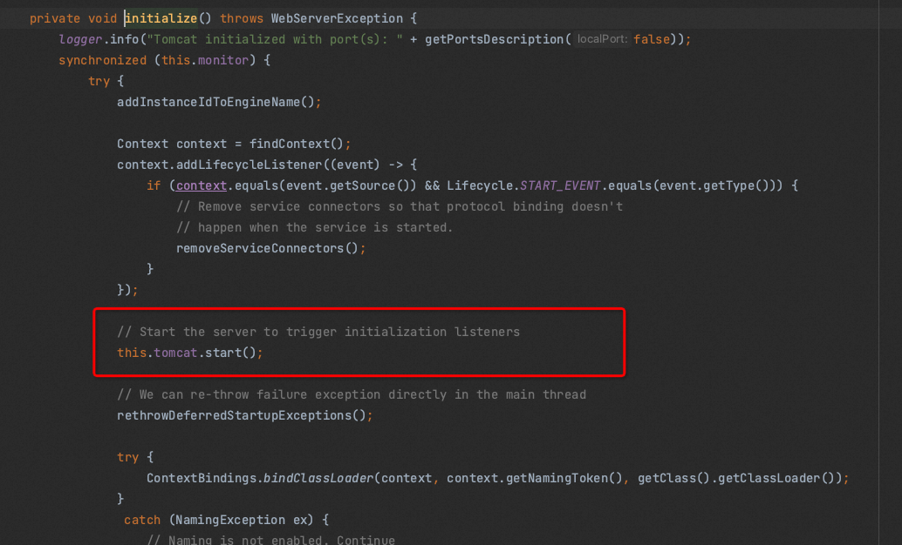

# ✅SpringBoot是如何实现main方法启动Web项目的？

# 典型回答

在Spring Boot中，通过SpringApplication类的静态方法run来启动Web项目。当我们在main方法中调用run方法时，Spring Boot使用一个**内嵌的Tomcat服务器**，并将其配置为处理Web请求。

当应用程序启动时，Spring Boot会自动扫描应用程序中所有的Spring组件，并使用默认的配置来启动内嵌的Tomcat服务器。在默认情况下，Spring Boot会自动配置大部分的Web开发所需的配置，包括请求处理、视图解析、静态资源处理等。

这样，在应用程序启动后，我们就可以通过Web浏览器访问应用程序了。例如，在默认情况下，可以通过访问http://localhost:8080 来访问应用程序的首页。

但是，很多人都会忽略一个关键的步骤（网上很多介绍SpringBoot启动流程的都没提到），那就是Web容器的启动，及Tomcat的启动其实也是在这个步骤。

### 实现原理

在SpringBoot的启动流程中，会调用SpringApplication.run方法，这个方法会有一个步骤进行上下文刷新（refreshContext），然后这个过程中，会调用一个关键的方法onRefresh。

[✅SpringBoot的启动流程是怎么样的？](https://www.yuque.com/hollis666/aw7b67/fadkbgd4fyv8816p)

调用链：`SpringApplication.run -> refreshContext -> refresh -> onRefresh`

在refresh-> onRefresh中，这里会调用到ServletWebServerApplicationContext的onRefresh中：

```java
@Override
protected void onRefresh() {
    super.onRefresh();
    try {
        createWebServer();
    }
    catch (Throwable ex) {
        throw new ApplicationContextException("Unable to start web server", ex);
    }
}


private void createWebServer() {
    WebServer webServer = this.webServer;
    ServletContext servletContext = getServletContext();
    if (webServer == null && servletContext == null) {
        StartupStep createWebServer = getApplicationStartup().start("spring.boot.webserver.create");
        ServletWebServerFactory factory = getWebServerFactory();
        createWebServer.tag("factory", factory.getClass().toString());
        this.webServer = factory.getWebServer(getSelfInitializer());
        createWebServer.end();
        getBeanFactory().registerSingleton("webServerGracefulShutdown",
                new WebServerGracefulShutdownLifecycle(this.webServer));
        getBeanFactory().registerSingleton("webServerStartStop",
                new WebServerStartStopLifecycle(this, this.webServer));
    }
    else if (servletContext != null) {
        try {
            getSelfInitializer().onStartup(servletContext);
        }
        catch (ServletException ex) {
            throw new ApplicationContextException("Cannot initialize servlet context", ex);
        }
    }
    initPropertySources();
}
```

这里面的�createWebServer方法中，调用到factory.getWebServer(getSelfInitializer());的时候，factory有三种实现，分别是JettyServletWebServerFactory、TomcatServletWebServerFactory、UndertowServletWebServerFactory这三个，默认使用TomcatServletWebServerFactory。

TomcatServletWebServerFactory的getWebServer方法如下，这里会创建一个Tomcat

```java
@Override
public WebServer getWebServer(ServletContextInitializer... initializers) {
    if (this.disableMBeanRegistry) {
        Registry.disableRegistry();
    }
    Tomcat tomcat = new Tomcat();
    File baseDir = (this.baseDirectory != null) ? this.baseDirectory : createTempDir("tomcat");
    tomcat.setBaseDir(baseDir.getAbsolutePath());
    for (LifecycleListener listener : this.serverLifecycleListeners) {
        tomcat.getServer().addLifecycleListener(listener);
    }
    Connector connector = new Connector(this.protocol);
    connector.setThrowOnFailure(true);
    tomcat.getService().addConnector(connector);
    customizeConnector(connector);
    tomcat.setConnector(connector);
    tomcat.getHost().setAutoDeploy(false);
    configureEngine(tomcat.getEngine());
    for (Connector additionalConnector : this.additionalTomcatConnectors) {
        tomcat.getService().addConnector(additionalConnector);
    }
    prepareContext(tomcat.getHost(), initializers);
    return getTomcatWebServer(tomcat);
}
```

�

�在最后一步getTomcatWebServer(tomcat);的代码中，会创建一个TomcatServer，并且把他启动：

```java
protected TomcatWebServer getTomcatWebServer(Tomcat tomcat) {
    return new TomcatWebServer(tomcat, getPort() >= 0, getShutdown());
}


public TomcatWebServer(Tomcat tomcat, boolean autoStart, Shutdown shutdown) {
    Assert.notNull(tomcat, "Tomcat Server must not be null");
    this.tomcat = tomcat;
    this.autoStart = autoStart;
    this.gracefulShutdown = (shutdown == Shutdown.GRACEFUL) ? new GracefulShutdown(tomcat) : null;
    initialize();
}
```

�

�接下来在initialize中完成了tomcat的启动。



# 扩展知识

## 修改web服务器

**除了默认的Tomcat之外，Spring Boot还支持内嵌Jetty和Undertow服务器。**

我们可以通过修改pom.xml文件中的依赖项来切换到其他的内嵌Web服务器。例如，如果我们想使用Undertow作为内嵌服务器，我们可以将以下依赖项添加到pom.xml文件中：

```plain
<dependency>
    <groupId>org.springframework.boot</groupId>
    <artifactId>spring-boot-starter-undertow</artifactId>
</dependency>
```

除了修改依赖项之外，我们还可以通过在application.properties或application.yml文件中设置server属性来配置内嵌Web服务器。例如，如果我们想将端口号从默认的8080更改为9090，我们可以在application.properties文件中添加以下属性：

```plain
server.port=9090
```

除了端口号之外，我们还可以在这里设置其他的Web服务器属性，例如上下文路径、SSL证书等。更多有关配置内嵌Web服务器的信息，可以参考Spring Boot官方文档。


> 更新: 2024-12-08 23:51:45  
> 原文: <https://www.yuque.com/hollis666/aw7b67/xc2sq4>