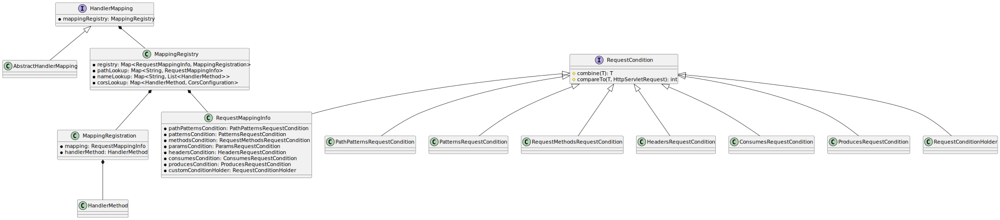
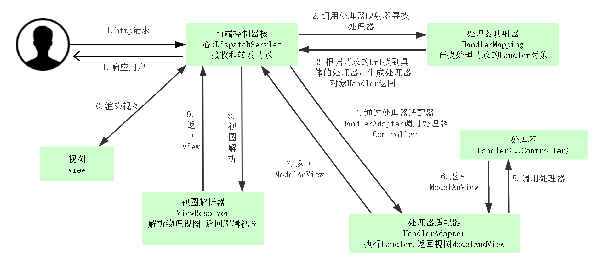

# ✅SpringMVC是如何将不同的Request路由到不同Controller中的？

# 典型回答

在计算机程序处理中，但凡涉及到路由，那包含到的数据结构一定是和map相关的。所以对于url和controller之间的映射，如果交给我们来设计的话，可能会用一个大的map将url和controller中对应的方法作为键值对存储起来，以此来达到路由的目的。

对于Spring MVC的流程中来说，当http请求进入tomcat并在`HttpServlet`中处理的时候，首先会解析http request中的数据，以此来拿到对应的`HandlerMethod`（`HandlerMethod`封装了对应的`Method`和持有它的Bean）。明白了这一层，本问题就会从**不同的request如何路由到不同的Controller**变为**不同的request如何拿到对应的**<code>**HandlerMethod**</code>

Spring MVC在启动的时候，会把带有`@RequestMapping`注解的方法和类封装成一个`RequestMappingInfo�`和`HandlerMethod`，然后注册到`MappingRegistry`。当`HttpServletRequest�`访问时，会通过`AbstractHandlerMethodMapping#lookupHandlerMethod`方法获取对应的`HandlerMethod�`，核心代码如下：

```java
protected HandlerMethod lookupHandlerMethod(String lookupPath, HttpServletRequest request) throws Exception {
    List<Match> matches = new ArrayList<>();
    // 先通过url获取到对应的RequestMappingInfo集合
    List<T> directPathMatches = this.mappingRegistry.getMappingsByDirectPath(lookupPath);
    if (directPathMatches != null) {
        // 把RequestMappingInfo和HandlerMethod放到match里面
        addMatchingMappings(directPathMatches, matches, request);
    }
    if (matches.isEmpty()) {
        addMatchingMappings(this.mappingRegistry.getRegistrations().keySet(), matches, request);
    }
    if (!matches.isEmpty()) {
        Match bestMatch = matches.get(0);
        // 如果匹配到多个Match（譬如url相同但是方法不同），则通过RequestMappingInfo中的各种condition匹配出对应的bestMatch
        if (matches.size() > 1) {
        }
        // 获取match中的HandlerMethod
        return bestMatch.getHandlerMethod();
    }
    else {
        return handleNoMatch(this.mappingRegistry.getRegistrations().keySet(), lookupPath, request);
    }
}
```

**要知道，一个http请求中，携带有不同的信息，如url，method，header等等，SpringMVC通过Match类统一封装所有的RequestMappingInfo中的各种condition，同时利用compare方法，直接比较出最优的那个handlerMethod。同时，不管是RequestMappingInfo和其组合的各个condition都实现了RequestCondition接口，所以，这也符合组合模式的基本思想**

为了让大家能更清楚的明白各个类之间的关系，我特意画了个类图，如下：



通过类图我们可以发现，SpringMVC有一个特别巧秒的地方，就是抽出一个RequestMappingInfo去聚合@RequestMapping注解的各种匹配方法，这有一点像门面模式。

**这一块涉及到的设计模式有组合模式和门面模式，非常推荐读者朋友通过源码再次深入理解，相信一定会有收获！**

# 知识扩展

## SpringMVC的执行流程是什么样的？

我们知道，对于Http请求来说，tomcat执行了`HttpServlet#service`方法，继承了HttpServlet的FrameWorkServlet则是执行`doService`方法，而SpringMVC的`DispatcherServlet`则是继承了FrameworkServlet，进入到SpringMVC的流程中，在DispatcherServlet中的流程如下：

1. 先通过`HandlerMapping`拿到request对应的`HandlerExecutionChain`，然后再拿到`HandlerExecutionChain`中handler对应的`HandlerAdapter`，执行`HandlerExecutionChain`中`interceptor#prehandle`方法。（责任链模式）
2. 再通过`HandlerAdapter`去执行handler，handler其实对应的是之前注册的`HandlerMethod`（handlerMethod里面封装的映射的真正方法 handler还有可能是原生的Servlet），所以要执行`handler.invoke`，不过在这之前要去判断参数，这一步需要参数解析器`HandlerMethodArgumentResolver`。反射调用完之后，需要调用返回值解析器`HandlerMethodReturnValueHanlder`（适配器模式&组合模式&策略模式）
3. 真正方法执行完了之后，再执行`HandlerExecutionChain`中`interceptor#posthandle`方法进行拦截器的后置处理。
4. SpringMVC执行完之后返回的是`ModelAndView`，我们还需要对`ModelAndView`进行render，即把`ModelAndView`中的view渲染到response中
5. 当发生异常时，会将异常拉到用户业务自己的异常处理方法中，这时也需要对参数和返回值进行custom，此时就需要用到`HandlerExceptionResolver`系列了。因为用户标记的`@ExceptionHandler`方法已经被`ExceptionHandlerMethodResolver`找到并且注册（key为对应异常，value为对应方法），只需要调用该方法就可以对异常进行处理，此时的方法调用和之前的handler几乎没有区别

SpringMVC的执行流程图如下：




> 更新: 2024-12-08 23:51:42  
> 原文: <https://www.yuque.com/hollis666/aw7b67/kdhprf>