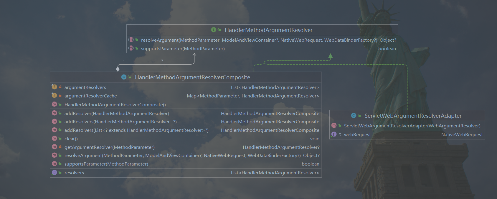
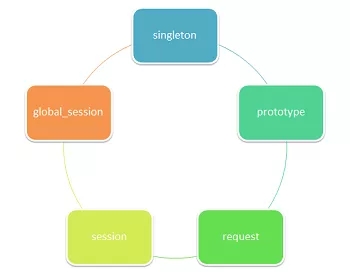

# ✅Spring中用到了哪些设计模式

# 典型回答

Spring有着非常优雅的设计，很多地方都遵循SOLID原则，里面的设计模式更是数不胜数。大概有以下几种：

## 工厂模式

所谓的工厂模式，核心是屏蔽内部的实现，直接由client使用即可。定义可以参考：

[✅三种工厂模式的区别和特点](https://www.yuque.com/hollis666/aw7b67/trigus)

Spring的IOC就是一个非常好的工厂模式的例子。Spring IOC 容器就像是一个工厂一样，当我们需要创建一个对象的时候，只需要配置好配置文件/注解即可，完全不用考虑对象是如何被创建出来的。 IOC 容器负责创建对象，将对象连接在一起，配置这些对象，并从创建中处理这些对象的整个生命周期，直到它们被完全销毁。

[✅介绍一下Spring的IOC](https://www.yuque.com/hollis666/aw7b67/wswp59)

## 组合模式

组合模式在SpringMVC中用的非常多，其中的参数解析，响应值处理等模块就是使用了组合模式。拿参数解析模块举例：

类图如下：



可以发现，整体的参数解析模块中，由一个接口`HandlerMethodArgumentResolver`负责。其中父节点会实现该接口，同时对所有的具体的子接口进行聚合。

其实这个里面不止用了组合模式，接口还提供了`#supportsParamerter`方法，去判断是否执行该resolver，这也是策略模式的一种。

## 适配器模式

适配器模式简而言之就是上游为了适应下游，而要做一些适配，承担适配工作的模块，就叫做适配器。常见的场景是甲方因为话语权很高，提供了一套交互模型，而所有对接甲方模型的乙方，就需要通过适配器模式来适配甲方的模型和自己已有的系统。

在SpringMVC中，`HandlerAdapter`就是典型的适配器模式。参考其注释我们可以发现：

> MVC framework SPI, allowing parameterization of the core MVC workflow.
>
> Interface that must be implemented for each handler type to handle a request. This interface is used to allow the DispatcherServlet to be indefinitely extensible. The DispatcherServlet accesses all installed handlers through this interface, meaning that it does not contain code specific to any handler type.

对于DispatcherServlet来说，HandlerAdapter是核心的业务逻辑处理流程，DispatcherServlet只负责调用`HandlerAdapter#handle`方法即可。至于当前Http的请求该如何处理，则交给HandlerAdapter的实现方负责。换句话说，HandlerAdapter只是定义了和DispatcherServlet交互的标准，帮助不同的实现适配了DispatcherServlet而已。

譬如，用于Controller注解解析和url映射的逻辑就是通过`RequestMappingHandlerAdapter`实现的。

```java
protected void doDispatch(HttpServletRequest request, HttpServletResponse response) throws Exception {
    

    try {
        ModelAndView mv = null;
        Exception dispatchException = null;

        try {

            // Determine handler for the current request.
            mappedHandler = getHandler(processedRequest);

            // Determine handler adapter for the current request.
            HandlerAdapter ha = getHandlerAdapter(mappedHandler.getHandler());

            // Process last-modified header, if supported by the handler.
            String method = request.getMethod();

            if (!mappedHandler.applyPreHandle(processedRequest, response)) {
                return;
            }

            // Actually invoke the handler. 【重要】
            mv = ha.handle(processedRequest, response, mappedHandler.getHandler());

        }
        catch (Exception ex) {
            dispatchException = ex;
        }
        catch (Throwable err) {
            // As of 4.3, we're processing Errors thrown from handler methods as well,
            // making them available for @ExceptionHandler methods and other scenarios.
            dispatchException = new NestedServletException("Handler dispatch failed", err);
        }
        processDispatchResult(processedRequest, response, mappedHandler, mv, dispatchException);
    }
    catch (Exception ex) {
    }
    finally {
    }
}
```

## 代理模式

代理模式和适配器模式的核心区别就在于，适配器模式的目的是为了适配不同的场景，而代理模式的目的则是enhance，即增强被代理的类（如增加日志打印功能等）。

Spring的AOP就是代理模式的典型代表，请参考：

[✅介绍一下Spring的AOP](https://www.yuque.com/hollis666/aw7b67/nget4r5wl2imegi7)

## 单例模式

单例模式是Spring一个非常核心的功能，Spring中的bean默认都是单例的，这样可以尽最大程度保证**对象的复用和线程安全**。

Spring Bean也不止是单例的，还有其他作用域，如下：

* **prototype** : 每次获取都会创建一个新的 bean 实例。也就是说，连续 getBean() 两次，得到的是不同的 Bean 实例。
* **request** （仅 Web 应用可用）: 每一次 HTTP 请求都会产生一个新的 bean（请求 bean），该 bean 仅在当前 HTTP request 内有效。
* **session** （仅 Web 应用可用） : 每一次来自新 session 的 HTTP 请求都会产生一个新的 bean（会话 bean），该 bean 仅在当前 HTTP session 内有效。
* **global-session** （仅 Web 应用可用）：每个 Web 应用在启动时创建一个 Bean（应用 Bean），，该 bean 仅在当前应用启动时间内有效。
* **websocket** （仅 Web 应用可用）：每一次 WebSocket 会话产生一个新的 bean。



## 观察者模式

具体可以参考：

[✅Spring在业务中常见的使用方式](https://www.yuque.com/hollis666/aw7b67/xn5f5v#a1dT6)

## 模板方法模式

如果使用过Spring的事务管理，相信一定对`TransactionTemplate�`这个类不陌生，而且顾名思义，这个也是用到了模板方法。它把事务操作按照3个固定步骤来写：

1. 执行业务逻辑
2. 如果异常则回滚事务
3. 否则提交事务

如下代码所示：

```java
public <T> T execute(TransactionCallback<T> action) throws TransactionException {

    TransactionStatus status = this.transactionManager.getTransaction(this);
    T result;
    try {
        // 1. 步骤一，执行事务逻辑
        result = action.doInTransaction(status);
    }
    catch (RuntimeException | Error ex) {
        // Transactional code threw application exception -> rollback
        rollbackOnException(status, ex);
        throw ex;
    }
    catch (Throwable ex) {
        // Transactional code threw unexpected exception -> rollback
        rollbackOnException(status, ex);
        throw new UndeclaredThrowableException(ex, "TransactionCallback threw undeclared checked exception");
    }
    // 2. 步骤三，提交事务
    this.transactionManager.commit(status);
    return result;
    
}
```

## 责任链模式

对于SpringMVC来说，他会通过一系列的拦截器来处理请求执行前，执行后，以及结束的response，核心的类是`handlerExecutionChain`，它封装了`HandlerAdapter`和一系列的过滤器。

对于执行前的处理来说，DispatherServlet会先通过`handlerExecutionChain`获取所有的`HandlerInterceptor`，然后再执行处理逻辑，如下代码所示：

```java
protected void doDispatch(HttpServletRequest request, HttpServletResponse response) throws Exception {
    try {

        try {

            // Process last-modified header, if supported by the handler.
            String method = request.getMethod();
        	// 执行预处理
            if (!mappedHandler.applyPreHandle(processedRequest, response)) {
                return;
            }

        }
        processDispatchResult(processedRequest, response, mappedHandler, mv, dispatchException);
    }
    catch (Exception ex) {
    }
    finally {
    }
}
```

```java
boolean applyPreHandle(HttpServletRequest request, HttpServletResponse response) throws Exception {
    HandlerInterceptor[] interceptors = getInterceptors();
    if (!ObjectUtils.isEmpty(interceptors)) {
        for (int i = 0; i < interceptors.length; i++) {
            HandlerInterceptor interceptor = interceptors[i];
            if (!interceptor.preHandle(request, response, this.handler)) {
                triggerAfterCompletion(request, response, null);
                return false;
            }
            this.interceptorIndex = i;
        }
    }
    return true;
}
```


> 更新: 2024-12-08 23:51:39  
> 原文: <https://www.yuque.com/hollis666/aw7b67/kirdzq>