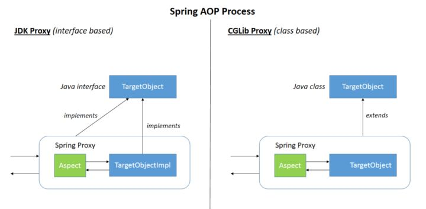

# ✅介绍一下Spring的AOP

# 典型回答

**AOP(Aspect-Oriented Programming)，即面向切面编程**，用人话说就是把公共的逻辑抽出来，让开发者可以更专注于业务逻辑开发。

和IOC一样，AOP也指的是一种思想。AOP思想是OOP（Object-Oriented Programming）的补充。OOP是面向类和对象的，但是AOP则是面向不同切面的。一个切面可以横跨多个类和对象去操作，极大的丰富了开发者的使用方式，提高了开发效率。

譬如，一个订单的创建，可能需要以下步骤：

1. 权限校验
2. 事务管理
3. 创建订单
4. 日志打印

如果使用AOP思想，我们就可以把这四步当成四个“切面”，让业务人员专注开发第三个切面，其他三个切面则是基础的通用逻辑，统一交给AOP封装和管理。

Spring AOP有如下概念（列举下，不用刻意记）：

| 术语 | 翻译 | 释义 |
| --- | --- | --- |
| Aspect | 切面 | 切面由切入点和通知组成，它既包含了横切逻辑的定义，也包括了切入点的定义。切面是一个横切关注点的模块化，一个切面能够包含同一个类型的不同增强方法，比如说事务处理和日志处理可以理解为两个切面。 |
| JoinPoint | 连接点 | 连接点是程序在运行时的执行点，这个点可以是正在执行的方法，或者是正在抛出的异常。因为Spring只支持方法类型的连接点，所以在Spring中连接点就是运行时刻被拦截到的方法。连接点由两个信息确定：<br/>+ 方法(表示程序执行点，即在哪个目标方法)<br/>+ 相对点(表示方位，即目标方法的什么位置，比如调用前，后等) |
| PointCut | 切入点 | 切入点是对连接点进行拦截的条件定义，决定通知应该作用于截哪些方法。（充当where角色，即在哪里做） |
| Advice | 通知 | 通知定义了通过切入点拦截后，应该在连接点做什么，是切面的具体行为。（充当what角色，即做什么） |
| Target | 目标对象 | 目标对象指将要被增强的对象，即包含主业务逻辑的类对象。或者说是被一个或者多个切面所通知的对象。 |
| Weaving | 织入 | 织入是将切面和业务逻辑对象连接起来, 并创建通知代理的过程。织入可以在编译时，类加载时和运行时完成。在编译时进行织入就是静态代理，而在运行时进行织入则是动态代理。 |

对于通知类型来说：

| Before Advice | 连接点执行前执行的逻辑 |
| --- | --- |
| After returning advice | 连接点正常执行（未抛出异常）后执行的逻辑 |
| After throwing advice | 连接点抛出异常后执行的逻辑 |
| After finally advice | 无论连接点是正常执行还是抛出异常，在连接点执行完毕后执行的逻辑 |
| Around advice | 该通知可以非常灵活的在方法调用前后执行特定的逻辑 |

来一段代码示例：

```bash
import org.aspectj.lang.ProceedingJoinPoint;
import org.aspectj.lang.annotation.*;

@Aspect
@Component
public class LoggingAspect {

    // 定义切点（匹配 service 包下所有方法）
    @Pointcut("execution(* com.hollis.service.*.*(..))")
    public void serviceMethods() {}

    // 前置通知
    @Before("serviceMethods()")
    public void beforeAdvice() {
        System.out.println("Before method execution...");
    }

    // 后置通知
    @AfterReturning("serviceMethods()")
    public void afterReturningAdvice() {
        System.out.println("After method execution...");
    }

    // 环绕通知
    @Around("serviceMethods()")
    public Object aroundAdvice(ProceedingJoinPoint pjp) throws Throwable {
        System.out.println("Around before...");
        Object result = pjp.proceed(); // 执行目标方法
        System.out.println("Around after...");
        return result;
    }
}

```

# 扩展知识

## AOP是如何实现的？

Spring 提供两种实现方式：

1. **基于动态代理的 AOP（最常用）**
   * 如果目标对象实现了接口 → 用 **JDK 动态代理**。
   * 如果没有实现接口 → 用 **CGLIB 代理**。
   * 基于运行时代理，仅支持方法级别的切点，适合业务开发（简单、够用）。
2. **基于 @AspectJ 注解的 AOP**
   * 使用 `@Aspect` 注解定义切面。
   * 配合 `@EnableAspectJAutoProxy` 开启自动代理。
   * 功能更强大（支持字段、构造器、静态块等），通过编译期或类加载期织入。

[🔜SpringBean的初始化流程](https://www.yuque.com/hollis666/aw7b67/zlvhpz)

从Bean的初始化流程中来讲，Spring的AOP会在bean实例的实例化已完成，进行初始化后置处理时创建代理对象，即下面代码中的applyBeanPostProcessorsAfterInitialization部分。

```java
protected Object initializeBean(final String beanName, final Object bean, RootBeanDefinition mbd) {

    //...
    //检查Aware
    invokeAwareMethods(beanName, bean);
    
	//调用BeanPostProcessor的前置处理方法
    Object wrappedBean = bean;
    if (mbd == null || !mbd.isSynthetic()) {
        wrappedBean = applyBeanPostProcessorsBeforeInitialization(wrappedBean, beanName);
    }

    //调用InitializingBean的afterPropertiesSet方法或自定义的初始化方法及自定义init-method方法
    try {
        invokeInitMethods(beanName, wrappedBean, mbd);
    }
    catch (Throwable ex) {
        throw new BeanCreationException(
                (mbd != null ? mbd.getResourceDescription() : null),
                beanName, "Invocation of init method failed", ex);
    }
    //调用BeanPostProcessor的后置处理方法
    if (mbd == null || !mbd.isSynthetic()) {
        wrappedBean = applyBeanPostProcessorsAfterInitialization(wrappedBean, beanName);
    }
    return wrappedBean;
}
```

applyBeanPostProcessorsAfterInitialization中会遍历所有BeanPostProcessor，然后

调用其postProcessAfterInitialization方法，而AOP代理对象的创建就是在AbstractAutoProxyCreator这个类的postProcessAfterInitialization中：

```java
@Override
public Object postProcessAfterInitialization(Object bean, String beanName) throws BeansException {
    if (bean != null) {
        Object cacheKey = getCacheKey(bean.getClass(), beanName);
        if (this.earlyProxyReferences.remove(cacheKey) != bean) {
            return wrapIfNecessary(bean, beanName, cacheKey);
        }
    }
    return bean;
}

```

这里面最重要的就是wrapIfNecessary方法了：

```java
/**
 * 如果需要，对bean进行包装。
 *
 * @param bean 要包装的目标对象
 * @param beanName bean的名称
 * @param cacheKey 缓存键
 * @return 包装后的对象，可能是原始对象或代理对象
 */
protected Object wrapIfNecessary(Object bean, String beanName, Object cacheKey) {
    // 如果beanName不为null且在目标源bean集合中，则直接返回原始对象
    if (beanName != null && this.targetSourcedBeans.contains(beanName)) {
        return bean;
    }

    // 如果缓存键对应的值为Boolean.FALSE，则直接返回原始对象
    if (Boolean.FALSE.equals(this.advisedBeans.get(cacheKey))) {
        return bean;
    }

    // 如果bean的类型为基础设施类，或者应跳过该类型的代理，则将缓存键对应的值设置为Boolean.FALSE并返回原始对象
    if (isInfrastructureClass(bean.getClass()) || shouldSkip(bean.getClass(), beanName)) {
        this.advisedBeans.put(cacheKey, Boolean.FALSE);
        return bean;
    }

    // 如果存在advice，为bean创建代理对象
    Object[] specificInterceptors = getAdvicesAndAdvisorsForBean(bean.getClass(), beanName, null);
    if (specificInterceptors != DO_NOT_PROXY) {
        // 将缓存键对应的值设置为Boolean.TRUE
        this.advisedBeans.put(cacheKey, Boolean.TRUE);
        // 创建代理对象
        Object proxy = createProxy(
                bean.getClass(), beanName, specificInterceptors, new SingletonTargetSource(bean));
        // 将代理对象的类型与缓存键关联起来
        this.proxyTypes.put(cacheKey, proxy.getClass());
        return proxy;
    }

    // 如果没有advice，将缓存键对应的值设置为Boolean.FALSE并返回原始对象
    this.advisedBeans.put(cacheKey, Boolean.FALSE);
    return bean;
}

```

createProxy的主要作用是根据给定的bean类、bean名称、特定拦截器和目标源，创建代理对象：

```java
/**
 * 根据给定的bean类、bean名称、特定拦截器和目标源，创建代理对象。
 *
 * @param beanClass 要代理的目标对象的类
 * @param beanName bean的名称
 * @param specificInterceptors 特定的拦截器数组
 * @param targetSource 目标源
 * @return 创建的代理对象
 */
protected Object createProxy(
        Class<?> beanClass, String beanName, Object[] specificInterceptors, TargetSource targetSource) {

    // 如果beanFactory是ConfigurableListableBeanFactory的实例，将目标类暴露给它
    if (this.beanFactory instanceof ConfigurableListableBeanFactory) {
        AutoProxyUtils.exposeTargetClass((ConfigurableListableBeanFactory) this.beanFactory, beanName, beanClass);
    }

    // 创建ProxyFactory实例，并从当前代理创建器复制配置
    ProxyFactory proxyFactory = new ProxyFactory();
    proxyFactory.copyFrom(this);

    // 如果不强制使用CGLIB代理目标类，根据条件决定是否使用CGLIB代理
    if (!proxyFactory.isProxyTargetClass()) {
        if (shouldProxyTargetClass(beanClass, beanName)) {
            proxyFactory.setProxyTargetClass(true);
        } else {
            // 根据bean类评估代理接口
            evaluateProxyInterfaces(beanClass, proxyFactory);
        }
    }

    // 构建advisor数组
    Advisor[] advisors = buildAdvisors(beanName, specificInterceptors);
    // 将advisors添加到ProxyFactory中
    proxyFactory.addAdvisors(advisors);
    // 设置目标源
    proxyFactory.setTargetSource(targetSource);
    // 定制ProxyFactory
    customizeProxyFactory(proxyFactory);

    // 设置代理是否冻结
    proxyFactory.setFrozen(this.freezeProxy);
    // 如果advisors已经预过滤，则设置ProxyFactory为预过滤状态
    if (advisorsPreFiltered()) {
        proxyFactory.setPreFiltered(true);
    }

    // 获取代理对象，并使用指定的类加载器
    return proxyFactory.getProxy(getProxyClassLoader());
}

```

**Spring AOP 是通过代理模式实现的**，具体有两种实现方式，一种是基于Java原生的动态代理，一种是基于cglib的动态代理。对应到代码中就是，这里面的Proxy有两种实现，分别是CglibAopProxy和JdkDynamicAopProxy。

> **Spring AOP默认使用标准的JDK动态代理进行AOP代理**。这使得任何接口可以被代理。但是JDK动态代理有一个缺点，就是它不能代理没有接口的类。
>
> 所以Spring AOP就使用CGLIB代理没有接口的类。



当然代理这种设计模式也有动态代理和静态代理之分，可以参考这篇文章：

[✅Java的动态代理如何实现？](https://www.yuque.com/hollis666/aw7b67/ugvfzx)

## 使用AOP可以实现哪些功能？

[🔜Spring在业务中常见的使用方式](https://www.yuque.com/hollis666/aw7b67/xn5f5v)


> 更新: 2025-08-29 20:16:49  
> 原文: <https://www.yuque.com/hollis666/aw7b67/nget4r5wl2imegi7>