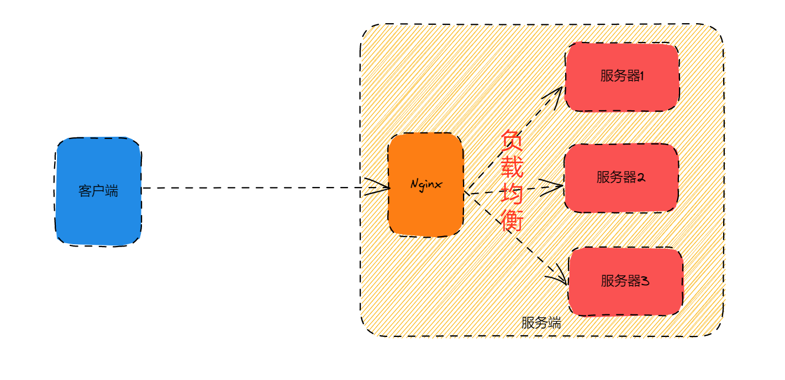
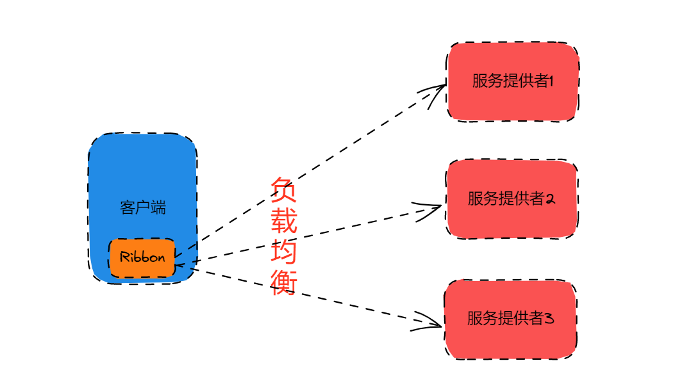

# ✅Zuul、Gateway和Nginx有什么区别？

# 典型回答

Zuul、Spring Cloud Gateway和Nginx都是常用的**网关技术**，但它们在实现和功能方面有一些区别。**Zuul和Gateway是同一类，而Nginx是另外一类。**

****

**下面是他们的区别的对照（原创，如有雷同，绝对抄袭**

| **差异点** | **Nginx** | **Spring Cloud Gateway/Zuul等** |
| --- | --- | --- |
| 定位 | 高性能的 Web 服务器、**反向代理**、负载均衡器。 | 微服务架构中的 API 网关。 |
| 主要用途 | 负载均衡，**反向代理** | 负载均衡、**统一鉴权、统一限流** |
| 微服务集成 | 并非专门为微服务设计，但可以作为反向代理和负载均衡器在微服务架构中使用。 | **专为微服务架构设计**，能与 Spring Cloud 生态系统紧密集成。 |
| 安全性 | 支持 SSL/TLS 终端、基本的限流和访问控制。 | 支持 OAuth2、JWT、身份验证、授权控制、API 限流等高级安全功能。 |
| 主要使用场景 | 负载均衡、**静态资源托管**、反向代理 | 动态路由、请求转换、身份认证和授权等。 |
| 负载均衡实现方式 | **服务端负载均衡**。支持多种负载均衡算法（轮询、加权轮询、IP Hash 等）。 | **需要与 Spring Cloud LoadBalancer 集成**，实现的是**客户端负载均衡**。 |
| 生态要求 | 无要求 | **Java微服务生态** |

### 主要定位
不管是Zuul还是Gateway，都是Spring Cloud生态的一部分，他的主要功能是**API 网关**。支持请求路由、负载均衡、权限认证、限流、请求过滤等功能。

[✅什么是Zuul网关，有什么用？](https://www.yuque.com/hollis666/aw7b67/ub4syzfkylukv8xv)

[✅为什么需要SpringCloud Gateway，他起到了什么作用？](https://www.yuque.com/hollis666/aw7b67/ow7cnpaa2du8zvv5)

Nginx 是一个高性能的 Web 服务器和反向代理服务器，广泛用于负载均衡、静态文件托管、请求转发等任务。其实Nginx也能实现鉴权、限流以及流量过滤的功能的。

但是这里面比较关键的就是**Nginx支持反向代理和静态资源托管。**

****

[✅什么是正向代理和反向代理？](https://www.yuque.com/hollis666/aw7b67/lrlsklnaacsxoa9q)

所谓**反向代理**，其实是”代理服务器”代理了”目标服务器”，去和”客户端”进行交互。就是说在调用者不知道自己调用的具体是哪台服务器。这个功能是Nginx独有的。而Gateway等是不具备这个功能的，他们是明确的知道自己要调用的服务器的具体的ip的。

**静态资源托管**，其实就是将网站或应用中不需要经过动态计算或生成的文件存储并提供给用户访问。比如网站上面的CSS、JS、图片、音视频等资源，都是静态资源，这些可以托管给Nginx，这样就不需要和后端交互了，nginx直接就能返回了，可以大大减少后端压力，也能提升性能。

### 负载均衡

其实，直接拿Gateway和Nginx对比并不一定不合适，因为Gateway中的负载均衡的功能是靠LoadBalancer实现的。而loadbalancer和nginx的主要区别是，虽然都是负载均衡，但是**loadbalancer是客户端负载均衡，而nginx是服务端负载均衡。**

服务端负载均衡指的是将负载均衡的逻辑集成到服务提供端，通过在服务端对请求进行转发，实现负载均衡。

> 因为Nginx是服务端负载均衡，所以他能实现反向代理的能力，调用者只知道自己调用的时候Nginx（反向代理服务器），而不知道具体调用的是哪个服务器。
>

客户端负载均衡指的是将负载均衡的逻辑集成到服务消费端的代码中，在客户端直接选择需要调用的服务提供端，并发起请求。这样的好处是可以在客户端直接实现负载均衡、容错等功能，不需要依赖其他组件，使得客户端具有更高的灵活性和可控性。

> 因为Ribbon、LoadBalancer等是客户端负载均衡，调用者是明确的知道自己调用的是哪个服务器的。所以他没有反向代理的能力。
>

### 微服务

我们都知道，**Zuul和Gateway是专门用于构建微服务架构的服务网关，提供了丰富的功能和易于配置的路由规则。而Nginx是一个通用的Web服务器和反向代理服务器，可以用作网关，但不像Zuul和Gateway那样专注于微服务架构。**

****

**还有就是Gateway只支持Java生态，或者说是Java的微服务生态。而Nginx则没有这个限制。**

****

****

### 如何选择

其实在许多生产环境中，Nginx 和 Spring Cloud Gateway 也**可以组合使用**。例如，Nginx 作为反向代理和负载均衡器，处理所有外部请求和静态资源，然后将请求转发给 Spring Cloud Gateway，后者则负责处理微服务间的路由和安全控制。

这样组合使用可以充分发挥两者的优势：**Nginx 处理高并发的静态资源和负载均衡，而 Spring Cloud Gateway 负责业务层面的请求路由和安全管理。**

> 更新: 2025-07-02 21:14:35  
> 原文: <https://www.yuque.com/hollis666/aw7b67/uliggwanbo7t3hxg>