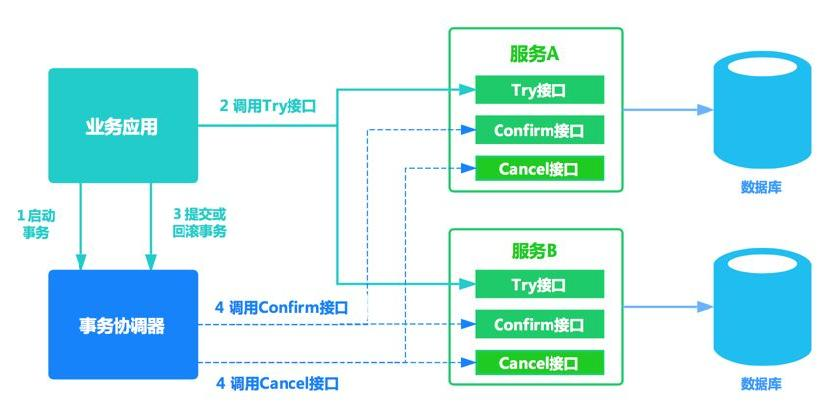

# ✅什么是TCC，和2PC有什么区别？

# 典型回答

TCC是Try-Confirm-Cancel的缩写，它是一种分布式事务解决方案，采用了基于业务逻辑的补偿机制，将整个分布式事务分解为若干个子事务，每个子事务都有一个try、confirm和cancel三个操作，通过这些操作来实现分布式事务的执行和回滚

具体来说，TCC事务包括以下三个步骤：

1. Try：在try阶段，参与者尝试执行本地事务，**并对全局事务预留资源**。如果try阶段执行成功，参与者会返回一个成功标识，否则会返回一个失败标识。

2. Confirm：如果所有参与者的try阶段都执行成功，则协调者通知所有参与者提交事务，那么就要执行confirm阶段，这时候参与者将在本地提交事务，并释放全局事务的资源。

3. Cancel：如果任何一个参与者在try阶段执行失败，则协调者通知所有参与者回滚事务。那么就要执行cancel阶段。

以下是一个简单的TCC事务的例子，假设有一个转账服务，需要从A账户中转移到B账户中100元、C账户中200元：

1. Try阶段：转账服务首先尝试将A账户的金额冻结300元。

2. Confirm阶段：如果所有的try操作都执行成功，转账服务将尝试执行解冻并转账，将金额转到B账户和C账户中。

3. Cancel阶段：如果try过程中，某个转账事务执行失败。那么将执行解冻，将300元解冻。如果在confirm过程中，A->C的转账成功，但是A->B的转账失败，则再操作一次C->A的转账，将钱退回去。

TCC这种事务方案有以下优缺点：

优点：

1. 灵活性：TCC适用于不同类型的业务场景，例如账户转账、库存扣减等，能够根据业务逻辑实现精细的事务控制。
2. 高可用性：TCC使用分布式锁来保证分布式事务的一致性，即使其中一个节点出现故障，也不会影响整个系统的运行。
3. 可扩展性：TCC采用分阶段提交的方式，支持横向扩展，可以适应更多的并发访问和业务场景。
4. 性能：TCC相对于2PC来说，具有更好的性能表现

缺点：

1. 实现复杂：TCC需要实现Try、Confirm和Cancel三个操作，每个操作都需要实现正确的业务逻辑和补偿机制，代码实现比较复杂。
2. 存在**悬挂事务问题**：TCC的实现方式存在悬挂事务的问题，即在执行过程中可能会有部分子事务成功，而其他子事务失败，导致整个事务无法回滚或提交。
3. **空回滚问题**：TCC中的Try过程中，有的参与者成功了，有的参与者失败了，这时候就需要所有参与者都执行Cancel，这时候，对于那些没有Try成功的参与者来说，本次回滚就是一次空回滚。需要在业务中做好对空回滚的识别和处理，否则就会出现异常报错的情况，甚至可能导致Cancel一直失败，最终导致整个分布式事务失败。
4. 业务代码侵入性：TCC需要将事务操作拆分为Try、Confirm和Cancel三个步骤，对业务代码有一定的侵入性，需要针对不同的业务场景进行实现。

[✅TCC的空回滚和悬挂是什么？如何解决？](https://www.yuque.com/hollis666/aw7b67/cu01a1g1xxn2v52u)

# 扩展知识
## Confirm/Cancel失败了怎么办？

[✅TCC中，Confirm或者Cancel失败了怎么办？](https://www.yuque.com/hollis666/aw7b67/xnvn2of7pmd005no)

## TCC和2PC有什么区别？

首先，**二者的实现机制不同**，2PC使用协调者和参与者的方式来实现分布式事务，而TCC采用分阶段提交的方式。

**最大的区别：站在每一个事务的参与者角度看，TCC其实是把一个事务拆成了3个独立的事务，而2PC就只是一个事务。**

+ TCC中，把一次业务操作，拆分成Try、Confirm、Cancel三个步骤，每一个步骤操作数据库的时候都是一个单独的事务，单独开启，单独提交。
+ 2PC是一个事务，拆分成了准备阶段和提交阶段，但是他还是一个事务，Prepare阶段事务是不提交的，直到第二个阶段实物才会提交。所以他的事务更长，阻塞时间更差，性能更差。

所以，你也就能理解，为啥2PC是一个强一致性的了，因为他是一个事务，是严格遵循ACID的。而TCC是最终一致性，通过全局锁和重试机制保证最终一致。

所以，接着你就能理解，为啥2PC的性能很差，而TCC的性能还可以了。

所以，2PC适用于对事务一致性要求较高的场景，例如银行转账等，需要保证数据一致性和完整性。而TCC适用于对事务一致性要求不那么高的场景，例如电商库存扣减等，需要保证数据最终一致性即可。

| **维度** | **XA 2PC** | **TCC** |
| --- | --- | --- |
| **实现层** | 数据库资源层 | 应用层代理 |
| **事务机制** | 一个事务 | 多个事务 |
| **性能** | 低（阻塞时间长） | 高（异步提交） |
| **隔离性** | 高（数据库隔离级别） | 弱（需全局锁辅助） |
| **数据库要求** | 需支持XA协议 | 无特殊要求 |
| **回滚方式** | 数据库原生回滚 | 反向SQL补偿 |
| **适用场景** | 强一致、低并发 | 高并发、最终一致 |

## TCC是强一致性还是最终一致性？

[✅TCC是强一致性还是最终一致性？](https://www.yuque.com/hollis666/aw7b67/aedtll1aq21ahiwf)

> 更新: 2025-10-07 12:31:49  
> 原文: <https://www.yuque.com/hollis666/aw7b67/xhvbak3ouy6xqiml>