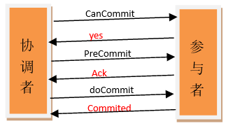

# ✅什么是分布式事务中的三阶段提交（3PC）

# 典型回答

[✅有了2阶段提交为什么还需要3阶段提交？](https://www.yuque.com/hollis666/aw7b67/du7xnm)

上面的2PC中介绍过了两阶段提交的原理和他主要存在的问题，在 **2PC** 中，如果协调者（Coordinator）在关键节点挂掉，参与者（Participant）可能会一直阻塞，甚至出现 **数据不一致**的情况。于是 3PC 在 2PC 的基础上加入了一个额外的阶段（**预提交阶段**），并引入了 **超时机制**，让参与者在没有收到协调者指令时也能自己做决定，从而减少阻塞问题。

3PC把2PC的准备阶段再次一分为二，这样三阶段提交就有CanCommit、PreCommit、DoCommit三个阶段。

### CanCommit 阶段（询问阶段）
+ 协调者向所有参与者发送 **CanCommit 请求**，询问是否可以执行事务。
+ 参与者：
    - 如果可以执行（比如本地检查通过），返回 Yes；
    - 如果不可以执行，返回 No。

这一阶段相当于 2PC 的第一阶段，但只是“问一下”。

### PreCommit 阶段（预提交阶段）
+ 如果所有参与者都返回 Yes：
    - 协调者向所有参与者发送 **PreCommit 请求**，进入预提交阶段。
    - 参与者执行事务操作（写日志、加锁），并进入 **等待提交状态**。
    - 此时参与者可以安全地提交事务，但还没有最终提交。
+ 如果有任何参与者返回 No：
    - 协调者发送 **Abort 请求**，所有参与者回滚事务。

这一阶段是 3PC 与 2PC 的关键区别：参与者已经进入一个“可以提交”的安全状态。

### DoCommit 阶段（提交阶段）
+ 如果 PreCommit 阶段所有参与者都确认成功：
    - 协调者向所有参与者发送 **DoCommit 请求**。
    - 参与者正式提交事务并释放资源。
+ 如果有失败或超时：
    - 协调者发送 **Abort 请求**，参与者回滚事务。

如果协调者在这个阶段挂掉，参与者可以依赖超时机制自行提交事务，从而避免阻塞。

这里再举一个生活中类似三阶段提交的例子：

> 班长要组织全班同学聚餐，由于大家毕业多年，所以要逐个打电话敲定时间，时间初定10.1日。然后开始逐个打电话。
>
> 班长：小A，我们想定在10.1号聚会，你有时间嘛？有时间你就说YES，没有你就说NO，然后我还会再去问其他人，具体时间地点我会再通知你，这段时间你可先去干你自己的事儿，不用一直等着我。（协调者询问事务是否可以执行，这一步不会锁定资源）
>
> 小A：好的，我有时间。（参与者反馈）
>
> 班长：小B，我们想定在10.1号聚会……不用一直等我。
>
> 班长收集完大家的时间情况了，一看大家都有时间，那么就再次通知大家。（协调者接收到所有YES指令）
>
> 班长：小A，我们确定了10.1号聚餐，你要把这一天的时间空出来，这一天你不能再安排其他的事儿了。然后我会逐个通知其他同学，通知完之后我会再来和你确认一下，还有啊，如果我没有特意给你打电话，你就10.1号那天来聚餐就行了。对了，你确定能来是吧？（协调者发送事务执行指令，这一步锁住资源。如果由于网络原因参与者在后面没有收到协调者的命令，他也会执行commit）
>
> 小A顺手在自己的日历上把10.1号这一天圈上了，然后跟班长说，我可以去。（参与者执行事务操作，反馈状态）
>
> 班长：小B，我们决定了10.1号聚餐……你就10.1号那天来聚餐就行了。
>
> 班长通知完一圈之后。所有同学都跟他说：”我已经把10.1号这天空出来了”。于是，他在10.1号这一天又挨个打了一遍电话告诉他们：嘿，现在你们可以出门拉。。。。（协调者收到所有参与者的ACK响应，通知所有参与者执行事务的commit）
>
> 小A，小B：我已经出门拉。（执行commit操作，反馈状态）
>

# 扩展知识

## 3PC为什么比2PC好？
直接分析前面（2PC的文章中）我们提到的协调者和参与者都挂的情况。

+ 第二阶段协调者和参与者挂了，挂了的这个参与者在挂之前已经执行了操作。但是由于他挂了，没有人知道他执行了什么操作。
    - 这种情况下，当新的协调者被选出来之后，他同样是询问所有的参与者的情况来决定是commit还是rollback。这看上去和二阶段提交一样啊？他是怎么解决一致性问题的呢？
    - 看上去和二阶段提交的那种数据不一致的情况的现象是一样的，但仔细分析所有参与者的状态的话就会发现其实并不一样。我们假设挂掉的那台参与者执行的操作是commit。那么其他没挂的操作者的状态应该是什么？他们的状态要么是prepare-commit要么是commit。因为3PC的第三阶段一旦有机器执行了commit，那必然第一阶段大家都是同意commit。所以，这时，新选举出来的协调者一旦发现未挂掉的参与者中有人处于commit状态或者是prepare-commit的话，那就执行commit操作。否则就执行rollback操作。这样挂掉的参与者恢复之后就能和其他机器保持数据一致性了。（为了简单的让大家理解，笔者这里简化了新选举出来的协调者执行操作的具体细节，真实情况比我描述的要复杂）

简单概括一下就是，如果挂掉的那台机器已经执行了commit，那么协调者可以从所有未挂掉的参与者的状态中分析出来，并执行commit。如果挂掉的那个参与者执行了rollback，那么协调者和其他的参与者执行的肯定也是rollback操作。

所以，再多引入一个阶段之后，3PC解决了2PC中存在的那种由于协调者和参与者同时挂掉有可能导致的数据一致性问题。

## 3PC存在的问题

在doCommit阶段，如果参与者无法及时接收到来自协调者的doCommit或者rebort请求时，会在等待超时之后，会继续进行事务的提交。

所以，由于网络原因，协调者发送的abort响应没有及时被参与者接收到，那么参与者在等待超时之后执行了commit操作。这样就和其他接到abort命令并执行回滚的参与者之间存在数据不一致的情况。

> 更新: 2025-09-12 20:47:04  
> 原文: <https://www.yuque.com/hollis666/aw7b67/zt707p4ypq68grpf>