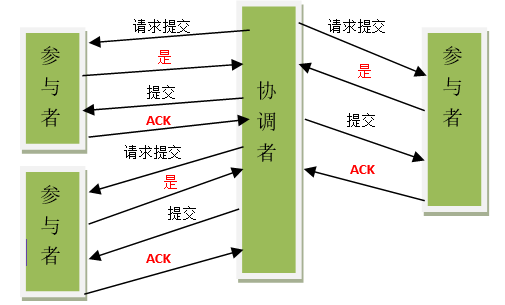

# ✅什么是分布式事务中的两阶段提交（2PC）

# 典型回答

在分布式系统中，一个事务可能会跨多个数据库或服务节点。我们需要保证事务的 **ACID 特性**，即使分布在多个节点上，也要么所有节点都成功提交，要么全部回滚，不能出现部分成功、部分失败的情况。

2PC（Two-Phase Commit，两阶段提交协议） 就是一个经典的**分布式事务一致性协议**，通过**协调者（Coordinator）** 和 **参与者（Participant）** 的配合来实现。参与者将操作成败通知协调者，再由协调者根据所有参与者的反馈情报决定各参与者是否要提交操作还是终止操作。

**协调者（Coordinator）**：

* 通常就是发起事务的那个应用程序或一个专门的事务管理器。
* 负责驱动整个协议流程，询问所有参与者，并根据反馈做出最终决定。

**参与者（Participants）**：

* 分布式事务中涉及的各个独立的资源管理器。
* 例如：不同的数据库、不同的微服务。
* 它们各自管理自己的本地事务，并执行协调者的指令。

所谓的两个阶段是指：\*\*第一阶段：准备阶段(投票阶段)和第二阶段：提交阶段（执行阶段）。\*\*在日常生活中其实是有很多事都是这种二阶段提交的，比如西方婚礼中就经常出现这种场景：

> 牧师：”你愿意娶这个女人吗?爱她、忠诚于她，无论她贫困、患病或者残疾，直至死亡。Doyou(你愿意吗)?”
>
> 新郎：”Ido(我愿意)!”
>
> 牧师：”你愿意嫁给这个男人吗?爱他、忠诚于他，无论他贫困、患病或者残疾，直至死亡。Doyou(你愿意吗)?”
>
> 新娘：”Ido(我愿意)!”
>
> 牧师：现在请你们面向对方，握住对方的双手，作为妻子和丈夫向对方宣告誓言。
>
> 新郎：我——某某某，全心全意娶你做我的妻子，无论是顺境或逆境，富裕或贫穷，健康或疾病，快乐或忧愁，我都将毫无保留地爱你，我将努力去理解你，完完全全信任你。我们将成为一个整体，互为彼此的一部分，我们将一起面对人生的一切，去分享我们的梦想，作为平等的忠实伴侣，度过今后的一生。
>
> 新娘：我全心全意嫁给你作为你的妻子，无论是顺境或逆境，富裕或贫穷，健康或疾病，快乐或忧愁，我都将毫无保留的爱你，我将努力去理解你，完完全全信任你，我们将成为一个整体，互为彼此的一部分，我们将一起面对人生的一切，去分享我们的梦想，作为平等的忠实伴侣，度过今后的一生。

上面这个比较经典的桥段就是一个典型的二阶段提交过程。

首先协调者（牧师）会询问两个参与者（二位新人）是否能执行事务提交操作（愿意结婚）。如果两个参与者能够执行事务的提交，先执行事务操作，然后返回YES，如果没有成功执行事务操作，就返回NO。

当协调者接收到所有的参与者的反馈之后，开始进入事务提交阶段。如果所有参与者都返回YES，那就发送COMMIT请求，如果有一个人返回NO，那就发送rollback请求。

值得注意的是，二阶段提交协议的第一阶段准备阶段不仅仅是回答YES or NO，还是要执行事务操作的，只是执行完事务操作，并没有进行commit还是rollback。和上面的结婚例子不太一样。如果非要举例的话可以理解为男女双方交换定情信物的过程。信物一旦交给对方了，这个信物就不能挪作他用了。也就是说，一旦事务执行之后，在没有执行commit或者rollback之前，资源是被锁定的。这会造成阻塞。

所以2PC总结一下就是以下两个PC：

**第一阶段：准备阶段（Prepare Phase）**

* **协调者** 向所有参与者发送 **Prepare 请求**，询问能否提交事务。
* **参与者**：
  * 执行事务，但不提交（只是写入日志或加锁，进入“预提交”状态）。
  * 如果成功，返回 “Yes”；如果失败或遇到冲突，返回 “No”。

此时事务还没有真正提交，所有参与者都处于 **等待协调者指令**的状态。

**第二阶段：提交阶段（Commit Phase）**

* 如果 **所有参与者都返回 Yes**：
  * 协调者向所有参与者发送 **Commit 请求**。
  * 参与者正式提交事务，并释放锁资源。
* 如果 **任意一个参与者返回 No（或超时未响应）**：
  * 协调者向所有参与者发送 **Rollback 请求**。
  * 参与者回滚事务，释放锁资源。

这样，所有节点的结果保持一致。

# 扩展知识

## XA规范

X/Open 组织（即现在的 Open Group ）定义了分布式事务处理模型。 模型中主要包括应用程序（ AP ）、事务管理器（ TM ）、资源管理器（ RM ）、通信资源管理器（ CRM ）等四个角色。

一般，常见的事务管理器（ TM ）是交易中间件，常见的资源管理器（ RM ）是数据库，常见的通信资源管理器（ CRM ）是消息中间件。

通常把一个数据库内部的事务处理，如对多个表的操作，作为本地事务看待。数据库的事务处理对象是本地事务，而分布式事务处理的对象是全局事务。

所谓全局事务，是指分布式事务处理环境中，多个数据库可能需要共同完成一个工作，这个工作即是一个全局事务，例如，一个事务中可能更新几个不同的数据库。对数据库的操作发生在系统的各处但必须全部被提交或回滚。此时一个数据库对自己内部所做操作的提交不仅依赖本身操作是否成功，还要依赖与全局事务相关的其它数据库的操作是否成功，如果任一数据库的任一操作失败，则参与此事务的所有数据库所做的所有操作都必须回滚。

XA 就是 X/Open DTP 定义的交易中间件与数据库之间的接口规范（即接口函数），交易中间件用它来通知数据库事务的开始、结束以及提交、回滚等。 XA 接口函数由数据库厂商提供。

**二阶提交协议**和**三阶提交协议**就是根据这一思想衍生出来的。可以说二阶段提交其实就是实现**XA分布式事务的关键**。

## 2PC的优缺点

2PC的优点比较明显，就是他的**概念和流程都比较简单**，并且是可以保证**强一致性**的。

但是缺点也比较明显，最重要的问题是可能会带来数据不一致的问题，除此之外，还存在同步阻塞以及单点故障的问题。

首先看为什么会发生同步阻塞和单点故障的问题：

**1、同步阻塞问题**。在参与者回复 `Yes` 后到收到协调者最终指令之前，其资源一直处于锁定状态。此时其他事务无法访问这些资源。如果协调者一直不发送指令，参与者会一直阻塞，严重影响系统性能和可用性。

**2、单点故障问题**。由于协调者的重要性，一旦协调者发生故障。参与者会一直阻塞下去。尤其在第二阶段，协调者发生故障，那么所有的参与者还都处于锁定事务资源的状态中，而无法继续完成事务操作。（如果是协调者挂掉，可以重新选举一个协调者，但是无法解决因为协调者宕机导致的参与者处于阻塞状态的问题）

作为一个分布式的一致性协议，我们主要关注他可能带来的**一致性问题**的。2PC在执行过程中可能发生协调者或者参与者突然宕机的情况，在不同时期宕机可能有不同的现象。

### 情况一：协调者挂了，参与者没挂

这种情况其实比较好解决，只要找一个协调者的替代者。当他成为新的协调者的时候，询问所有参与者的最后那条事务的执行情况，他就可以知道是应该做什么样的操作了。所以，这种情况不会导致数据不一致。

但是前面说了，这种情况虽然不会有不一致的问题，但是还是会带来阻塞的问题。

### 情况二：参与者挂了，协调者没挂

这种情况其实也比较好解决。如果参与者挂了。那么之后的事情有两种情况：

* 第一个是挂了就挂了，没有再恢复。那就挂了呗，反正不会导致数据一致性问题。
* 第二个是挂了之后又恢复了，这时如果他有未执行完的事务操作，直接取消掉，然后询问协调者目前我应该怎么做，协调者就会比对自己的事务执行记录和该参与者的事务执行记录，告诉他应该怎么做来保持数据的一致性。

### 情况三：参与者挂了，协调者也挂了

这种情况比较复杂，我们分情况讨论。

* 协调者和参与者在第一阶段（Prepare之后）挂了。
  * 由于这时还没有执行commit操作，新选出来的协调者可以询问各个参与者的情况，再决定是进行commit还是rollback。因为还没有commit，所以不会导致数据一致性问题。
* 第二阶段协调者和参与者挂了，挂了的这个参与者在挂之前并没有接收到协调者的指令，或者接收到指令之后还没来的及做commit或者rollback操作。
  * 这种情况下，当新的协调者被选出来之后，他同样是询问所有的参与者的情况。只要有机器执行了abort（rollback）操作或者第一阶段返回的信息是No的话，那就直接执行rollback操作。如果没有人执行abort操作，但是有机器执行了commit操作，那么就直接执行commit操作。这样，当挂掉的参与者恢复之后，只要按照协调者的指示进行事务的commit还是rollback操作就可以了。因为挂掉的机器并没有做commit或者rollback操作，而没有挂掉的机器们和新的协调者又执行了同样的操作，那么这种情况不会导致数据不一致现象。
* **第二阶段协调者和参与者挂了，挂了的这个参与者在挂之前已经执行了操作。但是由于他挂了，没有人知道他执行了什么操作。**
  * 这种情况下，新的协调者被选出来之后，如果他想负起协调者的责任的话他就只能按照上面介绍的情况来执行commit或者rollback操作（即询问所有参与者的情况）。这样新的协调者和所有没挂掉的参与者就保持了数据的一致性，我们假定他们执行了commit。但是，这个时候，那个挂掉的参与者恢复了怎么办，因为他之前已经执行完了之前的事务，如果他执行的是commit那还好，和其他的机器保持一致了，万一他执行的是rollback操作那？这不就导致数据的不一致性了么？虽然这个时候可以再通过手段让他和协调者通信，再想办法把数据搞成一致的，但是，这段时间内他的数据状态已经是不一致的了！

> 更新: 2025-09-12 20:46:37  
> 原文: <https://www.yuque.com/hollis666/aw7b67/du7xnm>