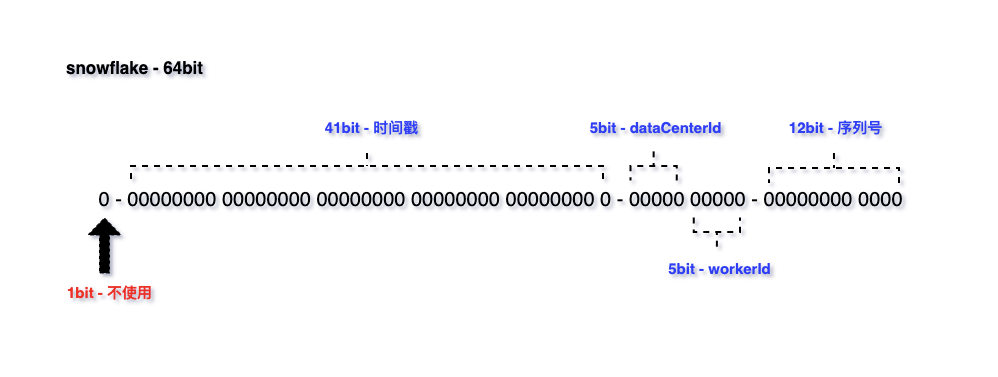

# ✅什么是雪花算法，怎么保证不重复的？

# 典型回答

雪花算法（Snowflake）是由Twitter研发的一种分布式ID生成算法，它可以生成全局唯一且递增的ID。它的核心思想是将一个64位的ID划分成多个部分，每个部分都有不同的含义，包括时间戳、数据中心标识、机器标识和序列号等。

具体来说，雪花算法生成的ID由以下几个部分组成：

1. 符号位（1bit）：预留的符号位，始终为0，占用1位。
2. 时间戳（41bit）：精确到毫秒级别，41位的时间戳可以容纳的毫秒数是2的41次幂，一年所使用的毫秒数是：365 * 24 * 60 * 60 * 1000，算下来可以使用69年。
3. 数据中心标识（5bit）：可以用来区分不同的数据中心。
4. 机器标识（5bit）：可以用来区分不同的机器。
5. 序列号（12bit)：可以生成4096个不同的序列号。

基于以上结构，雪花算法在唯一性保证方面就有很多优势：

首先，时间戳位于ID的最高位，保证新生成的ID比旧的ID大，在不同的毫秒内，时间戳肯定不一样。

其次，引入数据中心标识和机器标识，这两个标识位都是可以手动配置的，帮助业务来保证不同的数据中心和机器能生成不同的ID。

还有就是，引入序列号，用来解决同一毫秒内多次生成ID的问题，每次生成ID时序列号都会自增，因此不同的ID在序列号上有区别。

**所以，基于时间戳+数据中心标识+机器标识+序列号，就保证了在不同进程中主键的不重复，在相同进程中主键的有序性。**

  
雪花算法之所以被广泛使用，主要是因为他有以下优点：

1. 高性能高可用：生成时不依赖于数据库，完全在内存中生成
2. 高吞吐：每秒钟能生成数百万的自增 ID
3. ID 自增：在单个进程中，生成的ID是自增的，可以用作数据库主键做范围查询。但是需要注意的是，在集群中是没办法保证一定顺序递增的。

**SnowFlake 算法的缺点或者限制**：

1、在Snowflake算法中，每个节点的机器ID和数据中心ID都是硬编码在代码中的，而且这些ID是全局唯一的。当某个节点出现故障或者需要扩容时，就需要更改其对应的机器ID或数据中心ID，但是这个过程比较麻烦，需要重新编译代码，重新部署系统。还有就是，如果某个节点的机器ID或数据中心ID被设置成了已经被分配的ID，那么就会出现重复的ID，这样会导致系统的错误和异常。

2、Snowflake算法中，需要使用zookeeper来协调各个节点的ID生成，但是ZK的部署其实是有挺大的成本的，并且zookeeper本身也可能成为系统的瓶颈。

3、依赖于系统时间的一致性，如果系统时间被回拨，或者不一致，可能会造成 ID 重复。

# 扩展知识

## 时钟回拨问题

[✅什么是雪花算法的时钟回拨问题，如何解决？](https://www.yuque.com/hollis666/aw7b67/pvqyp93ugcft2mhv)

> 更新: 2025-09-05 21:05:05  
> 原文: <https://www.yuque.com/hollis666/aw7b67/rsocc4sd7v9i0pvc>