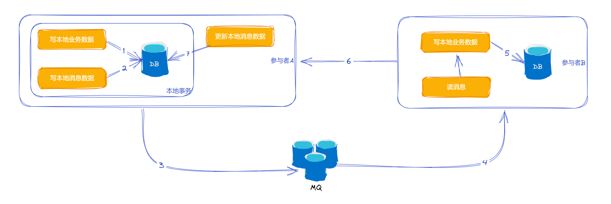
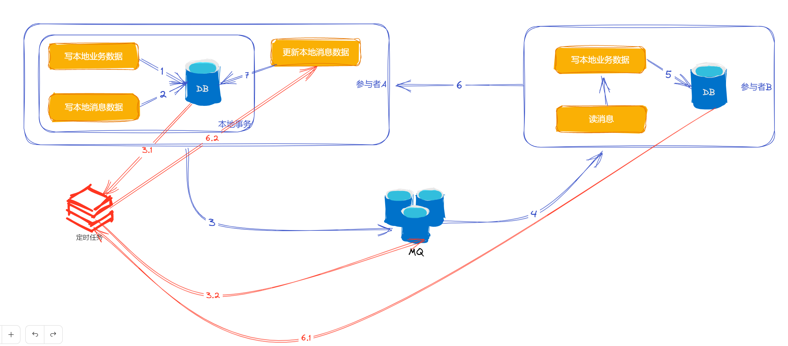

# ✅如何基于本地消息表实现分布式事务？

# 典型回答

本地消息表其实也是借助消息来实现分布式事务的。

这个方案的**主要思想是将分布式事务拆分为本地事务和消息事务两个部分**，本地事务在本地数据库中进行提交或回滚，而消息事务则将消息写入消息中间件中，以实现消息的可靠投递和顺序性。

一般来说的做法是，在发送消息之前，先创建一条本地消息，并且保证写本地业务数据的操作，和，写本地消息记录的操作在同一个事务中。这样就能确保只要业务操作成功，本地消息一定可以写成功。

然后再基于本地消息，调用MQ发送远程消息。

消息发出去之后，等待消费者消费，在消费者端，接收到消息之后，做业务处理，处理成功后再修改本地消息表的状态。

这个过程中，可能有几个步骤都可能发生失败，那么如果失败了怎么办呢？

1、2如果失败，因为在同一个事务中，所以事务会回滚，3及以后的步骤都不会执行。数据是一致的。

3如果失败，那么就需要有一个定时任务，不断的扫描本地消息数据，对于未成功的消息进行重新投递。

4、5如果失败，则依靠消息的重投机制，不断地重试。

6、7如果失败，那么就相当于两个分布式系统中的业务数据已经一致了，但是本地消息表的状态还是错的。这种情况也可以借助定时任务继续重投消息，让下游幂等消费再重新更改消息状态，或者本系统也可以通过定时任务去查询下游系统的状态，如果已经成功了，则直接推进消息状态即可。

# 扩展知识

## 优缺点

优点：

1. 可靠性高：基于本地消息表实现分布式事务，可以将本地消息的持久化和本地业务逻辑操作，放到一个事务中执行进行原子性的提交，从而保证了消息的可靠性。
2. 可扩展性好：基于本地消息表实现分布式事务，可以将消息的发送和本地事务的执行分开处理，从而提高了系统的可扩展性。
3. 适用范围广：基于本地消息表实现分布式事务，可以适用于多种不同的业务场景，可以满足不同业务场景下的需求。

缺点：

1. 实现复杂度高：基于本地消息表实现分布式事务，需要设计复杂的事务协议和消息发送机制，并且需要进行相应的异常处理和补偿操作，因此实现复杂度较高。
2. 系统性能受限：基于本地消息表实现分布式事务，需要将消息写入本地消息表，并且需要定时扫描本地消息表进行消息发送，因此对系统性能有一定影响。
3. **回滚困难：本地消息表的方案，比较适合那种上游成功下游必须成功的场景，比如下单成功了，运费险必须成功。而对于可能需要整个事务都回滚的场景，不适合这个方案，或者说想要做就要很复杂的作回滚机制。**
4. **参与方多不适合：虽然消息可以发送给多个监听者，但是本地消息表中的数据只有一条，如果一个事务有多个参与方，这个方案不适合。虽然可以在消息表中增加多个状态字段，表示多个参与者的状态，但是就太耦合了。**
5. **会带来消息堆积扫表慢、集中式扫表会影响正常业务、定时扫表存在延迟问题等问题。**在下文中介绍：

[✅本地消息表实现的分布式的缺点有什么？](https://www.yuque.com/hollis666/aw7b67/gamq6s7qf25cn332)

## 代码实践

[✅基于本地消息表实现分布式事务保证最终一致性](https://www.yuque.com/hollis666/aw7b67/hi956hl64rr7cwx1)

## 本地消息表如何设计

[✅为了避免丢消息问题需要落表，如何设计这张消息表？](https://www.yuque.com/hollis666/aw7b67/iw138sersv6ocx6u)

## 如何回滚

[✅用了本地消息表的方案，如果下游执行失败了上游如何回滚？](https://www.yuque.com/hollis666/aw7b67/fxytzn7grefl51yw)

> 更新: 2025-07-25 22:46:34  
> 原文: <https://www.yuque.com/hollis666/aw7b67/xm675quxo1bc5qm8>