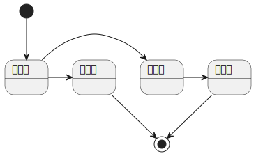

# ✅为了避免丢消息问题需要落表，如何设计这张消息表？

# 典型回答

这个其实是典型的本地消息表的方案：

[✅如何基于本地消息表实现分布式事务？](https://www.yuque.com/hollis666/aw7b67/xm675quxo1bc5qm8)

那么，我们就需要自己定义一张表，用来存储本地消息，这张表不仅用于存储，还会用来做扫表重试，那么这张表该如何设计呢？

以下是这张表需要包含的一些字段

| 字段名 | 类型 | 描述 |
| --- | --- | --- |
| `id` | BIGINT (PK) | 主键 |
| `gmt_create` | DATETIME | 创建时间 |
| `gmt_modified` | DATETIME | 更新时间 |
| `message_key` | VARCHAR | 消息的业务唯一标识（用于幂等处理） |
| `message_id` | VARCHAR | 消息的唯一ID，发送成功后才有，如果没成功，则该字段为null |
| `message_type` | VARCHAR | 消息的类型，根据这个消息类型执行不同的消息处理逻辑 |
| `topic` | VARCHAR | 消息所属主题或分类 |
| `message_body` | TEXT / JSON | 消息体，内容序列化存储 |
| `state` | VARCHAR | 消息状态（如：待发送，已发送，失败，已消费等） |
| `retry_count` | INT | 重试次数 |
| `next_retry_at` | DATETIME | 下一次重试时间（用于任务调度） |
| `last_retry_time` | DATETIME | 上一次的重试时间（用于任务调度） |
| `fail_reason` | TEXT | 失败原因，可以记录具体的错误码，或者异常的堆栈信息 |
| `lock_version` | BIGINT | 乐观锁版本号 |

索引情况：

* `state` 作为普通索引，用于高效扫表。这个也可以和`retry_count`、`next_retry_at`等字段一起建一个联合索引。
* `message_key`  +`message_type` 作为唯一索引，防止重复插入

关于state设置索引是否有用，可以看下面这篇：

[✅区分度不高的字段建索引一定没用吗？](https://www.yuque.com/hollis666/aw7b67/nr83t255g22gu3v7)

### 基本信息

| `id` | BIGINT (PK) | 主键 |
| --- | --- | --- |
| `gmt_create` | DATETIME | 创建时间 |
| `gmt_modified` | DATETIME | 更新时间 |
| `lock_version` | BIGINT | 乐观锁版本号 |

这些都是一些基本字段了，

lock\_version，主要用于乐观锁处理，避免出现并发问题导致更新错误

### 消息必要信息

| `message_key` | VARCHAR | 消息的业务唯一标识（用于幂等处理） |
| --- | --- | --- |
| `message_id` | VARCHAR | 消息的唯一ID，发送成功后才有，如果没成功，则该字段为null |
| `message_type` | VARCHAR | 消息的类型，根据这个消息类型执行不同的消息处理逻辑 |
| `topic` | VARCHAR | 消息所属主题或分类 |
| `message_body` | TEXT / JSON | 消息体，内容序列化存储 |

以上这些就是消息的基本信息了，因为这张表需要在消息失败的时候重新发送，所以需要把消息的相关信息都记录下来，方面后续重新发送。

`message_id`这个是消息发送成功的时候才会有的一个信息，即MQ返回的，然后把他存下来，方便后续排查消息是否成功，以及对应的消息是否处理，以及后续如果要定位到具体的消息，也更加方便一点。

`message_type`这个表是一个消息的类型，比如是确认收货消息，还是发货消息，可以在扫表任务中，根据这个消息类型执行不同的消息处理逻辑。

### 状态信息

| `state` | VARCHAR | 消息状态（如：待发送，已发送，已失败，已消费等） |
| --- | --- | --- |

状态表示一个消息的处理状态，可以包括待发送，已发送，失败，已消费，已挂起。

其中待发送是初始状态，已失败和已消费是终止状态。

这里面的已失败状态，可以根据发送次数进行逻辑处理，比如设置一个阈值，比如发送10次，还是不成功，这是为啥已失败状态，避免重复处理。

针对这种多次不成功的消息，比如已失败状态的消息，根据实际的业务情况，可以考虑降低重试次数（比如待发送的消息10分钟重试一次，已失败的消息6小时重试一次），或者告警出来人工跟进。

### 任务执行信息

| `retry_count` | INT | 重试次数 |
| --- | --- | --- |
| `next_retry_at` | DATETIME | 下一次重试时间（用于任务调度） |
| `last_retry_time` | DATETIME | 上一次的重试时间（用于任务调度） |
| `fail_reason` | TEXT | 失败原因，可以记录具体的错误码，或者异常的堆栈信息 |

以上几个是任务重试执行相关的信息，包括了重试的次数，上次重试时间、下一次重试时间，以及失败原因等。方便我们知道消息的执行情况，和快速的定位问题。

`next_retry_at`和`last_retry_time` 这两个字段可以有一个也行，都没有也不是不行，看你的实际业务情况，有的任务是可以主动设定下次执行时间，比如特殊的消息就是要3小时执行一次，那么就可以在每次执行后，如果失败了，则把当前时间加上3小时，设置到`next_retry_at`上面去。

`last_retry_time` 这个是方便我们扫表的时候可以设置特殊的过滤条件，比如只针对没重试过的消息（`last_retry_time`  is null ）进行扫描，或者针对10分钟之前的消息处理(`last_retry_time` < now - 10 min）等等。

> 更新: 2025-07-02 22:18:13  
> 原文: <https://www.yuque.com/hollis666/aw7b67/iw138sersv6ocx6u>