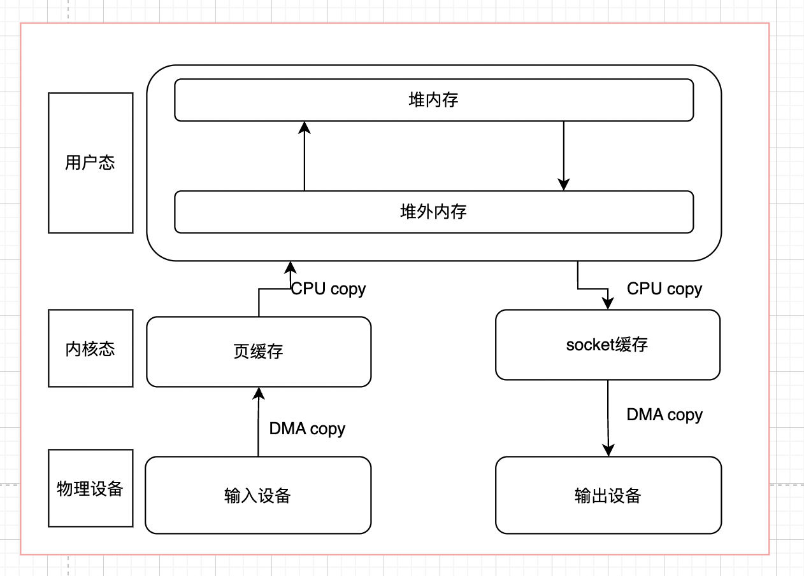
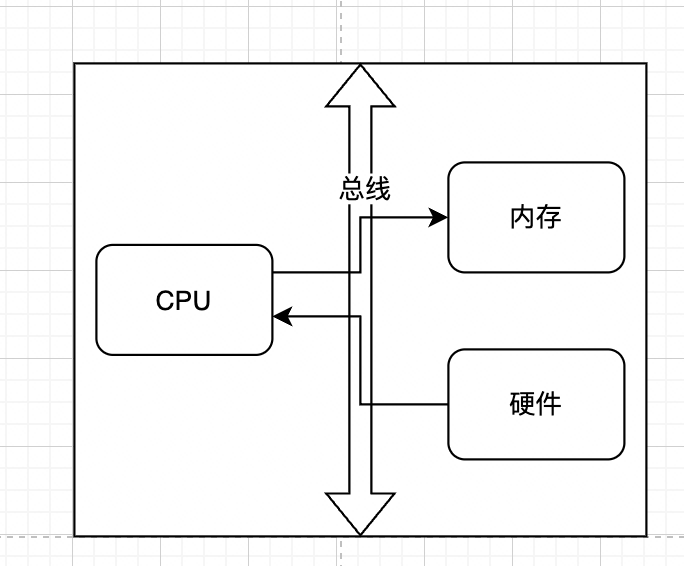
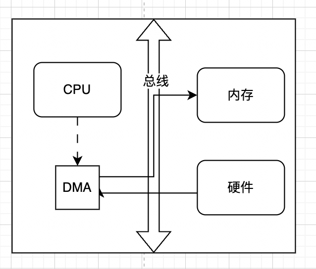
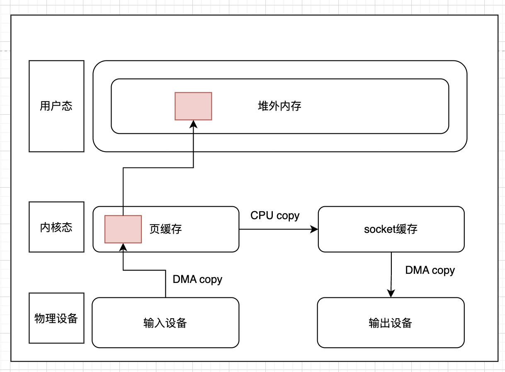
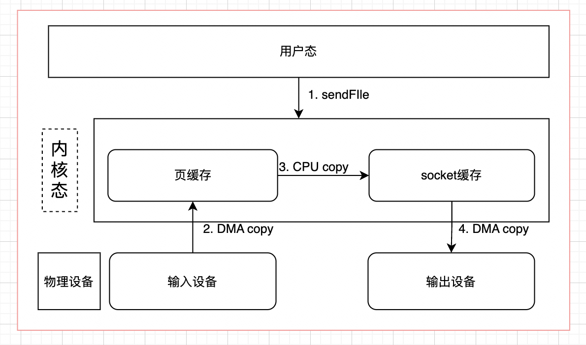
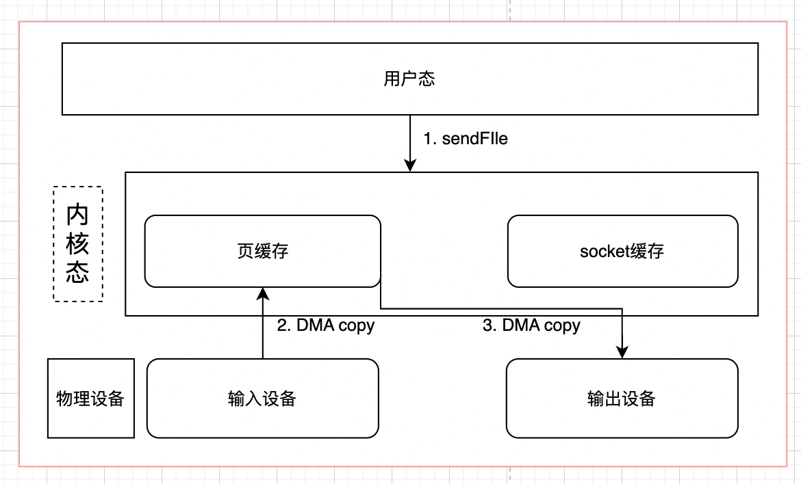

# ✅什么是零拷贝？

# 典型回答

要想理解零拷贝，首先要了解操作系统的IO流程，因为有内核态和用户态的区别，为了保证安全性和缓存，普通的读写流程如下：

（对于Java程序，还会多了一个堆外内存和堆内存之间的copy）



程序发起`read()`系统调用，要求从磁盘读取文件数据：

1. **上下文切换**：由用户态进入内核态
2. **DMA拷贝**：通过DMA技术**将磁盘中的数据copy到内核缓冲区中**
3. **CPU拷贝**：当DMA完成工作后，会发起一个中断通知CPU数据拷贝完成，然后CPU再**将内核缓冲区中的数据copy到应用程序缓冲区中**
4. **上下文切换**：read()调用返回，系统从内核态切换会用户态。内核唤醒对应线程，同时将用户态的数据返回给该线程空间

程序发起`write()`系统调用，要求将应用程序缓冲区里的数据通过socket发送出去：

1. **上下文切换**：从用户态切换到内核态。
2. **CPU 拷贝**：CPU将数据从应用程序缓冲区拷贝到内核的socket缓冲区（Socket Buffer）。
3. **DMA 拷贝**：DMA引擎将数据从socket缓冲区拷贝到网卡（NIC）缓冲区，准备进行网络传输。
4. **上下文切换**：`write()`调用返回，系统从内核态切换回用户态。

在这个过程中，如果不考虑用户态的内存拷贝和物理设备到驱动的数据拷贝，我们会发现，这其中会涉及4次数据拷贝。同时也会涉及到4次进程上下文的切换。**所谓的零拷贝，作用就是通过各种方式，在特殊情况下，减少数据拷贝的次数/减少CPU参与数据拷贝的次数。**

***

常见的零拷贝方式有mmap，sendfile，dma，directI/O等。

# 扩展知识

## DMA<font style="color:rgb(15, 17, 21);">(Direct Memory Access，直接内存访问)</font>

正常的IO流程中，不管是物理设备之间的数据拷贝，如磁盘到内存，还是内存之间的数据拷贝，如用户态到内核态，都是需要CPU参与的，如下所示



如果是比较大的文件，这样无意义的copy显然会极大的浪费CPU的效率，所以就诞生了DMA，<font style="color:rgb(15, 17, 21);">Direct Memory Access</font>你翻译一下也能知道，就是让硬件设备能够直接与主内存进行数据读写。

<font style="color:rgb(15, 17, 21);">DMA控制器是一个专门的硬件单元，可以看作是CPU的一个“搬运工助理”。</font>

1. **CPU下达指令**：CPU对DMA控制器进行配置，告诉它数据的源地址、目标地址和要传输的数据量。
2. **DMA接管工作**：配置完成后，DMA控制器会直接接管后续工作。它直接与设备（如网卡、磁盘控制器）和内存交互，开始搬运数据。（在此期间，CPU可以被解放出来去执行其他计算任务，只需等待DMA的工作完成。）
3. **DMA发出中断**：当整个数据块传输完毕后，DMA控制器向CPU发送一个中断信号，通知它“任务已完成”。



所以，**通过DMA，减少了CPU在I/O操作中的开销。**

## mmap

上文我们说到，正常的read+write，都会经历至少四次数据拷贝的，其中就包括内核态到用户态的拷贝，它的作用是为了安全和缓存。如果我们能保证安全性，是否就让用户态和内核态共享一个缓冲区呢？这就是mmap的作用。

mmap，全称是memory map，翻译过来就是内存映射，顾名思义，就是将内核态和用户态的内存映射到一起，避免来回拷贝，实现这样的映射关系后，进程就可以采用指针的方式读写操作这一段内存，而系统会自动回写脏页面到对应的文件磁盘上，即完成了对文件的操作而不必再调用 read、write 等系统调用函数。相反，内核空间对这段区域的修改也直接反映用户空间，从而可以实现不同进程间的文件共享。其函数签名如下：

```basic
void *mmap(void *addr, size_t length, int prot, int flags, int fd, off_t offset);
```

一般来讲，mmap会代替read方法，模型如下图所示：



`mmap` + `write` 方式:

1. `mmap()`: 系统调用将内核缓冲区直接映射到用户进程的虚拟地址空间。这使得用户进程的指针可以直接指向这片内核缓冲区。
2. 用户进程像操作普通内存一样操作这片映射区域。
3. `write()`: 数据从映射的内存区域（即内核缓冲区） -> (CPU拷贝到) Socket缓冲区 -> (DMA拷贝到) 网卡。

采用mmap + write的方式，内存拷贝的次数会变为3次（减少了一次CPU拷贝），上下文切换则依旧是4次。

需要注意的是，mmap采用基于缺页异常的懒加载模式。通过 mmap 申请 1000G 内存可能仅仅占用了 100MB 的虚拟内存空间，甚至没有分配实际的物理内存空间，只有当真正访问的时候，才会通过缺页中断的方式分配内存

**但是mmap不是银弹**，有如下原因：

1. mmap 使用时必须实现指定好内存映射的大小，因此 mmap 并不适合变长文件；
2. 因为mmap在文件更新后会通过OS自动将脏页回写到disk中，所以在随机写很多的情况下，mmap 方式在效率上不一定会比带缓冲区的一般写快；
3. 因为mmap必须要在内存中找到一块连续的地址块，如果在 32-bits 的操作系统上，虚拟内存总大小也就 2GB左右（32位系统的地址空间最大为4G，除去1G系统，用户能使用的内存最多为3G左右（windows内核较大，一般用户只剩下2G可用）。），此时就很难对 4GB 大小的文件完全进行 mmap，所以对于超大文件来讲，mmap并不适合

## sendfile

如果只是传输数据，并不对数据作任何处理，譬如将服务器存储的静态文件，如html，js发送到客户端用于浏览器渲染，在这种场景下，如果依然进行这么多数据拷贝和上下文切换，简直就是丧心病狂有木有！所以我们就可以通过sendfile的方式，只做文件传输，而不通过用户态进行干预：



sendfile() 系统调用：

* 程序发起`sendfile()`系统调用。
* **上下文切换**：从用户态切换到内核态。
* **DMA 拷贝**：DMA引擎将文件数据从磁盘拷贝到内核缓冲区。
* **CPU 描述信息拷贝（而非数据本身**）：CPU仅将内核缓冲区中数据的位置和长度描述信息（以文件描述符`fd`和地址偏移量形式）拷贝到socket缓冲区。数据本身没有被拷贝。
* **DMA 拷贝**：DMA引擎根据socket缓冲区中的描述信息，直接从内核缓冲区将数据收集到网卡进行传输。
* **上下文切换**：`sendfile()`调用返回，系统从内核态切换回用户态。

此时我们发现，数据拷贝变成了3次，上下文切换减少到了2次。

虽然这个时候已经优化了不少，但是我们还有一个问题，为什么内核要拷贝两次（page cache -> socket cache），能不能省略这个步骤？当然可以

### sendfile + DMA Scatter/Gather

<font style="color:rgb(15, 17, 21);"></font>

DMA gather是LInux2.4新引入的功能

> DMA gather是一种DMA的高级功能。传统的DMA传输要求物理内存是连续的。而Scatter/Gather允许DMA引擎从多个不连续的内存区域“收集”（Gather）数据，然后一次性发送出去；或者将接收到的数据“分散”（Scatter）到多个不连续的内存区域。

`sendfile` 与 DMA Scatter/Gather 的协作：

这个过程实现了**完全零CPU拷贝**：

1. <code>**sendfile()**</code>\*\* 系统调用\*\*： 用户进程调用`sendfile(out_fd, in_fd, NULL, length)`。
2. **DMA 将数据加载到内核缓冲区**： DMA引擎将文件数据从磁盘拷贝到内核缓冲区（一次DMA拷贝）。
3. **CPU描述数据位置**： CPU不拷贝数据本身，而是将内核缓冲区中数据的位置（内存地址）和长度（offset, size）信息描述符（即上面说的“提货单”）添加到Socket缓冲区。
4. **DMA Scatter/Gather 进行发送**： DMA引擎根据Socket缓冲区中的“提货单”，使用Scatter/Gather功能，直接从内核缓冲区的不同位置收集数据，组装成一个完整的数据包，直接发送到网卡。数据完全绕开了CPU。
5. **完成**： 传输完成后，DMA发起中断通知CPU。
6.

这个过程的结果是：0次CPU数据拷贝。只有2次DMA拷贝（磁盘->内核缓冲区，内核缓冲区->网卡）。2次上下文切换（调用和返回`sendfile`）。这是性能最优的方案了。

如下图所示：



## direct I/O

之前的mmap可以让用户态和内核态共用一个内存空间来减少拷贝，其实还有一个方式，就是硬件数据不经过内核态的空间，直接到用户态的内存中，这种方式就是Direct I/O。换句话说，Direct I/O不会经过内核态，而是用户态和设备的直接交互，用户态的写入就是直接写入到磁盘，不会再经过操作系统刷盘处理。

这样确实拷贝次数减少，读取速度会变快，但是因为操作系统不再负责缓存之类的管理，这就必须交由应用程序自己去做，譬如MySql就是自己通过Direct I/O完成的，同时MySql也有一套自己的缓存系统

同时，虽然direct I/O可以直接将文件写入磁盘中，但是文件相关的元信息还是要通过fsync缓存到内核空间中


> 更新: 2025-09-12 21:06:03  
> 原文: <https://www.yuque.com/hollis666/aw7b67/edxez2ggicn8thzq>