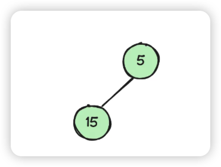
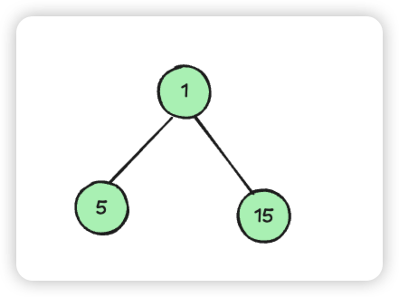
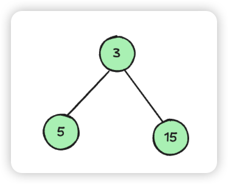
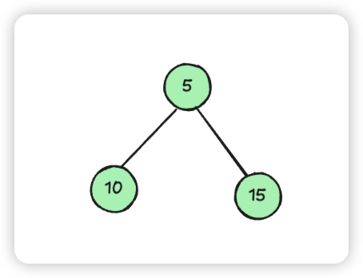
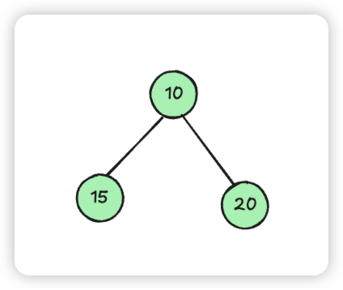

# ✅海量数据查找最大的 k 个值，用什么数据结构？

# 典型回答
这是个典型的 top K问题，如果从海量数据查找最大的 k 个值，并且是内存有限的话，可以使用小顶堆（如果内存无限，可以直接用大顶堆）。如以下操作步骤：

1. 限制堆的大小：设定堆的最大容量为 𝑘，其中 𝑘 是你想要找出的最大元素的个数
2. 添加元素：每次向堆中添加一个新元素时，首先比较它是否大于堆顶元素（即堆中最小的元素）。
    - 如果新元素比堆顶元素大，将堆顶元素弹出，然后将新元素添加到堆中。
    - 如果新元素不大于堆顶元素，直接丢弃该元素。
3. 维持堆的性质：通过上述操作，堆始终保持最小的 k 个最大元素。堆顶元素是这些元素中最小的，堆中其他元素是比堆顶元素大的值。
4. 结果查询：当需要查询最大元素时，只需查看堆中的元素。如果 𝑘=1，直接返回堆顶元素即可；如果 𝑘>1，则堆中所有元素都是最大的 𝑘 个元素中的一部分。

假设我们有以下这些数字：5,15,1,3,10,20,2。找出最最大的三个元素。

1. 初始化一个最大容量为3的小顶堆。这个堆会存储当前遇到的最大的3个数字。
+ 添加第一个元素（5）：堆现在包含 5。
+ 添加第二个元素（15）：堆现在包含 5,15。

+ 添加第三个元素（1）：1 小于堆顶元素（5），但是因为堆中还不满3个，所以1先入堆

+ 添加第四个元素（3）：3 大于堆顶元素（1），所以3入堆。

+ 添加第五个元素（10）：10大于5和3，移除3，添加10，堆更新为 5,15,10。

+ 添加第六个元素（20）：20 大于堆顶元素（5），移除5，添加20。堆更新为 10,15,20。

+ 添加第七个元素（2）：2 小于堆顶元素（10），所以丢弃2。堆保持不变 10,15,20。

处理结束：<u>堆中的元素 10,15,20 就是整个数据集中最大的3个数。</u>

使用小顶堆的一个显著优势是内存效率。当处理非常大的数据集，但只关心顶部 k 个最大元素时，小顶堆只需维护 k 个元素的大小，而大顶堆则需要存储整个数据集来保持堆结构，这在数据量极大时非常耗费内存。

对于动态数据流（即不断有新数据加入），小顶堆允许更高效地维护最大 𝑘 个元素。每次插入操作只需 𝑂(log⁡𝑘)的时间复杂度，而如果使用大顶堆，每次更新可能需要重新处理更多的数据。

小顶堆适用于“Top K”问题，即从大量元素中找出最大的 k 个元素。

> 更新: 2026-01-17 15:01:47  
> 原文: <https://www.yuque.com/hollis666/aw7b67/shg3ez3kglge71o2>