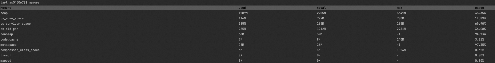
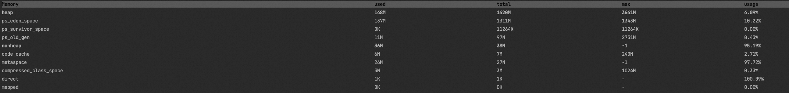
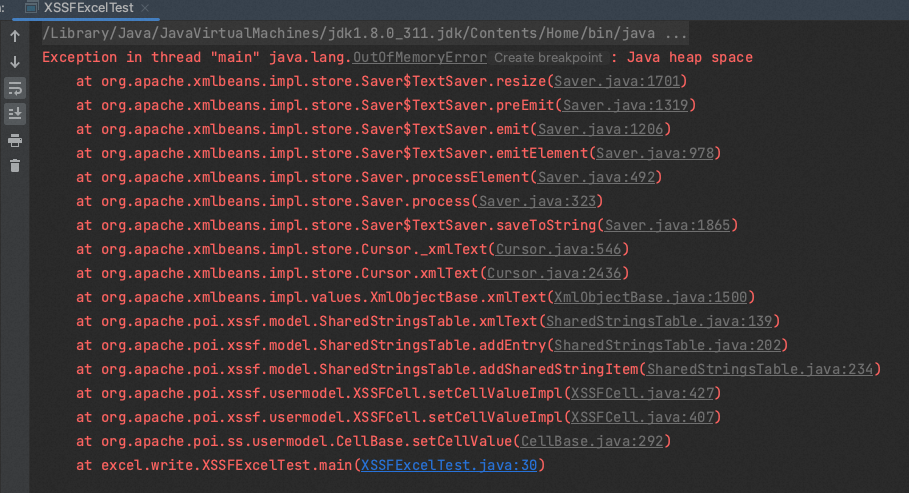

# ✅POI的如何做大文件的写入

# 典型回答

[✅什么是POI，为什么它会导致内存溢出？](https://www.yuque.com/hollis666/aw7b67/gcxwx1gnimfyamvw)

上一篇中介绍了POI的内存溢出以及几种Workbook，那么，我们在做文件写入的时候，该如何选择呢？他们的在内存使用上有啥差异呢？

我们接下来分别使用XSSFWorkbook和SXSSFWorkbook来写入一个Excel文件，分别看一下堆内存的使用情况。

### 使用XSSF写入文件

```java
package excel.write;

import org.apache.poi.ss.usermodel.Cell;
import org.apache.poi.ss.usermodel.Row;
import org.apache.poi.ss.usermodel.Sheet;
import org.apache.poi.xssf.usermodel.XSSFWorkbook;

import java.io.FileOutputStream;
import java.io.IOException;
import java.util.UUID;

public class XSSFExcelTest {

    public static void main(String[] args) throws InterruptedException {
        // 创建一个新的工作簿
        XSSFWorkbook workbook = new XSSFWorkbook();

        // 创建一个新的表格
        Sheet sheet = workbook.createSheet("Example Sheet");
        for (int i = 0; i < 10000; i++) {
            // 创建行（从0开始计数）
            Row row = sheet.createRow(i);
            for (int j = 0; j < 100; j++) {
                // 在行中创建单元格（从0开始计数）
                Cell cell = row.createCell(j);

                // 设置单元格的值
                cell.setCellValue(UUID.randomUUID().toString());
            }
        }

        // 设置文件路径和名称
        String filename = "example.xlsx";

        try (FileOutputStream outputStream = new FileOutputStream(filename)) {
            // 将工作簿写入文件
            workbook.write(outputStream);
        } catch (IOException e) {
            e.printStackTrace();
        } finally {
            try {
                // 关闭工作簿资源
                workbook.close();
            } catch (IOException e) {
                e.printStackTrace();
            }
        }
    }
}
```

�

运行main方法的过程中，通过arthas看一下堆内存的使用情况：

```java
curl -O https://arthas.aliyun.com/arthas-boot.jar

java -jar arthas-boot.jar
```

```java
➜  java -jar arthas-boot.jar
[INFO] JAVA_HOME: /Library/Java/JavaVirtualMachines/jdk1.8.0_311.jdk/Contents/Home/jre
[INFO] arthas-boot version: 3.7.1
[INFO] Found existing java process, please choose one and input the serial number of the process, eg : 1. Then hit ENTER.
* [1]: 41417 org.jetbrains.idea.maven.server.RemoteMavenServer36
  [2]: 4874 
  [3]: 43484 org.jetbrains.jps.cmdline.Launcher
  [4]: 43485 excel.write.XSSFExcelTest
4
[INFO] arthas home: /Users/hollis/.arthas/lib/3.7.1/arthas
[INFO] Try to attach process 43485
Picked up JAVA_TOOL_OPTIONS: 
[INFO] Attach process 43485 success.
[INFO] arthas-client connect 127.0.0.1 3658

```

执行memory命令（这个执行的时间点很重要，我是在`String filename = "example.xlsx";`前输出了一行日志，然后sleep 50s，我在控制台看到这行日志之后开始查看堆内存情况）：

```java
[arthas@43485]$ memory
```

得到结果：



即占用堆内存1200+M。

### 使用SXSSFWorkbook写入文件

```java
package excel.write;

import org.apache.poi.ss.usermodel.Cell;
import org.apache.poi.ss.usermodel.Row;
import org.apache.poi.ss.usermodel.Sheet;
import org.apache.poi.xssf.streaming.SXSSFWorkbook;

import java.io.FileOutputStream;
import java.io.IOException;
import java.util.UUID;

public class SXSSFExcelTest {

    public static void main(String[] args) {
        // 创建一个新的工作簿
        SXSSFWorkbook workbook = new SXSSFWorkbook();

        // 创建一个新的表格
        Sheet sheet = workbook.createSheet("Example Sheet");
        for(int i=0;i<10000;i++){
            // 创建行（从0开始计数）
            Row row = sheet.createRow(i);
            for(int j=0;j<100;j++){
                // 在行中创建单元格（从0开始计数）
                Cell cell = row.createCell(j);

                // 设置单元格的值
                cell.setCellValue(UUID.randomUUID().toString());
            }
        }

        // 设置文件路径和名称
        String filename = "example.xlsx";

        try (FileOutputStream outputStream = new FileOutputStream(filename)) {
            // 将工作簿写入文件
            workbook.write(outputStream);
        } catch (IOException e) {
            e.printStackTrace();
        } finally {
            try {
                // 关闭工作簿资源
                workbook.close();
            } catch (IOException e) {
                e.printStackTrace();
            }
        }
    }
}

```

同样通过Arthas查看内存占用情况：



占用内存在148M左右。

### 对比结果

同样的一份文件写入，XSSFWorkbook需要1200+M，SXSSFWorkbook只需要148M。所以大文件的写入，使用SXSSFWorkbook是可以更加节省内存的。

如果不方便使用arthas，也可以直接在JVM启动参数中增加Xmx150m的参数，运行以上两段代码，使用XSSFWorkbook的会抛出OOM：



而使用SXSSFWorkbook时则不会。

所以，在使用POI时，如果要做大文件的写入，建议使用SXSSFWorkbook，会更加节省内存。

# 扩展知识

## 为啥SXSSFWorkbook占用内存更小?

[✅为啥SXSSFWorkbook占用内存更小?](https://www.yuque.com/hollis666/aw7b67/ivczis4gyskog9q2)


> 更新: 2024-12-08 23:51:59  
> 原文: <https://www.yuque.com/hollis666/aw7b67/kalmkdx5fukxt13q>