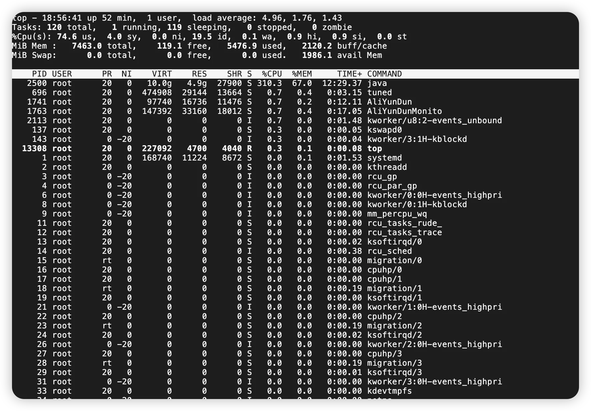
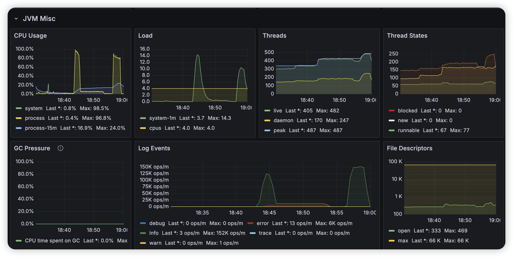
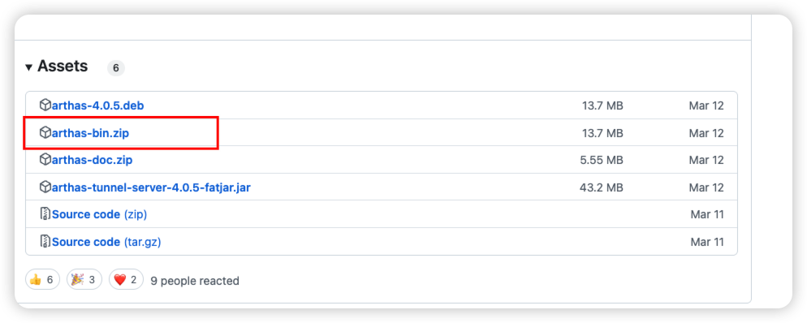
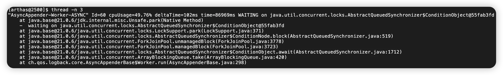
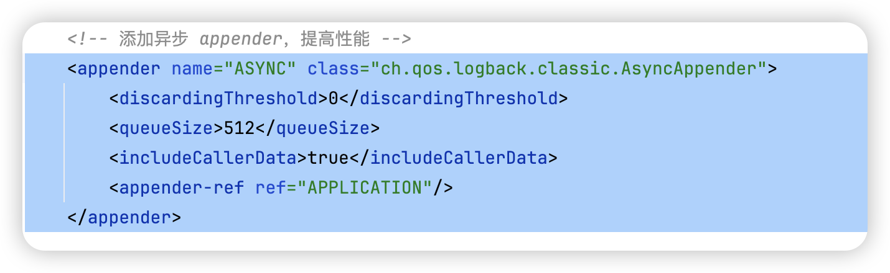
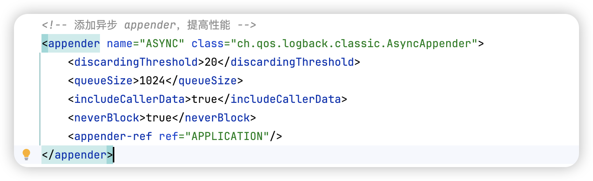
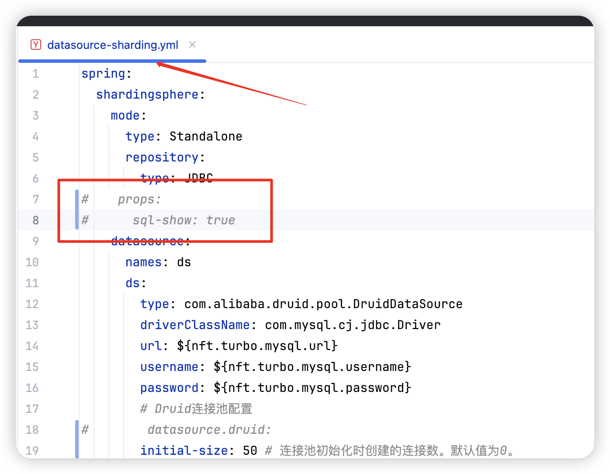
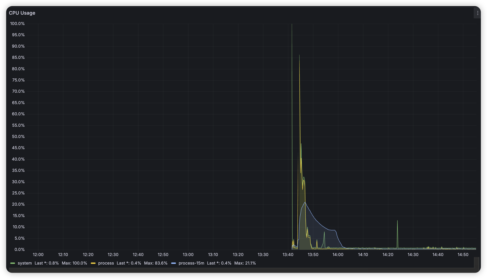

# ✅日志打印导致CPU飙高问题排查

### （本案例来自我的[数藏项目](https://www.yuque.com/hollis666/aw7b67/dgolk0cckpb94sia)中压测相关问题，更多类似问题和具体过程，在项目课中均有讲解）

### 问题出现

在我们的压测过程中，我们出现过一次因为日志打印占用CPU过的问题，当时的情况是这样的。

4C8G的机器，单商品设置5000库存，采用秒杀第二套方案Redis+MQ+Mysql的方案进行扣减，QPS在100进行压测。（详见压测视频）

压测过程中出现CPU飙高。

通过top命令查看CPU在300%以上，因为我们是4核的机器，所以基本上CPU利用率在80%以上了。

通过prometheus的监控也能看到CPU飙高的比较明显。

### 问题定位

紧接着通过arthas进行问题排查。

先通过github下载arthas： <u>https://github.com/alibaba/arthas/releases</u>

下载后解压，然后执行`java -jar arthas-boot.jar`

进入arthas之后，执行`thread -n 3` 查看占用CPU最高的三个线程，可以看到第一个线程的情况是：

通过以上信息我们可以知道，这个线程占用CPU在50%左右，并且通过多次执行thread命令后发现他都是持续排在第一的。那说明他一定有问题。

于是通过堆栈信息，发现这是一个和日志打印有关的代码。因为可以看到堆栈的最后一行，提示这个是logback的AsyncAppender的调用。

这时候基本定位到和日志打印有关。那我们看下我们的logback的配置，找到代码中的logback-spring.xml ，找到AsyncAppender的配置内容如下：

以上配置问题很大，我们看下这几个配置的作用分别是什么。

| **属性** | **默认值** | **说明** |
| --- | --- | --- |
| `queueSize` | 256 | 队列容量（日志事件数）。队列满时根据策略处理新事件。 |
| `discardingThreshold` | 20 | 队列剩余容量阈值（百分比）。低于阈值时丢弃`INFO`以下级别日志（TRACE/DEBUG）。 |
| `neverBlock` | `false` | 队列满时： `true`=直接丢弃新事件 `false`=阻塞等待队列空间（可能影响性能）。 |
| `includeCallerData` | `false` | `true`=异步获取调用者信息（类/方法名），有性能损耗，必要时启用。 |
| `maxFlushTime` | 1000 | 关闭时等待队列处理完成的超时时间（毫秒），超时后丢弃剩余事件。 |

通过了解这些参数的配置之后，我们可以发现，我们的配置有几个问题：

1、`queueSize` 太小

* 队列小的话就容易满，满了就可能到导致阻塞

2、`discardingThreshold`配置为0

* 为0的时候表示所有级别日志都会进入队列，并且不会因队列剩余容量触发自动丢弃

3、没有配置`neverBlock`

* false默认的，则表示队列满的时候，会阻塞等待队列空间，这会大大影响性能

### 问题解决

所以，我们做如了下修改：

另外，我们也通过日志查看，检查了一下下单接口的日志，发现应用中有大量的和shardingjdbc的SQL有关的日志，其实这些日志可以不用打印的。所以我们修改配置项， 让这个SQL不打印：

修改之后，重新进行压测，则CPU下降明显，

基本维持在50%以下，通过arthas查看线程占用情况，这个日志的线程也基本上占用cpu在10%左右。当然还有优化空间，但是优化肯定是有必要再做，不要做过度优化。

这个改造之后，Redis的扣减和数据库的扣减可以控制在2s以内的延迟了，我们认为可以接受了。如果后继有更高的QPS了，那么如果又出现瓶颈，则我们再调整即可。

### （本案例来自我的[数藏项目](https://www.yuque.com/hollis666/aw7b67/dgolk0cckpb94sia)中压测相关问题，更多类似问题和具体过程，在项目课中均有讲解）

> 更新: 2025-06-21 15:09:28  
> 原文: <https://www.yuque.com/hollis666/aw7b67/zxuto1zdfl8k9ag4>