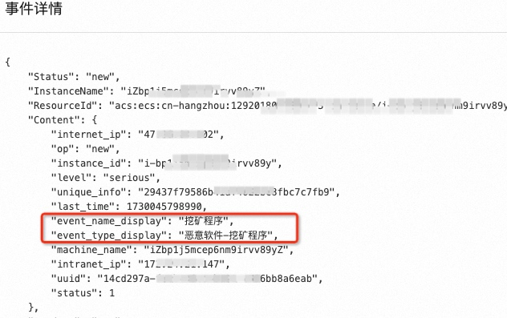
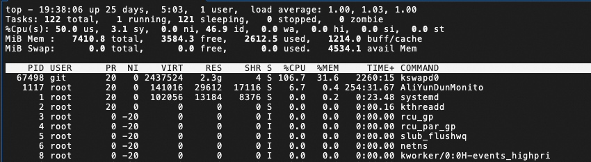
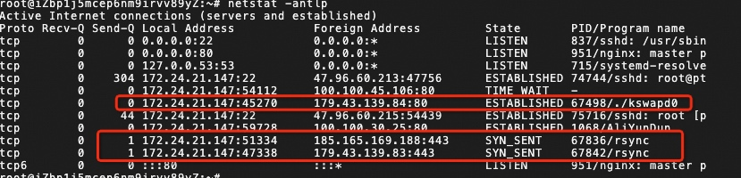
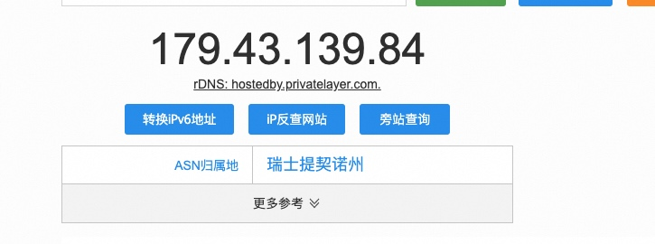
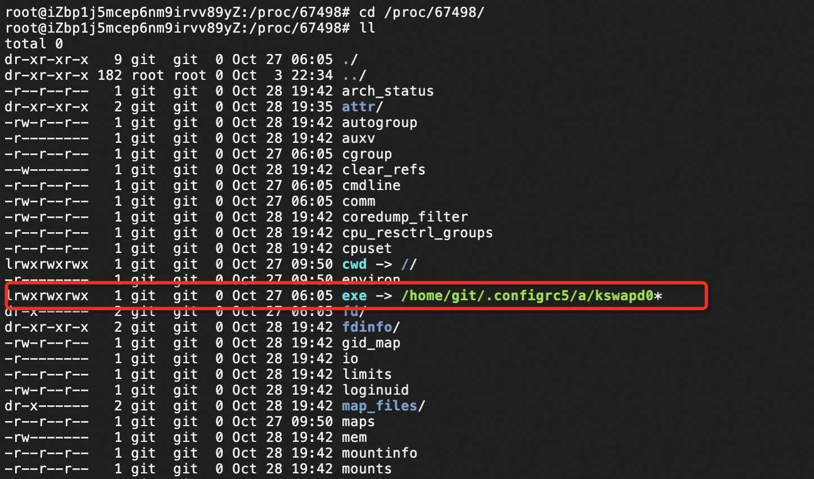
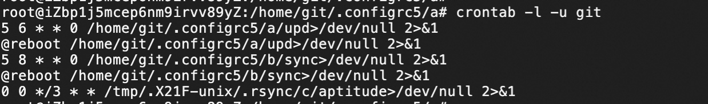
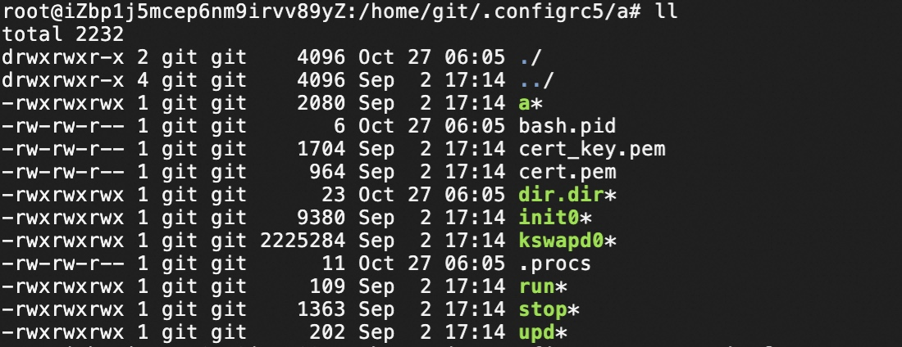
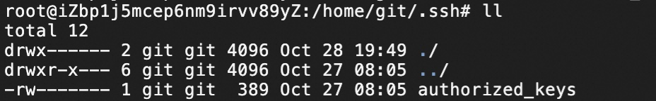
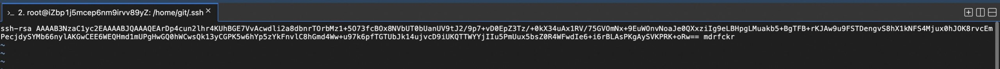
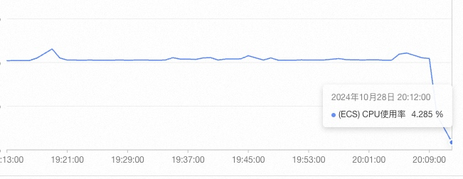

# ✅服务器被注入挖矿木马问题排查

我有一台云服务器，用于部署一个我的个人博客的。最近收到告警，说挂了挖矿程序

首先看下这个程序是不是已经在跑了，top看下运行的进程，发现有一个kswapd0进行耗CPU比较高，这个进程本身是个linux的后台进程，负责内存交换的，但是熟悉的都知道，他其实是个老演员了。

正常的kswapd0不会一直在，也不会占CPU这么高，所以怀疑接下来用 netstat -antlp 看看网络连接情况，挖矿不可能没有远程传输吧。

不查不知道，一查就发现了老朋友。通过netstat发现一个瑞士的IP在和kswapd0通信，同时有两个一个罗马尼亚的ip在和rsync这个数据传输进程在不断通信。

接下来就要深挖了，找到这个kswapd0占用的文件路径到底在哪，进入/proc/<pid>这个目录，我这里的<pid>是67498：

最终发现是在git用户在有个文件夹，那这个文件夹就可以直接干掉了。

接下来就是删除文件夹、kill掉进程

检查并清除定时任务，删除被黑的账号，

清楚这个用户的密钥：

然后机器就恢复正常了。

> 更新: 2024-12-08 23:52:04  
> 原文: <https://www.yuque.com/hollis666/aw7b67/qyptd5ubbyvgvq0e>