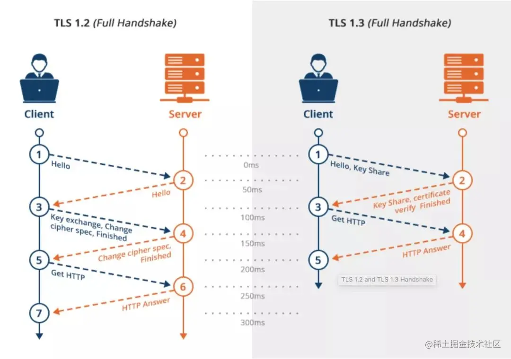

# ✅HTTPS建立连接的时候是几次握手？

# 典型回答

这里其实考察的是TCP的三次握手，以及HTTPS相比HTTP中需要增加的TLS/SSL，但是其实**TLS的数据交换并不叫握手，没有这么叫的，他只是数据交换而已。**

**需要TCP的3次握手，在根据TLS的版本，做2-4步的加密通道建立（TLS 1.2需要4步，TLS 1.3需要2步）。**

首先是需要进行TCP的三次握手，用来建立TCP的连接

* 第一次握手：客户端发送`SYN`包（同步序列编号）到服务器，进入`SYN_SENT`状态。
* 第二次握手：服务器返回`SYN-ACK`包（确认客户端的SYN），进入`SYN_RCVD`状态。
* 第三次握手：客户端发送`ACK`包确认服务器的SYN，完成TCP连接建立。

[✅什么是TCP三次握手、四次挥手？](https://www.yuque.com/hollis666/aw7b67/gbsihwp8q22wc3cn)

接下来通过TLS来建立加密通道，根据不同的版本看，情况不一样。以TLS 1.2为例（需2个往返，共4步）：

* ClientHello：发送客户端支持的TLS版本、加密算法、随机数。
* ServerHello：服务器选定TLS版本、加密算法、随机数；发送证书（身份验证）、`ServerKeyExchange`（密钥参数，如ECDHE）。
* 客户端验证证书：生成预主密钥，用服务器公钥加密后发送；计算会话密钥。
* Finish：双方发送加密的`Finished`消息验证握手完整性。

对于TLS 1.3来说，做了优化（1个往返，共2步）：

* ClientHello：包含支持的加密算法和密钥共享（Key Share）。
* ServerHello：选择参数、发送证书、生成会话密钥并直接响应。

（图片来自网络）

# 扩展知识

## 为什么HTTPS不在TCP握手的时候直接把加密干了

其实最主要的原因就是职责问题，TCP他是一个是传输层协议，只负责“可靠地传数据”；而 TLS 是应用层/会话层的安全协议，负责“加密、认证和完整性”。两者目标不同，职责分离。TLS 必须在 TCP 之上运行，因为加密需要建立在可靠的连接基础上。

> 更新: 2025-12-13 12:35:08  
> 原文: <https://www.yuque.com/hollis666/aw7b67/mkzzeex754d5w2fq>