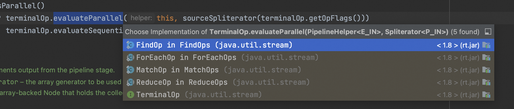
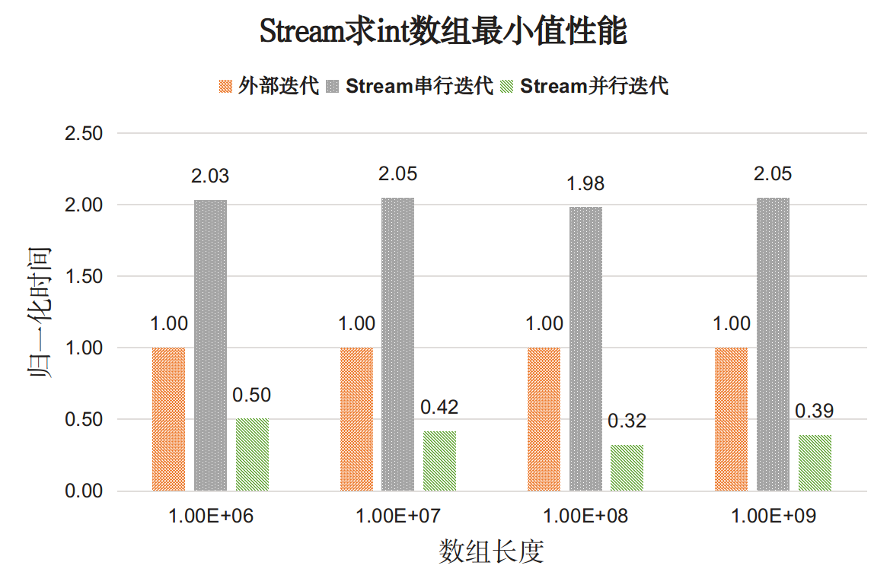
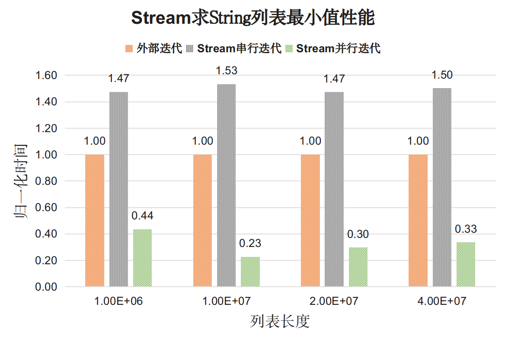
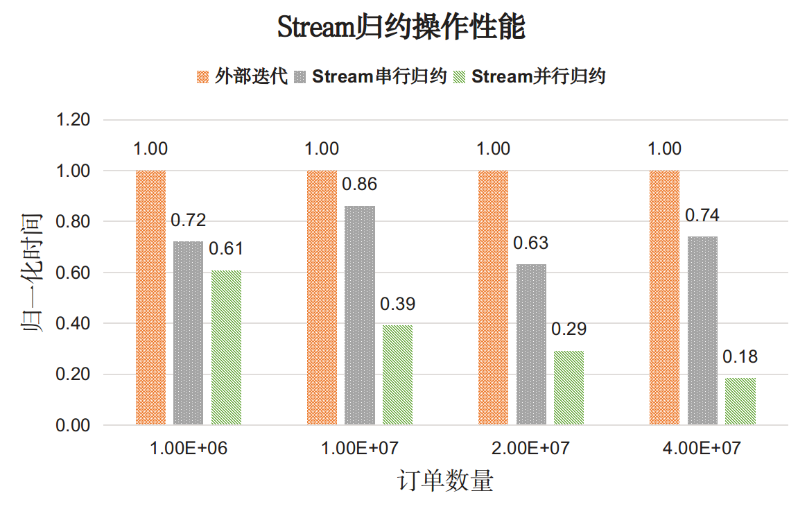

# ✅Stream的并行流是如何实现的？

# 典型回答

Java中的Stream API提供了一种高效且易于使用的方式来处理数据集合。其中，Stream的并行流（parallel stream）是一种特别强大的工具，它可以显著提高数据处理的效率，特别是在处理大型数据集时。

```java
List<String> list = Arrays.asList("Apple", "Banana", "Cherry", "Date");

// 创建一个串行流
Stream<String> stream = list.stream();

// 创建一个并行流
Stream<String> parallelStream = list.parallelStream();
```

使用parallelStream方法就能获取到一个并行流。通过并发运行的方式执行流的迭代及操作。

并行流底层使用了Java 7中引入的Fork/Join框架。这个框架旨在帮助开发者利用多核处理器的并行处理能力。它工作的方式是将一个大任务分割（fork）成多个小任务，这些小任务可以并行执行，然后再将这些小任务的结果合并（join）成最终结果。

[✅ForkJoinPool和ThreadPoolExecutor区别是什么？](https://www.yuque.com/hollis666/aw7b67/wl8s1swvh7g841be)

我们来看下他的具体实现方式，Stream的reduce方法是用来遍历这个Stream的，看下他的实现，是在ReferencePipeline这个实现类中的：

```plain
@Override
public final Optional<P_OUT> reduce(BinaryOperator<P_OUT> accumulator) {
    return evaluate(ReduceOps.makeRef(accumulator));
}

final <R> R evaluate(TerminalOp<E_OUT, R> terminalOp) {
  assert getOutputShape() == terminalOp.inputShape();
  if (linkedOrConsumed)
      throw new IllegalStateException(MSG_STREAM_LINKED);
  linkedOrConsumed = true;

  return isParallel()
         ? terminalOp.evaluateParallel(this, sourceSpliterator(terminalOp.getOpFlags()))
         : terminalOp.evaluateSequential(this, sourceSpliterator(terminalOp.getOpFlags()));
}
```

�

可以看到，这里调用了一个evaluate方法，然后再方法中有一个是否并行流的判断——`isParallel()`，如果是并行流，那么执行的是`terminalOp.evaluateParallel`，接下来看一下具体实现。

这个实现类有很多个：



随便先找一个打开看下，如MatchOp中：

```plain
@Override
public <S> Boolean evaluateParallel(PipelineHelper<T> helper,
                                    Spliterator<S> spliterator) {
    // Approach for parallel implementation:
    // - Decompose as per usual
    // - run match on leaf chunks, call result "b"
    // - if b == matchKind.shortCircuitOn, complete early and return b
    // - else if we complete normally, return !shortCircuitOn

    return new MatchTask<>(this, helper, spliterator).invoke();
}
```

�

这里面用到了MatchTask。

再看下FinOp：

```plain
@Override
public <P_IN> O evaluateParallel(PipelineHelper<T> helper,
                                 Spliterator<P_IN> spliterator) {
    return new FindTask<>(this, helper, spliterator).invoke();
}
```

�

这里又用到了一个FindTask。以及其他的几个实现分别用到了ReduceTask、ForEachTask等。

其实，这几个Task都是CountedCompleter的子类，而CountedCompleter其实就是一个ForkJoinTask

```plain
public abstract class CountedCompleter<T> extends ForkJoinTask<T> {
}
```

也就是我们熟悉的ForkJoinPool的实现了，如果你不了解ForkJoinPool可以看下面这篇：

[✅ForkJoinPool和ThreadPoolExecutor区别是什么？](https://www.yuque.com/hollis666/aw7b67/wl8s1swvh7g841be)

# 扩展知识

## 并行流一定更快吗？

答案是不一定。

其性能优势取决于多种因素，包括数据量大小、CPU数量、单个任务的计算成本以及任务的类型等。

并行流在处理大型数据集时往往表现更好，因为数据可以被分割成多个小块，然后在不同的处理器核心上并行处理。对于较小的数据集，串行流可能更有效，因为并行流的线程分配和管理本身就有一定的开销。

> "大数据集"的定义在不同的上下文和应用中可能有所不同，尤其是在决定是否使用并行流处理时。没有一个固定的阈值可以定义何时数据集变成“大”。我认为当集合中数据量超过1000就可以算大了。

之前有人做过实验测试，我们直接看下结果吧，具体的可以参考：<https://www.hollischuang.com/archives/3364>







基于这个测试，我们可以得出以下结论：

1. 对于简单操作，比如最简单的遍历，Stream串行API性能明显差于显示迭代，但并行的Stream API能够发挥多核特性。
2. 对于复杂操作，Stream串行API性能可以和手动实现的效果匹敌，在并行执行时Stream API效果远超手动实现。

所以，如果出于性能考虑：

* 对于简单操作推荐使用外部迭代手动实现，
* 对于复杂操作，推荐使用Stream API，
* 在多核情况下，推荐使用并行Stream API来发挥多核优势，单核情况下不建议使用并行Stream API。
* 数据量比较小的情况，尤其是集合中只有几十个甚至几个的时候，没必要用并行流。

<font style="color:rgb(55, 65, 81);"></font>

### <font style="color:rgb(55, 65, 81);">使用自定义线程池</font>

<font style="color:rgb(55, 65, 81);"></font>

默认情况下，所有的并行流操作都共享一个公共的 ForkJoinPool，它的线程数量通常等于处理器的核心数减一。如果需要，可以使用自定义的 ForkJoinPool 来执行操作。自定义线程池可以帮助我们：

1. 避免资源竞争：使用公共的ForkJoinPool可能会与其他并行任务竞争资源。
2. 调整性能：根据应用程序的需求调整线程池的大小，优化性能。
3. 更好的错误处理和监控：自定义线程池可以提供更多的错误处理和监控机制。

<font style="color:rgb(55, 65, 81);"></font>

<font style="color:rgb(55, 65, 81);"></font>

<font style="color:rgb(55, 65, 81);">自定义方式如下：</font>

<font style="color:rgb(55, 65, 81);"></font>

```java
import java.util.concurrent.ForkJoinPool;
import java.util.stream.Stream;

public class CustomThreadPoolExample {
    public static void main(String[] args) {
        // 创建具有特定线程数的ForkJoinPool
        ForkJoinPool customThreadPool = new ForkJoinPool(4); 

        try {
            customThreadPool.submit(() -> {
                // 在自定义线程池中执行并行流操作
                Stream.of("Apple", "Banana", "Cherry", "Date")
                      .parallel()
                      .forEach(System.out::println);
            }).get(); // 等待操作完成
        } catch (Exception e) {
            e.printStackTrace();
        } finally {
            customThreadPool.shutdown(); // 关闭线程池
        }
    }
}

```

我们创建了一个自定义的ForkJoinPool，并使用它的submit方法来执行并行流操作。


> 更新: 2024-12-08 23:51:55  
> 原文: <https://www.yuque.com/hollis666/aw7b67/lwhrhzqn0swdrg3r>