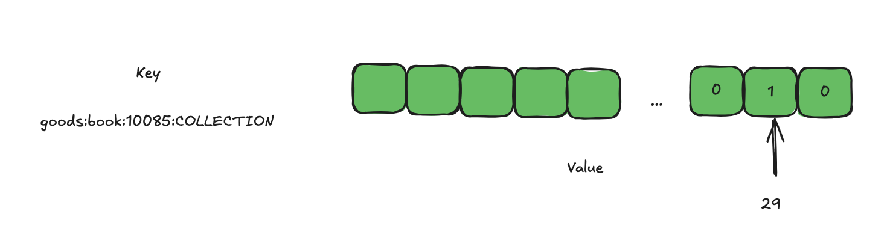

# ✅基于 bitset 实现高效的商品预约

### （本项目亮点来自我的[数藏项目](https://www.yuque.com/hollis666/aw7b67/dgolk0cckpb94sia)文档中的最佳实践部分，更多项目亮点难点（50+），更详细的落地方案和讲解，可以在项目课中和我们一起学）


针对一些热点商品，我们提供了预约功能，就像天猫超市卖茅台一样，需要提前预约才能购买，不约不能买。


同一个商品，我们想要记录哪些用户预约过，同时需要能够快速查询，并且可以尽可能的减少存储空间，避免浪费，我们选择了使用 BitSet。


为了快速的存取，我们使用 Redis，正好Redis 也支持 bitSet 数据结构，同时，我们为了避免Redis 挂了，我们也要存储一张预约表， 在数据库中做持久化。


Redis 的 BitSet 是一种特殊的字符串类型，它允许你对字符串中的每一位（bit）进行操作。每个位可以是 0 或 1，因此你可以将 BitSet 视为一个非常高效的布尔数组。使用 Redis BitSet 的好处


+ 节省内存
    - 每个位只占用 1 位（bit），相比于布尔数组或整数数组，BitSet 可以显著减少内存占用。这对于存储大量布尔值（如用户是否预约了某个商品）非常有用。
+ 高效的操作
    - Redis 提供了丰富的命令来操作 BitSet，例如 SETBIT、GETBIT、BITCOUNT 等。这些命令可以高效地设置、获取和统计位的状态。
+ 原子性操作
    - Redis 的 BitSet 操作是原子性的，这意味着多个客户端可以同时对同一个 BitSet 进行操作而不会产生竞争条件。这在高并发场景下非常重要。


因为我们的用户 ID 是一定不重复的，并且可以转换成integer，所以没一个用户可以映射到一个唯一的 bit 上面，这样预约过的用户对应的 bit 设置为1 ，没预约过的默认为0，就能实现存储预约信息了。


那么我们就可以把商品 id 作为 key，存储一个 bitset，bitset 中存储的是已经预约过的用户的id 列表。


具体实现方式如下：

```plain
// 因为用户id都是不重复的，并且可以转换成integer，所以这里可以使用BitSet来存储预约信息，减少存储量
RBitSet bookedUsers = redissonClient.getBitSet(BOOK_KEY + request.getGoodsType() + CacheConstant.CACHE_KEY_SEPARATOR + request.getGoodsId());
// 不报错则成功
bookedUsers.set(Integer.parseInt(request.getBuyerId()));
```

就这样，就可以把一个预约的信息保存下来了。


当29这个用户 ID 预约过之后：



想要查询某个用户是否预约过的时候，可以：


```plain
RBitSet bookedUsers = redissonClient.getBitSet(BOOK_KEY + goodsType + CacheConstant.CACHE_KEY_SEPARATOR + goodsId);
return bookedUsers.get(Integer.parseInt(buyerId));
```

这样就能查看某个用户是否在 bitset 中，即是否预约过。


以上操作其实就相当于执行了命令：

```plain
GETBIT "goods:book:COLLECTION:10085" "39"
```

### （本项目亮点来自我的[数藏项目](https://www.yuque.com/hollis666/aw7b67/dgolk0cckpb94sia)文档中的最佳实践部分，更多项目亮点难点（50+），更详细的落地方案和讲解，可以在项目课中和我们一起学）


> 更新: 2025-10-07 13:29:54  
> 原文: <https://www.yuque.com/hollis666/aw7b67/wa2gec97ixa2waw0>