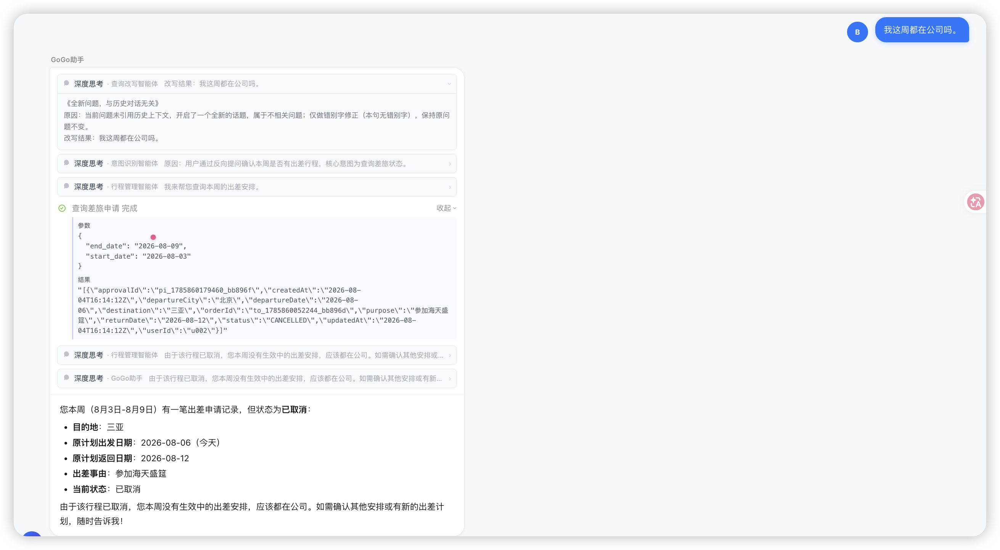
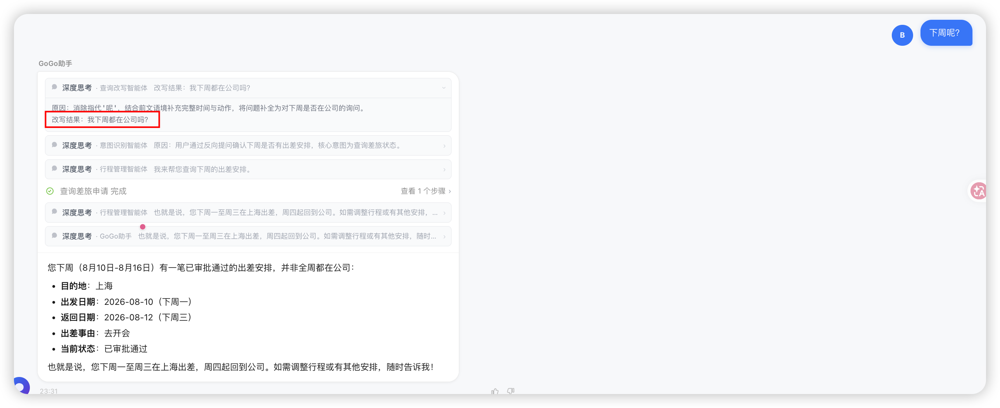
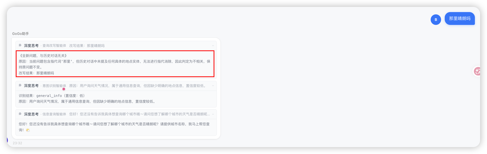

# ✅通过问题改写融合多轮对话（已废弃）

**新方案：**[../12-✅通过问题改写融合多轮对话.md](../12-✅通过问题改写融合多轮对话.md)

**以下内容已被上面的新方案替代>**

在多轮对话中，用户的后续提问往往依赖前文上下文：

```text
用户：我想申请下周去杭州出差。
助手：好的，请告诉我具体出发和返回日期。
用户：周一去，周三回。
用户：帮我查一下那边的酒店      ← "那边"指哪？下游Agent看不懂
```

如果直接把「帮我查一下那边的酒店」喂给意图识别或执行Agent，会遇到：

- 意图识别无法判断这是杭州的酒店查询
- 执行Agent不知道目标城市和入住日期

**解决方案**：在下游处理之前，通过一次问题改写将多轮上下文「压缩」到一句自包含的问题中。

而且改写的话，还有一个好处，那就是有的时候问题太抽象，意图识别会错，经过改写之后，意图识别的准确率也能大大提升。后面我们介绍意图识别的时候会讲到，意图识别做了三层识别，越前面的成本月底，问题改写也能把本来需要L3识别的情况提前到L1就能识别（L1-L3是啥后面会讲），减少响应时长。

| 文件 | 职责 |
| --- | --- |
| `QueryRewritingAgent.java` | 继承 AgentBase，单次 LLM 调用实现改写，通过 Hook 获得多轮记忆 |
| `query-rewriting-agent-system.md` | System Prompt：定义改写规则（指代消除、错别字、step-back 等） |

代码实现详解

QueryRewritingAgent — 继承 AgentBase 的轻量实现

```java

@Component("queryRewritingAgent")
@Scope("prototype")  // 每次请求创建新实例，避免状态污染
public class QueryRewritingAgent extends AgentBase {

    @Autowired
    @Qualifier("stableModel")
    private Model stableModel;

    @Autowired
    private SessionPersistenceHook sessionPersistenceHook;
    // ... 其他 Hook 注入

    public QueryRewritingAgent() {
        super(NAME);  // 仅需传入 Agent 名称
    }

    @Override
    protected Mono<Msg> doCall(List<Msg> msgs) {
        List<Msg> messages = new ArrayList<>();
        // 拼入 System Prompt
        messages.add(Msg.builder()
                .role(MsgRole.SYSTEM)
                .name("system")
                .content(TextBlock.builder()
                        .text(PromptLoader.load("query-rewriting-agent-system.md")).build())
                .build());
        // 拼入多轮历史 + 当前用户消息
        if (msgs != null) {
            messages.addAll(msgs);
        }
        // 单次 LLM 调用，不走 ReAct 循环
        return Mono.fromCallable(() ->
                        stableModel.stream(messages, null, null).collectList().block())
                .map(responses -> Msg.builder()
                        .name(NAME)
                        .role(MsgRole.ASSISTANT)
                        .content(TextBlock.builder().text(extractText(responses)).build())
                        .build());
    }
}
```

- 继承 `AgentBase` 而非 `ReActAgent`：问题改写是确定性的单步文本变换，无需工具调用和多轮推理循环，直接通过 `model.stream()` 发起单次 LLM 请求
- `@Scope("prototype")`：每次请求新建实例，内存为空白状态
- Hook 通过 `@Autowired` 注入：SessionPersistenceHook 在 Agent 执行前自动从 Session 加载历史对话。（后面会讲）
- `doCall()` 中手动拼装 System Prompt：由于不使用 ReActAgent 的内置 sysPrompt 机制，在 `doCall()` 方法中显式将 prompt 作为第一条 SYSTEM 消息加入

System Prompt 的改写策略

`query-rewriting-agent-system.md` 定义了几个改写规则：

```text
## 改写规则

### 1. 相关性判断

判断当前问题是否与历史对话相关：

- **相关**：当前问题是对前文话题的延续、追问、补充、确认或修正。
- **不相关**：当前问题开启了一个全新的、与历史无关的话题。

判断标准包括但不限于：

- 是否包含指代词（它、这个、那个、那边、上面、之前、上次等）。
- 是否省略了前文已提及的实体（城市、日期、酒店、航班、审批单号等）。
- 是否继续讨论同一出差任务、行程、审批或报销事项。

### 2. 问题融合与指代消除

当判断为相关时：

- 将当前问题中的省略和指代替换为历史中的具体实体。
- 把分散在多轮中的约束条件合并到当前问题中。
- 如果用户当前问题只是简单确认（如“确认”“好的”“就它吧”），则融合为完整动作描述，例如：“确认提交此前讨论的北京到杭州的差旅审批。”

### 3. 错别字改写

- 识别并修正用户输入中的常见错别字、拼音错误、形近字错误。
- 例如：`杭洲` → `杭州`、`差旅游` → `差旅`、`报消` → `报销`。
- 修正时必须保留原始语义，不得引入新信息。

### 4. Step-back 改写

- 当用户问题过于具体、模糊或带有强烈假设时，先退一步，生成一个更通用、更基础的问题版本，帮助理解真实意图。
- 例如：
  - 用户：`西湖附近那个全季怎么样？`
  - Step-back：`用户想了解杭州西湖附近全季酒店的相关信息（价格、位置、评价、是否符合差旅政策）。`
- Step-back 改写后的问题用于辅助理解，最终 `rewritten_question` 仍应保留具体细节。

### 5. 信息保留原则

改写后的问题**必须**满足：

- 不丢失原始问题中的关键实体（人、地点、时间、金额、审批单号、酒店/航班名等）。
- 不改变用户原始意图。
- 不添加历史中没有的假设信息，除非用于消除必要歧义。
- 对于不相关问题，原则上保持原问题不变，仅做错别字修正。

### 6. 面向下游的输出约束

- **禁止引入内部名称**：`rewritten_question` 会作为下游智能体的输入且可能在思考面板向用户展示，因此**绝不允许**向其中添加工具函数名、子智能体名、内部字段名与文件路径（如 `query_travel_order`、`plan_roundtrip`、`itineraryPlanAgent` 等 `snake_case` 或 camelCase 名称）；`reason` 字段也应以中文自然语描述改写思路，不得引用此类英文标识符。
```

相关性判断

LLM 首先判断当前问题与历史是否相关：

- **相关**：含指代词（它/那边/上次）、省略了前文实体、延续同一任务
- **不相关**：开启全新话题

指代消除与信息融合

```text

历史：用户想去杭州出差，周一去周三回
当前："帮我查一下那边的酒店"
改写："帮我查一下杭州的酒店，入住日期为下周一，离店日期为下周三。"
```

将「那边」替换为「杭州」，并融合分散在多轮中的日期约束。

错别字修正

```text
"我要报消一张发票" → "我要报销一张发票"
```

Step-back 改写

当问题过于具体或模糊时，先退一步理解真实意图：

```text

"西湖附近那个全季怎么样？"
→ 用户想了解杭州西湖附近全季酒店的相关信息（价格、位置、评价、是否符合差旅政策）
```

输出约束

- 不丢失原始关键实体
- 不改变用户原始意图
- 不添加历史中没有的假设信息
- 不引入内部名称（tool 名、Agent 名等）

为了提升准确性，我们还使用了few-shot，增加了几个示例：

````text

## 示例

### 示例 1：指代消除

History:

- 用户：我想申请下周去杭州出差。
- 助手：好的，请告诉我具体出发和返回日期。
- 用户：周一去，周三回。

Current question: `帮我查一下那边的酒店`

Output:

```json
{
  "related": true,
  "rewritten_question": "帮我查一下杭州的酒店，入住日期为下周一，离店日期为下周三。",
  "reason": "消除指代'那边'，融合历史中的目的地和日期信息。"
}
```

### 示例 2：错别字修正

Current question: `我要报消一张发票`

Output:

```json
{
  "related": false,
  "rewritten_question": "我要报销一张发票",
  "reason": "修正错别字'报消'为'报销'，当前问题未引用历史上下文。"
}
```

### 示例 3：不相关问题

History:

- 用户：帮我查一下杭州的签证政策。
- 助手：杭州属于中国境内，无需签证。

Current question: `今天北京天气怎么样？`

Output:

```json
{
  "related": false,
  "rewritten_question": "今天北京天气怎么样？",
  "reason": "当前问题与历史话题无关，保持原问题。"
}
```
````

一个完整的多轮示例







---

来源: https://thoughts.aliyun.com/workspaces/6963289eb0fc2e001bb052eb/docs/6a5a0b33c71a8900017abf11
