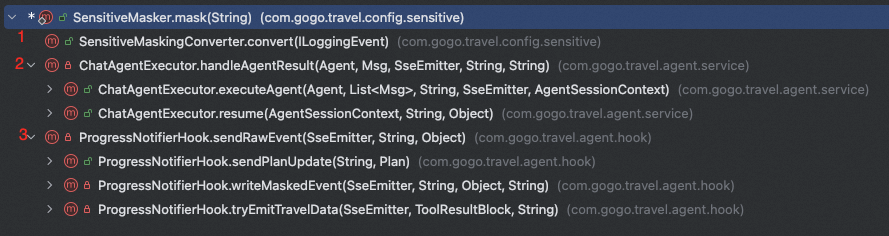

# ✅隐私保护——全链路敏感信息脱敏

在我们的项目中，有很多敏感信息，比如用户的身份证号、手机号、ApiKey等等内容。这些信息我们需要做全方位的保护和脱敏。

其实，前面我们针对ApiKey的加密和脱敏，已经介绍过了，这里把另外一部敏感信息的内容也补全。

在我们的项目中，我们借助一个开源的脱敏框架实现了一个统一的脱敏工具类：SensitiveMasker，这里面把手机号、身份证号、apikey等的脱敏都包含了。

```text
/**
 * 对文本做统一脱敏，返回脱敏后的新字符串；入参为 null/空时原样返回。
 */
public static String mask(String text) {
    if (text == null || text.isEmpty()) {
        return text;
    }
    // 顺序有讲究：先脱敏身份证，再脱敏银行卡，避免 18 位身份证被银行卡规则重复处理
    String masked = maskPattern(text, ID_CARD, ID_NO_STRATEGY);
    masked = maskPattern(masked, BANK_CARD, CARD_ID_STRATEGY);
    masked = maskPattern(masked, PHONE, PHONE_STRATEGY);
    masked = maskPattern(masked, EMAIL, EMAIL_STRATEGY);
    masked = maskPattern(masked, SK_KEY, MASK_ALL_STRATEGY);
    masked = maskKvSecrets(masked);
    return masked;
}
```

上面这个方法的调用入口有三个：



第一个入口：日志

```text
//src/main/java/com/gogo/travel/config/sensitive/SensitiveMaskingConverter.java:19-25
public class SensitiveMaskingConverter extends MessageConverter {

    @Override
    public String convert(ILoggingEvent event) {
        return SensitiveMasker.mask(super.convert(event));
    }
}
```

挂载方式是 logback 的 conversionRule——注册一个自定义转换词，然后在 pattern 里用它替换掉默认的 %msg：

```text
<!-- src/main/resources/logback-spring.xml:6-15 -->
    <!-- 统一日志脱敏：手机号/身份证/银行卡/邮箱/地址（houbb 内置） + 秘钥（自定义扩展） -->
    <conversionRule conversionWord="sensitive"
                    converterClass="com.gogo.travel.config.sensitive.SensitiveMaskingConverter"/>

    <appender name="CONSOLE" class="ch.qos.logback.core.ConsoleAppender">
        <encoder>
            <pattern>%d{yyyy-MM-dd HH:mm:ss.SSS} [%thread] %-5level %logger{36} - %sensitive%n</pattern>
            <charset>UTF-8</charset>
        </encoder>
    </appender>
```

一个字符的改动（%msg → %sensitive）就让**全工程所有 ****logger.xxx()**** 调用**自动过脱敏，业务代码一行都不用改。这是"横切关注点"最标准的落地方式。

第二个入口：事件推送

ProgressNotifierHook 是 Agent 执行过程的实时播报器，它要推 progress（进度条）、thinking（思考流）、plan_update（任务清单）、travel_data（机酒卡片）四类事件。四类事件、七个业务发送方法，但**物理上的 ****emitter.send**** 只有一处**：

```text
// src/main/java/com/gogo/travel/agent/hook/ProgressNotifierHook.java:605-611
    /**
     * 序列化 → 脱敏 → 通过 emitter 发送。异常向上抛出，调用方决定日志与降级策略。
     */
    private void sendRawEvent(SseEmitter emitter, String eventName, Object data) throws IOException {
        String masked = SensitiveMasker.mask(JSON.toJSONString(data));
        emitter.send(SseEmitter.event().name(eventName).data(masked));
    }
```

注意脱敏发生在 JSON.toJSONString(data) **之后**——先序列化成字符串，再对整个 JSON 文本做文本级脱敏。这里有个隐含前提值得点破：脱敏必须保证结果仍是**合法 JSON**。因为掩码字符只有 *，不会引入引号、反斜杠或花括号，所以这个前提天然成立。文档也把它写进了注释：

```text
// src/main/java/com/gogo/travel/agent/hook/ProgressNotifierHook.java:613-629
    /**
     * 统一 SSE 出口：调用 {@link #sendRawEvent} 并吞掉常见的断连异常。
     *
     * <p>所有对前端可见的 progress / thinking 事件都应经过此方法，避免手机号、身份证、
     * 银行卡号、邮箱、API Key、KV 秘钥等敏感字段外泄。{@link SensitiveMasker} 使用带边界的
     * 正则匹配 + 值级脱敏策略，替换后的字符串仍是合法 JSON。</p>
     */
    private void writeMaskedEvent(SseEmitter emitter, String eventName, Object data, String logTag) {
        try {
            sendRawEvent(emitter, eventName, data);
        } catch (IllegalStateException e) {
            // emitter 已完成（客户端断开 / 超时），静默忽略
            logger.debug("[{}] 发送失败，emitter 已完成: {}", logTag, e.getMessage());
        } catch (IOException e) {
            logger.debug("[{}] 发送失败（网络异常）: {}", logTag, e.getMessage());
        }
    }
```

上层三个业务方法都只是往这个漏斗里丢数据，各自的注释还标明了它们为什么需要脱敏：

```text
// src/main/java/com/gogo/travel/agent/hook/ProgressNotifierHook.java:582-603
    private void sendProgress(SseEmitter emitter, Map<String, String> data) {
        // 进度事件可能带手机号、身份证、API Key 等敏感字段，出口统一脱敏
        writeMaskedEvent(emitter, "progress", data, "PROGRESS");
    }

    private void sendThinking(SseEmitter emitter, String agentName, String text) {
        Map<String, String> data = new HashMap<>();
        data.put("agentName", agentName);
        data.put("text", text);
        writeMaskedEvent(emitter, "thinking", data, "THINKING");
    }
    // ... sendThinkingRoundStart 同理
```

另外两处直接调 sendRawEvent，一处是任务清单，注释明确说"其实不敏感，但仍然走统一出口"：

```text
// src/main/java/com/gogo/travel/agent/hook/ProgressNotifierHook.java:673-675
        try {
            // 计划/任务名理论上不含敏感字段，但仍走统一脱敏出口，防御性覆盖
            sendRawEvent(emitter, "plan_update", data);
```

一处是机酒卡片，这个是真的敏感：

```text
// src/main/java/com/gogo/travel/agent/hook/ProgressNotifierHook.java:747-748
            // 卡片里可能有联系人电话、证件号等敏感字段，走统一脱敏出口
            sendRawEvent(emitter, "travel_data", payload);
```

**这一节的设计精华在于"漏斗形状"**：七个入口、一个出口、一行 mask。新增第八个事件类型的人，只要复用 writeMaskedEvent，就自动获得脱敏能力，不需要知道脱敏这回事存在。反过来说，这也是它唯一的脆弱点——只要有人绕开 writeMaskedEvent 自己写 emitter.send，防线就有缺口。第 2.5 节和第六节会看到这个缺口真实存在

第三个入口：模型输出答案

Agent 跑完之后的最终回复，脱敏点在 ChatAgentExecutor：

```text
// src/main/java/com/gogo/travel/agent/service/ChatAgentExecutor.java:314-326
        // 返回给前端的最终答案做敏感信息脱敏
        String text = SensitiveMasker.mask(result.getTextContent());
        String agentName = agent != null ? agent.getName() : "MasterAgent";
        String messageId = null;
        try {
            messageId = chatHistoryService.saveAssistantMessage(sessionId, userId, text, agentName, null);
        } catch (Exception e) {
            logger.warn("[EXECUTOR] 保存AI回复失败 sessionId={}: {}", sessionId, e.getMessage());
        }
        sseNotifier.sendMessage(emitter, text);
        // 先发正文再发 messageId，前端拿到后回填到刚渲染出的这条消息上
        sseNotifier.sendMessageId(emitter, messageId);
        return false;
```

这里有个容易被忽略但很重要的细节：**text**** 是先脱敏、再同时用于落库（和下发**。也就是说数据库 chat_message 表里，AI 说的话存的就是脱敏版本。用户刷新页面重新拉历史，看到的还是脱敏版本，前后一致，不会出现"刚才看到的是 1380****000，刷新后变成完整号码"的尴尬。

但这个一致性只覆盖了一半。用户自己说的话是**完全不脱敏**入库的：

```text
// src/main/java/com/gogo/travel/controller/ChatController.java:71-76
            // 持久化用户消息
            try {
                chatHistoryService.saveUserMessage(sessionId, userId, message);
            } catch (Exception e) {
                logger.warn("[CHAT] 保存用户消息失败 sessionId={}: {}", sessionId, e.getMessage());
            }
```

```text
// src/main/java/com/gogo/travel/business/chat/service/ChatHistoryService.java:83-93
    @Transactional(rollbackFor = Exception.class)
    public void saveUserMessage(String conversationId, String userId, String content) {
        ensureConversationExists(conversationId, userId);
        if (content != null && !content.isBlank()) {
            updateTitleFromFirstUserMessage(conversationId, content);
        }
        ChatMessage message = new ChatMessage(
                generateMessageId(), conversationId, "user", content, null, null);
        chatHistoryRepository.saveMessage(message);
        logger.debug("[CHAT_HISTORY] 保存用户消息 conversationId={}", conversationId);
    }
```

---

来源: https://thoughts.aliyun.com/workspaces/6963289eb0fc2e001bb052eb/docs/6a6a0edd51b1440001fc8482
