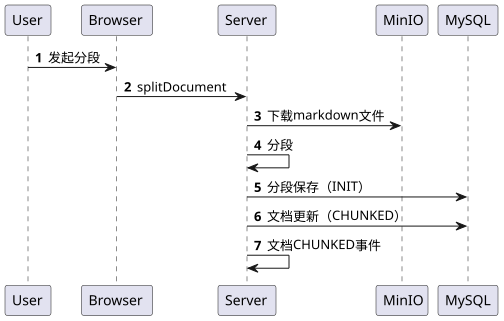

# ✅文档预处理阶段全流程讲解（事件驱动）

完整流程


1、多个流程之间，基于事件驱动。这样可以更好的解耦。

2、事件驱动如果处理失败了， 引入任务定时任务兜底。

文档上传


文档分段



文档向量保存

1、事件驱动


在DocumentEventListener中，接收DocumentChunkedEvent，做向量化和保存处理：

```text
    /**
     * 监听文档CHUNKED事件
     * 触发向量嵌入流程
     *
     * @param event 文档已分段事件
     */
    @Async("eventListenerExecutor")
    @EventListener
    public void onDocumentChunked(DocumentChunkedEvent event) {
        Long documentId = event.getDocumentId();
        log.info("收到文档CHUNKED事件，开始执行向量嵌入，documentId: {}, segmentCount: {}",
                documentId, event.getSegmentCount());

        try {
            boolean success = documentProcessService.embeddingAndStore(documentId);
            log.info("向量嵌入完成，documentId: {}, success: {}", documentId, success);
        } catch (Exception e) {
            log.error("向量嵌入失败，documentId: {}", documentId, e);
        }
    }
```

---

来源: https://thoughts.aliyun.com/workspaces/6963289eb0fc2e001bb052eb/docs/69be4b85d31fed000133bdd8
