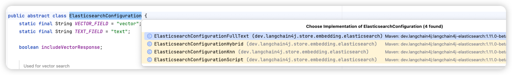

# ✅混合检索如何实现？

因为我们采用了ElasticSearch来做知识的存储，而且ES同时支持向量检索和关键词检索，我们只需要依赖一个扩展包[langchain4j-elasticsearch](https://github.com/langchain4j/langchain4j/tree/main/langchain4j-elasticsearch)的话，就能使用他的检索器做检索了。

为什么要做混合检索？

只所以要用，是因为单独使用向量检索和关键词检索都会有问题：

**1、只用了向量检索效果不行**

**核心问题：****向量检索依赖语义相似度，对专有名词、精确短语、编号等缺乏精确匹配能力；且在面对极短查询时，因语义上下文有限，容易导致召回内容过于宽泛。**

比如我们课程讲的内容中，针对『超级桌面』这个内容的检索。超级桌面本身就是一个汽车领域的专有名词，而和他相似的词有很多，比如典型的3D桌面，手机桌面，车机桌面，桌面。

单纯靠向量检索的话，包含这些关键词的文档得分都挺高的。使得检索效果差。比如这个case：

**2、只用bm25关键词检索效果不行**

**核心问题：****关键词匹配是死板的字面匹配，无法理解同义词、语义表达变化或复杂的自然语言意图。**

这个就很好理解了，关键词检索要求一定要字面匹配，比如我们想要问关于手机能否启动汽车等问题的时候，其实在问的是汽车如何做启停、如何无钥匙进入、智能座舱功能等。

单纯按照分词后的关键词检索的话，就会检索不到想要的内容，就算检索到，得分也不高。

ES中接入混合检索

接入方式参考:

前面的课程中我们讲过，这个包中提供了**ElasticsearchEmbeddingStore、ElasticsearchContentRetriever两个类。**

- **ElasticsearchEmbeddingStore**：`EmbeddingStore` 接口的实现，使用 Elasticsearch 来存储和检索嵌入向量。
- **ElasticsearchContentRetriever**：`ContentRetriever` 接口的实现，使用 Elasticsearch 基于向量相似度搜索来检索相关文档。

而ElasticsearchContentRetriever就是我们要用的ContentRetriever的实现。那我们就可以直接用它来做检索，即：

```text
public String retriever(String query, String chatMessageId) {
    ElasticsearchConfiguration configuration = ElasticsearchConfigurationHybrid.builder().build();

    ElasticsearchContentRetriever contentRetriever = ElasticsearchContentRetriever.builder()
            .restClient(restClient)
            .embeddingModel(openAiEmbeddingModel)
            .configuration(configuration)
            .maxResults(5)
            .indexName("know-engine")
            .minScore(0.5)
            .build();

    KnowEngineQueryTransformer queryTransformer = new KnowEngineQueryTransformer(chatModel, chatMessageId);

    // 创建检索增强器
    RetrievalAugmentor retrievalAugmentor = DefaultRetrievalAugmentor.builder()
            .contentRetriever(contentRetriever)
            .queryTransformer(queryTransformer)
            .build();

    KnowEngineChatAiService aiService = AiServices.builder(KnowEngineChatAiService.class)
            .chatModel(chatModel)
            .streamingChatModel(streamingChatModel)
            .chatMemoryProvider(memoryId -> MessageWindowChatMemory.withMaxMessages(10))
            .retrievalAugmentor(retrievalAugmentor)
            .build();

    Result<String> result = aiService.chatWithRag(UUID.randomUUID(), query);

    return result.content();
}
```

这里面比较关键的就是这个ElasticsearchConfiguration，为了使用混合检索，我们用到的是ElasticsearchConfigurationHybrid，即支持混合检索的配置。

但是，以上代码我在实际运行中报错如下：

```text
[security_exception] current license is non-compliant for [Reciprocal Rank Fusion (RRF)] 
```

主要原因是我的ES用的是开源版，而开源版默认是不支持RRF做重排序的，只有企业版才支持。而ElasticsearchContentRetriever会默认使用内置的RRF做重排序，那么就会导致报错。

所以，直接使用ElasticsearchContentRetriever+ElasticsearchConfigurationHybrid这条路走不通了。于是我们需要自己来实现混合检索了。

什么是混合检索不展开说了，请看：

自定义实现混合检索

既然直接使用自带的ElasticsearchConfigurationHybrid走不通，那我们就要自己来实现这个混合检索的逻辑了，我们看看ElasticsearchConfiguration其实有多个实现类：



其中ElasticsearchConfigurationFullText、ElasticsearchConfigurationKnn分别是用来做全文检索和向量检索的配置。

我们可以借助这两个配置来实现混合检索，即基于KNN做相似度检索，基于全文做关键词检索。

先定义一个fullTextRetriever：

```text
fullTextRetriever = ElasticsearchContentRetriever.builder()
        .restClient(restClient)
       .configuration(ElasticsearchConfigurationFullText.builder().build())
        .maxResults(MAX_RESULT)
        .indexName(INDEX_NAME)
        .minScore(MIN_SCORE)
        .build();
```

再定义一个embeddingRetriever：

```text
embeddingRetriever = ElasticsearchContentRetriever
.builder()
        .restClient(restClient)
        .embeddingModel(openAiEmbeddingModel)
        .configuration(ElasticsearchConfigurationKnn.builder().build())
        .maxResults(MAX_RESULT)
        .indexName(INDEX_NAME)
        .minScore(MIN_SCORE)
        .build();
```

然后把这两个Retriver都设置给一个Router即可：

```text
KnowEngineChatAiService chatService = AiServices.builder(KnowEngineChatAiService.class)
        .chatModel(chatModel)
        .streamingChatModel(streamingChatModel)
        .chatMemoryProvider(memoryId -> MessageWindowChatMemory.withMaxMessages(10))
        .retrievalAugmentor(DefaultRetrievalAugmentor.builder()
                .queryRouter(new KnowEngineQueryRouter(List.of(embeddingRetriever, fullTextRetriever), chatModel)
                .contentInjector(contentInjector)
                .queryTransformer(queryTransformer)
                .contentAggregator(contentAggregator)
                .build())
        .build();
```

但是，实际的代码中，我们还需要给我们的向量检索的检索器做一些定制，如：

1、如何选择精确KNN 还是 近似KNN检索？

2、如何实现检索过滤

3、涉及到父子分段/兄弟分段时，需要把分段做替换和合并

4、针对混合检索到的结果做重排序

这几个我们会分开在讲解。

---

来源: https://thoughts.aliyun.com/workspaces/6963289eb0fc2e001bb052eb/docs/69be4a793fb918000139f9a9
