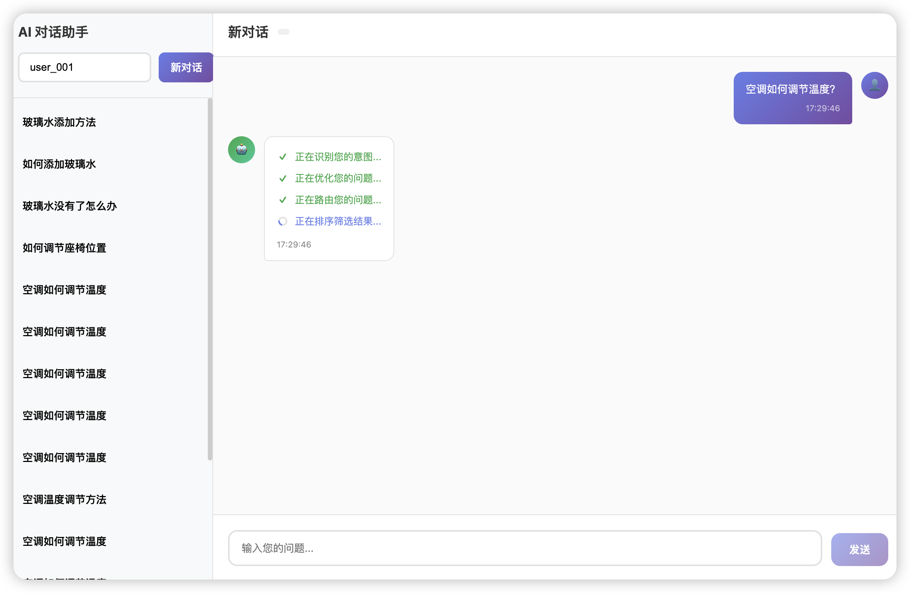
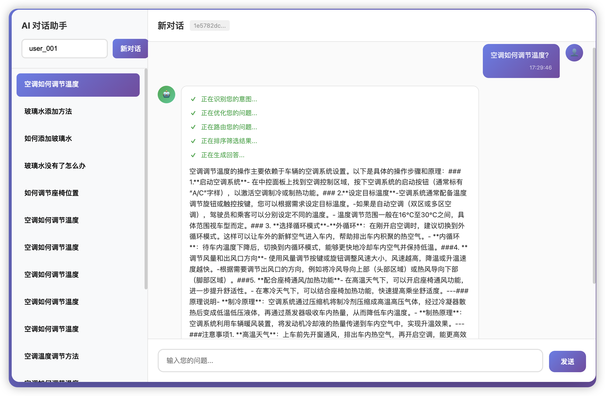

# ✅如何把RAG的过程内容返回给用户

我们见过的很多Agent都会要把执行过程返回给用户，而不是直接给出一个冷冰冰的最终答案，本质上是因为 Agent 的工作方式已经从“单次问答”进化到了“多步自主执行”。

把中间过程展示出来，主要有以下几个核心原因：

**1. 建立信任与认知共识：**普通的大模型聊天像是一场“开卷考试”，输入问题后直接给出答案，你不知道它是对是错，也不知道它有没有在“一本正经地胡说八道”。而 Agent 的工作模式更像是一个新手工程师坐在电脑前帮你干活：分析意图、问题优化、问题路由、文档检索、排序优化等。

**2. 缓解等待焦虑：RAG的回答**任务可能需要几十秒甚至几分钟。如果界面一直转圈，用户会非常焦虑，甚至以为程序卡死了。通过实时展示“正在分析意图...”、“正在问题优化...”、“正在文档检索...”等过程状态，能极大地缓解用户的等待焦虑，让整个交互体验更加丝滑和人性化。





cn.hollis.llm.mentor.know.engine.chat.controller.ChatController#send 中从意图识别处开始做流式的过程输出返回给前端：

```
return Flux.just("[PROGRESS]:正在识别您的意图...")
    .concatWith(
        Mono.fromCallable(() -> {
            IntentRecognitionService intentRecognitionService = 
                AiServices.builder(IntentRecognitionService.class).chatModel(chatModel).build();
            return intentRecognitionService.chat(content);
        })
        .subscribeOn(Schedulers.boundedElastic())
        .flatMapMany(intentRecognitionResult -> {
            // 不相关问题：走通用对话
            if (!intentRecognitionResult.related()) {
                return Flux.concat(
                    Flux.just("[PROGRESS]:正在为您生成回答..."),
                    commonChatService.streamChat(userId, content)
                );
            }
            // 相关问题：走 RAG 流程
            return chatApplicationService.chat(
                new ChatParam(userId, finalConversationId, messageId, content, intentRecognitionResult));
        })
    )
    .doOnError(e -> log.error("流式对话异常", e))
    .concatWith(Mono.just("[DONE]:" + finalConversationId));
```

- Flux.just(T...)：创建包含给定元素的 Flux
- .concatWith(Publisher)：将另一个 Publisher 连接到当前 Flux 末尾
- Mono.fromCallable(...)：将阻塞调用包装为 Mono
- .subscribeOn(Schedulers.boundedElastic())：在弹性线程池上执行上游操作
- .flatMapMany(Function)：根据意图识别结果，动态决定并切换到两条完全不同的异步数据流管道，最终统一对外输出一个 `Flux` 流。

`Mono.fromCallable(...).subscribeOn(Schedulers.boundedElastic())` 的作用是将耗时的阻塞任务，从 WebFlux 默认的事件循环线程（EventLoop）中剥离出来，放到专门的弹性线程池（boundedElastic）中去执行。这样即使 AI 响应很慢，也不会卡住整个 Web 服务器的请求处理线程，保证了系统的高并发性能。

ChatApplicationService.chat 使用 Flux.create 将 RAG 管道各阶段的进度消息与 LLM 流式输出桥接到同一个 Flux：

```
return Flux.<String>create(sink -> {
    // 1. 问题改写（带进度回调）
    KnowEngineQueryTransformer queryTransformer = 
        new KnowEngineQueryTransformer(chatModel, chatParam.messageId(), callback);

    // 2. 构建多个检索器
    KnowEngineElasticsearchContentRetriever embeddingRetriever = new ProgressAwareContentRetriever(...);  // 向量检索
    ElasticsearchContentRetriever fullTextRetriever = new ProgressAwareContentRetriever(...)
;             // 全文检索
    SqlDatabaseContentRetriever sqlRetriever = new ProgressAwareContentRetriever(...)
;                    // SQL 数据库检索
    Neo4jText2CypherRetriever neo4jRetriever = new ProgressAwareContentRetriever(...)
;                    // 图数据库检索

    // 3. 重排序聚合器（带进度回调）
    ContentAggregator contentAggregator = new ProgressAwareContentAggregator(...);

    // 4. 构建查询路由器（带进度回调）
    RetrievalAugmentor retrievalAugmentor = DefaultRetrievalAugmentor.builder()
        .queryRouter(new KnowEngineQueryRouter(..., callback))
        .queryTransformer(queryTransformer)
        .contentAggregator(contentAggregator)
        .contentInjector(contentInjector)
        .build();

    // 5. 构建 AI Service，订阅 LLM 流式输出
    KnowEngineChatAiService knowEngineChatAiService = AiServices.builder(...)
        .chatModel(chatModel)
        .streamingChatModel(streamingChatModel)  // 流式模型
        .retrievalAugmentor(retrievalAugmentor)
        .build();

    // 订阅流式输出，桥接到 sink
    knowEngineChatAiService.streamChat(chatParam.conversationId(), chatParam.content())
        .subscribe(token -> sink.next(token), 
                   sink::error, 
                   sink::complete);
})
.subscribeOn(Schedulers.boundedElastic())
.publishOn(Schedulers.parallel());
```

- KnowEngineQueryTransformer
- [PROGRESS]:正在优化您的问题...
- KnowEngineQueryRouter
- [PROGRESS]:正在路由您的问题...
- ProgressAwareContentRetriever
- [PROGRESS]:正在检索知识库内容...
- ProgressAwareContentAggregator
- [PROGRESS]:正在排序筛选结果...
- [PROGRESS]:正在生成回答...

本文涉及到的Spring WebFlux相关API：

- Flux.create(sink)：在 RAG 流程中手动创建 Flux，将多个异构来源（进度回调、LLM 响应流）桥接到同一个响应流。
- .publishOn(parallel)：引入异步边界，让 boundedElastic 线程专心执行阻塞的 RAG 操作，parallel 线程负责推送数据到前端，确保进度消息能及时 flush。

在KnowEngineQueryTransformer中的transform中的关于进度返回的代码如下：

```text
public Collection<Query> transform(Query query) {
    // 发送进度：开始问题改写
    if (progressCallback != null) {
        progressCallback.accept("[PROGRESS]:正在优化您的问题...");
        System.out.println("[PROGRESS]:正在优化您的问题...");
    }
    // ...
}
```

即执行sink.next(msg); 将内容返回。

而有一些组件我们其实并没有直接定义一个新的，比如ElasticsearchContentRetriever、ReRankingContentAggregator，那么就需要用一个代理来实现过程数据返回，如：

```text
public class ProgressAwareContentAggregator implements ContentAggregator {

    private final ContentAggregator delegate;
    private final Consumer<String> progressCallback;

    public ProgressAwareContentAggregator(ContentAggregator delegate, Consumer<String> progressCallback) {
        this.delegate = delegate;
        this.progressCallback = progressCallback;
    }

    @Override
    public List<Content> aggregate(Map<Query, Collection<List<Content>>> queryToContents) {
        // 发送进度：开始重排序/聚合
        if (progressCallback != null) {
            progressCallback.accept("[PROGRESS]:正在排序筛选结果...");
            System.out.println("[PROGRESS]:正在排序筛选结果...");
        }

        List<Content> result = delegate.aggregate(queryToContents);

        // 发送进度：聚合完成，即将进入LLM生成
        if (progressCallback != null) {
            progressCallback.accept("[PROGRESS]:正在生成回答...");
            System.out.println("[PROGRESS]:正在生成回答...");
        }

        return result;
    }
}
```

---

来源: https://thoughts.aliyun.com/workspaces/6963289eb0fc2e001bb052eb/docs/69be4ac9d31fed000133bd89
