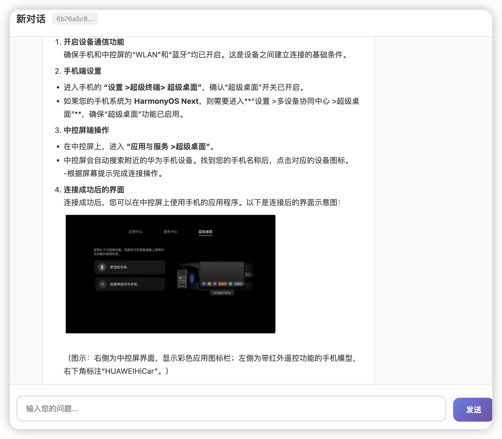
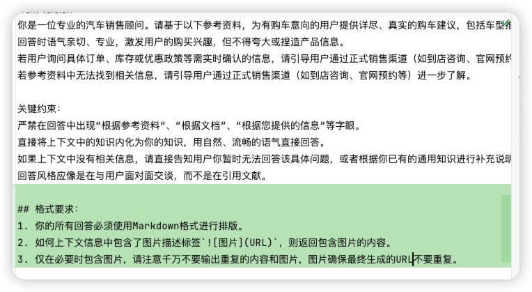

# ✅支持图片的召回和渲染

我们的RAG系统想要实现如下功能，即在页面上可以展示出图片，并且可以针对图片做召回。



基于我们之前的代码，需要做如下调整。

内容提示词修改

在我们的LLM的RAG的最终的生成的提示词中，增加关于markdown和图片的说明：



```
## 格式要求：
1. 你的所有回答必须使用Markdown格式进行排版。
2. 如何上下文信息中包含了图片描述标签``，则返回包含图片的内容。
3. 仅在必要时包含图片，请注意千万不要输出重复的内容和图片，图片确保最终生成的URL不要重复。
```

增加这个约束的目的是让模型的输出更加稳定，并且可以把图片正常返回。

图片描述生成提示词优化

```text
"请描述这张图片的内容，包括场景、对象、布局、颜色、文字信息，直接输出纯文本描述，不要多余说明，不要增加任何特殊符号，特别是换行符"
```

在后面增加`不要增加任何特殊符号，特别是换行符` ，因为一旦生成的图片描述中带有多行的话，会导致一个markdown的图片标签失效，如：

```

```

页面优化支持

在chat.html中增加针对markdown的支持，这块不展开了，我也是靠AI写的。提交的代码修改如下：

- [优化图片的召回和展示](https://codeup.aliyun.com/67c56af4e77e9167fa2fa6df/LLMentor/commit/6390f12186f6eef781a206e643d916074c9c60a2?branch=master)

---

来源: https://thoughts.aliyun.com/workspaces/6963289eb0fc2e001bb052eb/docs/6a170c2074e4030001a301d5
